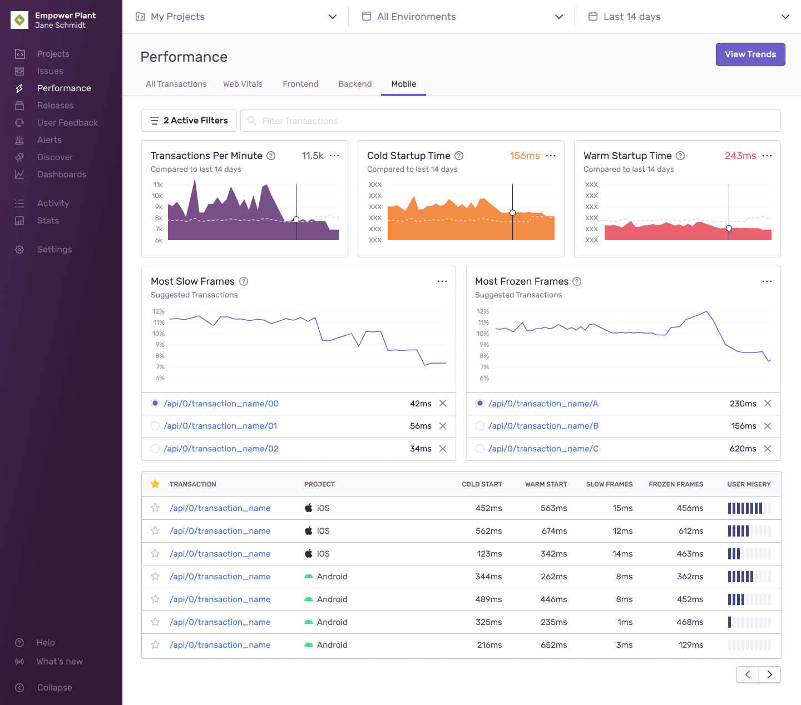
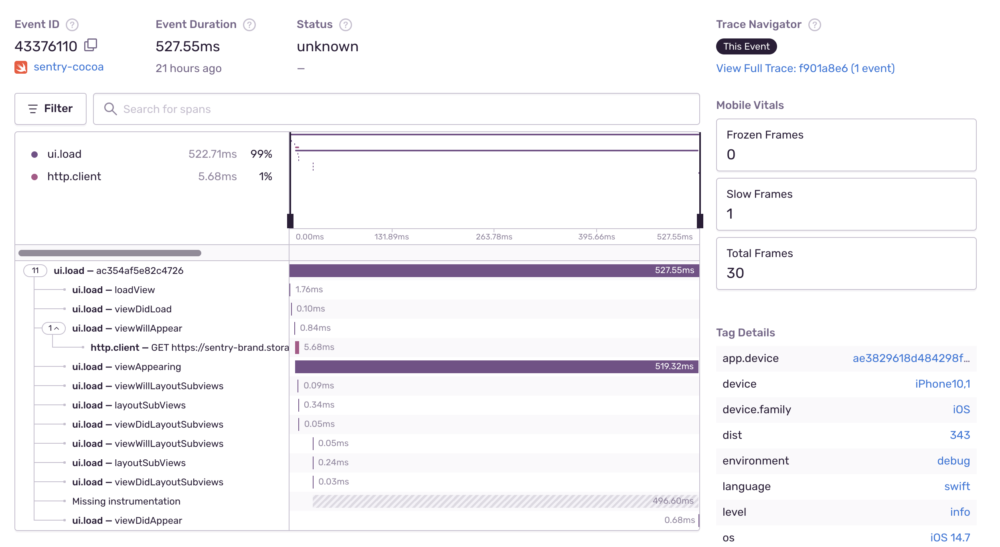
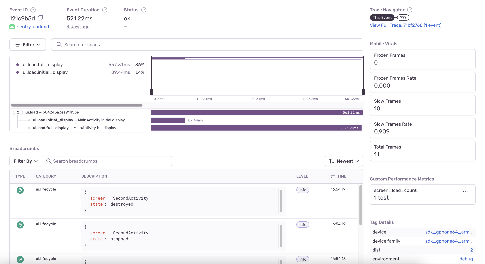

Mobile Vitals are a set of metrics that measure how fast your app starts and the number of slow and frozen frames your users experience. Each metric provides insights into the overall performance of your mobile application and gives you the details you need to not only prioritize critical performance issues, but to trace issues down to the root cause to solve them faster.

Mobile Vitals are summarized in several graphs on the **Performance** page in [sentry.io](https://sentry.io) in the "Mobile" tab.

## App Start

App start metrics track how long your mobile application takes to launch. For this, Sentry measures _cold starts_ and _warm starts_.

The definitions of cold start and warm start change slightly depending on the operating system. On iOS, Apple recommends your app take at most 400ms to render the first frame. On Android, the [Google Play console](https://developer.android.com/topic/performance/vitals/launch-time#av) warns you when a cold start takes longer than five seconds or a warm start longer than two seconds. For definitions by operating system, check out the corresponding SDK docs:

- [Android](/platforms/android/performance/instrumentation/automatic-instrumentation/#app-start-instrumentation)
- [Flutter](/platforms/flutter/performance/instrumentation/automatic-instrumentation/#app-start-instrumentation)
- [iOS](/platforms/apple/guides/ios/performance/instrumentation/automatic-instrumentation/#app-start-tracking)
- [React Native](/platforms/react-native/performance/instrumentation/automatic-instrumentation/#app-start-instrumentation)

In the example below, the detail view of a transaction displays the warm start measurement in the right sidebar.

While the SDKs differentiate between a cold and a warm start, they don't track hot starts or resumes.

## Slow and Frozen Frames

To track the responsiveness of the user interface, Sentry measures _slow frames_ and _frozen frames_. Typically, a phone or tablet renders 60 frames per second (fps). At 60 fps, every frame has 16 or 16.67 ms to render.

- **Slow Frames**: Using 60 fps, slow frames are frames that take more than 16 ms (Android) or 16.67 ms (iOS) to render.
- **Frozen Frames**: Frozen frames are frames that take longer than 700 ms to render.

For Apple, the frame rate can be higher, especially as 120 fps displays are becoming more popular. For these apps, Sentry detects the frame rate and adjusts the slow frame calculation accordingly.

In the example below, the detail view of the transaction displays the slow, frozen, and total frames in an iOS application:

You can track slow and frozen frames for:

- [Android](/platforms/android/performance/instrumentation/automatic-instrumentation/#slow-and-frozen-frames)
- [Flutter](/platforms/flutter/performance/instrumentation/automatic-instrumentation/#slow-and-frozen-frames)
- [iOS](/platforms/apple/guides/ios/performance/instrumentation/automatic-instrumentation/#slow-and-frozen-frames)
- [React Native](/platforms/react-native/performance/instrumentation/automatic-instrumentation/#slow-and-frozen-frames)

## Time to Initial Display and Time to Full Display

To track how long it takes your application to produce its first frame and then how long it takes to produce its first frame with all the content, Sentry measures time to initial display and time to full display, respectively.

- **Time to initial display**: tracks how long it takes for you mobile application to produce its first frame. This includes app start time on the first screen loaded. It doesn’t include any content loaded lazily after the first frame is drawn. Time to initial display is automatic and enabled by default.
- **Time to full display**: tracks how long it takes for your mobile application to produce its first frame with full content. This includes content loaded asynchronously after the first frame, for example, after loading content from the network. Time to full display is opt-in and requires you to manually call the API to report that the screen has loaded all of its content and is fully displayed.

In the example below, the detail view of the transaction displays the time-to-initial-display span in an Android application:

You can track time to initial display for:

- [Android](/platforms/android/performance/instrumentation/automatic-instrumentation/#time-to-initial-display)
- [Apple](/platforms/apple/performance/instrumentation/automatic-instrumentation/#time-to-initial-display)

You can track time to full display for:

- [Android](/platforms/android/performance/instrumentation/automatic-instrumentation/#time-to-full-display)
- [Apple](/platforms/apple/performance/instrumentation/automatic-instrumentation/#time-to-full-display)

## Screens

The **Screens** page shows an overview of how long it takes for your application to load its screens. Here you can identify slow or regressed screens and get additional information to understand the factors contributing to the slowness of both time to initial display (TTID) and time to full display (TTFD).

While Sentry automatically tracks TTID, [TTFD](#time-to-initial-display-and-time-to-full-display) requires for the `reportFullyDisplayed()` API to be called manually to report that the screen has loaded all of its content and is fully displayed.

**Minimum SDK Requirements:**

For Android:

- `>=5.0` for automatic activity transactions
- `>=6.10.0` for TTID
- `>=6.17.0` for TTFD, released March 2023

iOS:

- `>=3.13` for UIViewController transactions
- `>=8.4.0` for TTID+TTFD, released April 2023

By default, the **Screens** page displays metrics for the two releases with the highest screen counts for the time range you’ve selected. To choose a different set of releases to compare, use the “release selector” at the top of the page.

The charts section shows a comparison of TTID and TTFD for your top five screens across your two selected releases.

The sortable table below shows a list of your application's screens with the average TTID and TTFD for each release.

**Reasons Why You Might Not Be Seeing Any Data:**

- You don’t have any transactions with op `ui.load`
- Your SDKs don’t meet the minimum SDK requirements

## Screen Summary

To get additional information about any of your application's screens, click on them to get to the **Screen Summary** page. Here, you’ll see a breakdown of TTID and TTFD values broken out by [device class](/product/reference/search/searchable-properties/#device-classification) (high, medium, low, or unknown), across your selected releases. This will help you understand how users with different device performance levels are being affected.

The Screen Details page also shows the average TTID, average TTFD, and Count (the number of times a screen has been called) - broken out by release.

To quickly get to slow TTID and TTFD events and profiles for each release broken out by specific device class, use the “Device Class” dropdown at the top of the table.

At the bottom of the page, you’ll see a table of spans that occurred during screen load, sorted by the most time your screen spent in that span. Here, you’ll be able to:

- Spot span regressions by comparing the average duration of each span across your two releases of choice.

- Find the slowest spans in the release you’re interested in by looking at average span duration.

- See which spans occur most frequently by looking at “Count”. (This might help you identify excessive io calls or repeated work that might be occurring during screen load.)

**Eligible span operations:**

- file.read
- file.write
- ui.load
- http.client
- db
- db.sql.query
- db.sql.transaction

## Span Detail View

If you click on a span description, it’ll open a side panel view where you can see span details including the average duration and count for that span in each of the releases you’re looking at.

In the table below, you’ll see a list of sampled events and profiles (if they exist). By comparing the two, you’ll be able to see how much the duration of the span you’re looking at deviates from average spans in each of the two releases you’ve selected.

Sentry automatically identifies sample events to help you investigate performance problems. (They’re shown as triangles in the “Average Duration” graph.) To give you an accurate picture, a range of faster than average, slower than average, and average span durations are sampled across the whole time period you’ve selected.

You can use the sample list to drill down to and compare fast, average, and slow events of interest within a given screen.

Clicking on a sample event will take you into either the query's span details within the span waterfall of the **Event Details** page or the profile icon to see the [flamegraph](/product/profiling/flame-charts-graphs/) for the event. To get different event samples, click the "Try Different Samples" button.
