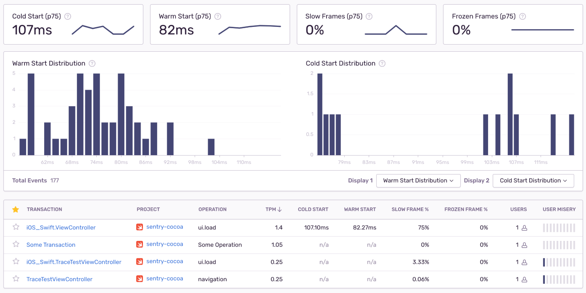

Mobile Vitals are a set of metrics that measure how fast your app starts and the number of slow and frozen frames your users experience. Each metric provides insights into the overall performance of your mobile application and gives you the details you need to not only prioritize critical performance issues, but to trace issues down to the root cause to solve them faster.

Mobile Vitals are summarized in several graphs on the **Performance** page in [sentry.io](https://sentry.io) when you select "Mobile" in the "Display" dropdown.

## App Start

App start metrics track how long your mobile application takes to launch. For this, Sentry measures *cold starts* and *warm starts*.

- **Cold Start**: A cold start refers to when the app launches for the first time, after a reboot or update. The app is not in memory and no process exists.
- **Warm Start**: A warm start refers to when the app has already launched at least once and is partially in memory. For instance, the user backs out of your app, but then re-launches it. The process may have continued to run, but the app must recreate the activity from scratch.

On iOS, Apple recommends your app take at most 400ms to render the first frame. On Android, the [Google Play console](https://developer.android.com/topic/performance/vitals/launch-time#av) warns you when a cold start takes longer than five seconds or a warm start longer than two seconds. The exact definitions differ slightly per platform. Learn more in our [iOS](/platforms/apple/guides/ios/performance/instrumentation/automatic-instrumentation/), [Android](/platforms/android/performance/instrumentation/automatic-instrumentation/), and [React Native](/platforms/react-native/performance/instrumentation/automatic-instrumentation/) SDK docs.

In the example below, the detail view of a transaction displays the warm start measurement in the right sidebar.

While the SDKs differentiate between a cold and a warm start, they don't track hot starts or resumes.

## Slow and Frozen Frames

To track the responsiveness of the user interface, Sentry measures *slow frames* and *frozen frames*.  Typically, a phone or tablet renders 60 frames per second (fps). At 60 fps, every frame has 16 or 16.67 ms to render.

- **Slow Frames**: Using 60 fps, slow frames are frames that take more than 16 ms (Android) or 16.67 ms (iOS) to render.
- **Frozen Frames**: Frozen frames are frames that take longer than 700 ms to render.

For Apple, the frame rate can be higher, especially as 120 fps displays are becoming more popular. For these apps, Sentry detects the frame rate and adjusts the slow frame calculation accordingly.

In the example below, the detail view of the transaction displays the slow, frozen, and total frames in an iOS application:

