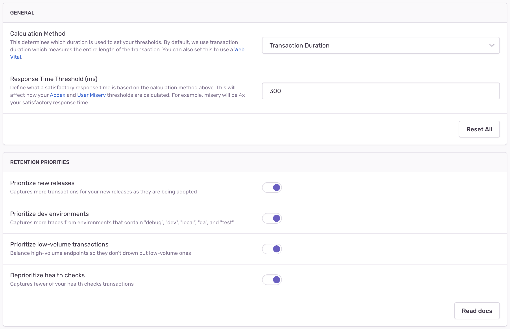

<Note>

This feature is only available on the latest version of our plans, starting from 1M reserved transactions. Anyone in your org with owner or billing-level permissions can update your plan by going to Settings > Subscription, and clicking the "Manage Subscription" button.

</Note>

## Current Limitations

The **Performance at Scale** feature is currently only available for the following SDKs:

<Include name="sampling-supported-sdks.mdx" />

If your application relies on any Sentry SDK that isn't specified above, then you won’t be able to use Sentry's **Performance at Scale**.

## 1. Update Sentry SDK Versions

Once you’ve confirmed that your application only relies on [supported SDKs](#current-limitations), then the next step is to update them to the specified version or higher. Check out the migration documentation for the [SDKs](/platforms/) you’re using to learn everything you need to know to get up and running again with the latest Sentry features.

## 2. Optionally, Update Retention Priorities

While we do our best to provide you with the most useful transaction data, we recognize that every project is different. For example, you may have a project where retaining transactions from the latest release or development environments is not a priority for you.

You can update your configuration by going into your project settings and navigating to the Performance tab. The feature allows you to turn the priorities that we apply to your data retention on or off: you can set these toggles differently for different projects.

By default, these toggles are all enabled so that Sentry's retention priorities are applied to your data.

## 3. Increase Your SDK Transaction Sample Rate {#4-increase-your-sdk-transaction-sample-rate}

Our Performance at Scale feature works best when you send us as much data as you can (ideally 100%). As you purchase more transaction volume, your per-transaction pricing goes down accordingly, so you can affordably monitor your application at any scale. Update your transaction sample rate in the SDK by setting the [tracesSampleRate](/platform-redirect/?next=/performance/).
