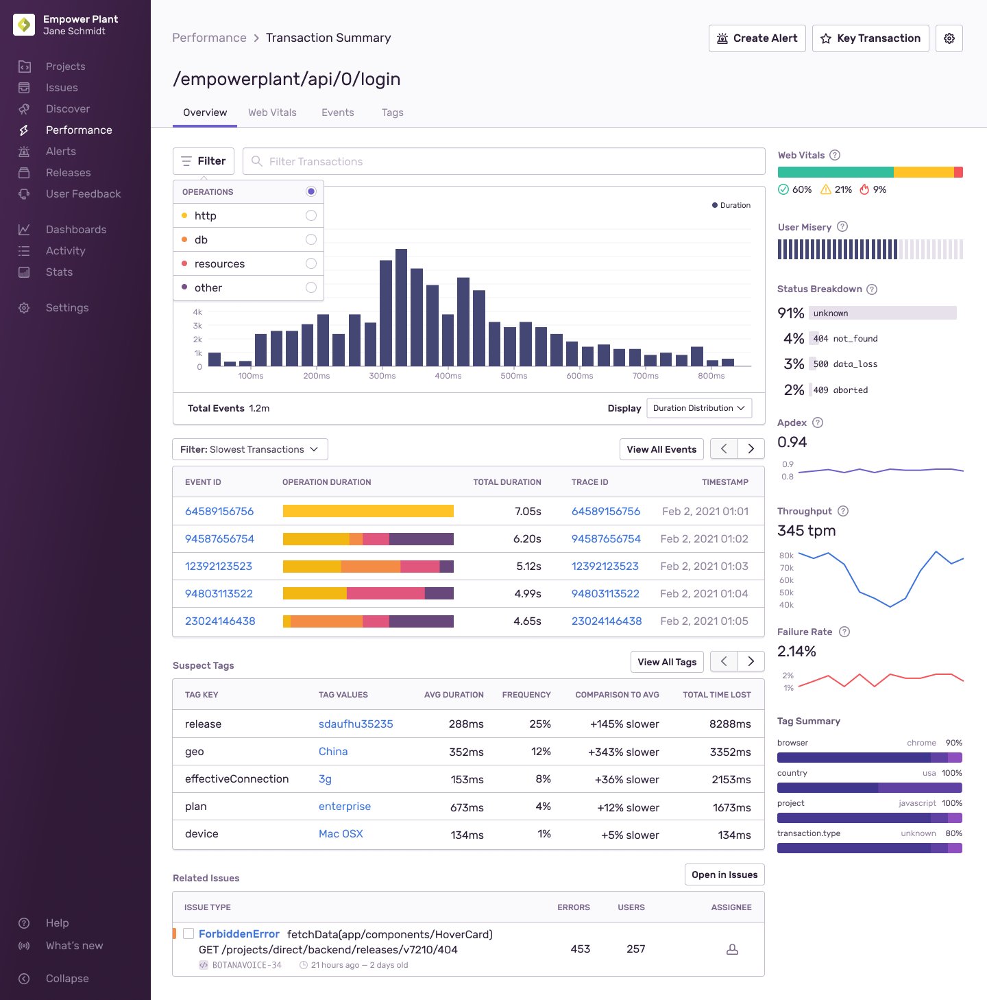
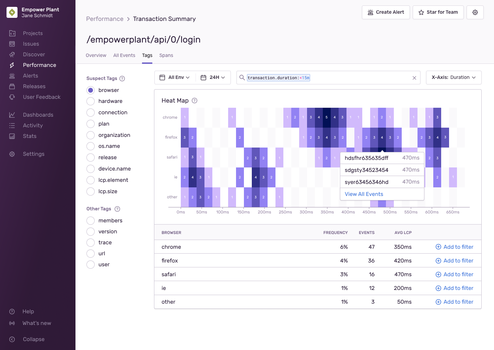
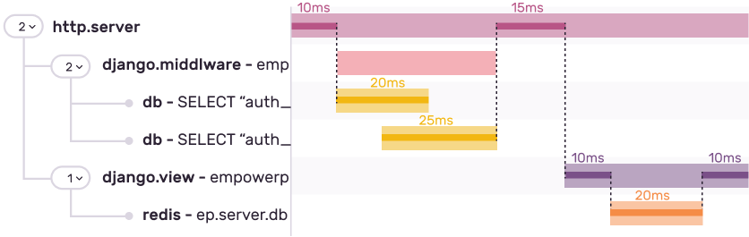

Every transaction has a summary view that gives you a better understanding of its overall health. With this view, you'll find graphs, instances of these events, stats, facet maps, related errors, and more.

## What Is a Transaction?

A transaction represents a single instance of an activity you want to measure or track, like a page load, page navigation, or an asynchronous task. Having transaction information lets you monitor the overall performance of your application beyond when it crashes or generates an error. Without transactions, you can only know when things in your application have actually gone wrong, which is important, but not the whole picture.

Transactions on the **Performance** page are grouped by the transaction names, such as endpoint paths for backend request transactions (like `/store/checkout/` or `api/v2/users/<user_id>/`) or URLs/routes for page load transactions (like `https://docs.sentry.io/performance-monitoring/`). When you click a transaction on the **Performance** page, it takes you to the **Transaction Summary**, where you can see a list of transaction events: that is, the individual instances of that specific transaction.

<Note>

Learn more about setting transaction names in our [SDK documentation](/platform-redirect/?next=/enriching-events/transaction-name/).

</Note>

Learn about how to control the type and amount of transactions you send to Sentry, in [Manage Your Transaction Quota](/product/accounts/quotas/manage-transaction-quota/). For a more in-depth explanation of what’s in a transaction as it relates to traces, check out our [full tracing documentation](/product/sentry-basics/tracing/).

## Overview

### Filter and Search

While you can use the search field to narrow down your events, you can also filter by http, db, browser, and resource by toggling between operations in the "Filter" menu. This filtering is reflected in the rest of the page, which provides you with more targeted drill-downs.

### Graphs

- **Duration Breakdown:** By graphing [P50](/product/performance/metrics/#p50-threshold), [P75](/product/performance/metrics/#p75-threshold), [P95](/product/performance/metrics/#p95-threshold), [P99](/product/performance/metrics/#p99-threshold), and P100 durations distinctly, you can utilize this display to see their transaction performance over time. Toggle the display of each segment by clicking on the legend (including Releases). Also, zoom in on specific slices to investigate spikes or possible performance regressions from a release.

- **Duration Percentiles:** This graph shows the [average transaction duration](/product/performance/metrics/#average-transaction-duration) across distinct percentiles. For example, see how different the P50 and P99 response time durations are for a given transaction and understand the rate of increase between segments.

- **Duration Distribution:** This graph shows the volume of transactions per median duration. This view helps you understand the spread of the transaction durations in order to determine the likelihood of different outcomes. For example, what transaction duration is the most likely for a user.

- **Trends:** This graph uses a modified version of [ASAP](https://arxiv.org/pdf/1703.00983.pdf) smoothing. The Trends graph shows the unsmoothed data of the Display data, along with a smoothed version of that data.

- **Web Vitals:** This graph displays the [P75 threshold](/product/performance/metrics/#p75-threshold) of [First Paint](/product/performance/web-vitals/#first-paint-fp), [First Contentful Paint](/product/performance/web-vitals/#first-contentful-paint-fcp), [Largest Contentful Paint](/product/performance/web-vitals/#largest-contentful-paint-lcp), and [First Input Delay](/product/performance/web-vitals/#first-input-delay-fid) over time. This view helps you understand how the web vitals associated with the transaction are performing over time.

- **User Misery:** This graph displays the [User Misery](/product/performance/metrics/#user-misery) score for the transaction. User Misery is a score that represents the number of unique users who have experienced load times four times the project's configured threshold.

### Transaction Table

On initial load, the table displays slow occurrences of the transaction along with the Event ID, User, [Operations Breakdown](/product/sentry-basics/tracing/event-detail/#operations-breakdown), Total Transaction Duration, and Timestamp of the event. Click on the Event ID to open the [event detail](/product/sentry-basics/tracing/event-detail/) or the Trace ID to view the [full trace](/product/sentry-basics/tracing/trace-view). Other sets of transactions you can browse through are below.

- Fastest Transactions
- Slow Transactions (p95)
- Outlier Transactions (p100)
- Recent Transactions

The table also updates dynamically if you change any of the project, environment, or date range filters or when you drill in on a latency segment (applicable when viewing the Latency Histogram).

When viewing transactions, you may want to create more curated views. Click "Open in Discover" above the table to create a custom query to investigate further. For more details, see the full documentation for the Discover [Query Builder](/product/discover-queries/query-builder/).

<Note>

Currently, only transaction data — the transaction name and any attributes the transaction inherits from its root span — is searchable. Data contained in spans other than the root span is not indexed and therefore cannot be searched.

</Note>

### Suspect Spans

The transaction summary includes a list of suspect spans that correspond to where most of the time in a transaction is spent. By default, we sort spans by the total self time. When you click the "Example Transaction" event, it takes you directly to the span in question.

### Suspect Tags

The transaction summary includes a list of suspect tags that often correspond to slower transactions. By default, we sort tags by the total time lost. The list includes additional information:

- **Tag Key**: The tag category (for example, device, geo)
- **Tag Value**: The specific tag value (for example, Android, South America)
- **Avg (Tag) Duration**: Provides the average duration for a transaction with this tag
- **Comparison to Avg**: Indicates how much slower or faster this tag is than the average duration of this transaction
- **Total Time Lost**: Calculates how much total time you've lost in the selected time range when comparing the average tag duration to the average transaction duration

To investigate why these tags are affecting performance, click on the tag value to filter the transaction summary further.

### Related Issues

This table will show you all related issues. In other words, any errors that are associated with this transaction. Click "Open in Issues" to see the full list.

### Sidebar

The sidebar contains helpful supplementary information about this transaction's [User Misery](/product/performance/metrics/#user-misery), [Apdex](/product/performance/metrics/#apdex), [Throughput](/product/performance/metrics/#throughput-total-tpm-tps), [Latency](/product/performance/metrics/#latency), and more. You'll also find a Tag Summary (facet map) for a list of common tags related to this transaction.

## Web Vitals

Frontend transactions will have a "Web Vitals" tab. Clicking on the tab will take you to the [Web Vitals page](/product/performance/web-vitals), where you can see a detailed view of the web vitals associated with this transaction.

## Tags

The **Tags** tab displays a list of suspect tag keys that often correspond to slower transactions. Toggle through them to have the corresponding tag values reflected in the heat map. Similar to a histogram, events are distributed by duration. Click on any purple box to view a list of events or continue to filter down the events by adding values to the filter in the table below the heat map. Use the "X-Axis" dropdown to aggregate the events by transaction duration or by Largest Contentful Paint (LCP).

## All Events

The table in **All Events** tab offers a full list of transactions broken down similar to the abbreviated table in the overview. Filters are carried across from other views. You can also narrow the events down by percentile.

## Spans

The "Spans" tab displays a list of suspect spans that correspond to where most of the time in a transaction is being spent, and it can help you find spans where performance problems lie.

Choose from one of several [metrics](#metrics) to sort spans and identify different types of problems. Filter spans to only see the span operation type you're interested in.

### Span Summary

Clicking on a span will take you to its summary page which will give you more details about this specific span [group](#grouping). On the page, you can see the performance of the span over time and see a list of transaction events that contain the span.

<Note>

This span distribution feature is available only if you're in the Early Adopter program. Features available to Early Adopters are still in-progress and may have bugs. We recognize the irony. If you’re interested in being an Early Adopter, you can turn your organization’s Early Adopter status on/off in General Settings. This will affect all users in your organization and can be turned back off just as easily.

</Note>

If you're in the Early Adopter program, you can also see the distribution of the span self time using the (added) "Display" dropdown. This histogram can help you identify systemic performance issues across the entire dataset by showing how self time for every span instance is distributed.

You can also select a subset of the dataset by zooming into the distribution histogram. The stats and transaction events table will reflect that change and will only include spans with self time that are within the bounds of your subset. This allows you to focus on the best or worse performing spans so you can troubleshoot performance issues more easily.

### Self Time

Suspect spans are determined using a span's self time rather than its duration. To calculate a span's self time, take the interval of the span and subtract the intervals of any child spans. The duration of the remaining interval is the span's self time.

In the example below, the self time of each span is highlighted by the darker areas. For example, the `http.server` has a self time of 10ms + 15ms = 25ms.

### Metrics

- **Total Self Time**: The sum of the [self time](#self-time) for a span. This metric is useful to identify the span where the majority of the time is being spent.
- **Average Count**: The average number of times a span appears in a transaction. This metric is useful to identify redundant work being done within a transaction. It is often indicative of an n + 1 problem.
- **Total Count**: The total number of times a span appears across all transactions. This metric is useful to identify spans that appear most frequently.
- **p50 Self Time**: The 50th percentile of the [self time](#self-time) for a span. This metric is useful to identify spans that take a long time individually.
- **p75 Self Time**: The 75th percentile of the [self time](#self-time) for a span. This metric is useful to identify spans that take a long time individually.
- **p95 Self Time**: The 95th percentile of the [self time](#self-time) for a span. This metric is useful to identify spans that take a long time individually.
- **p99 Self Time**: The 99th percentile of the [self time](#self-time) for a span. This metric is useful to identify spans that take a long time individually.

### Grouping

Spans with the same operation and description are grouped together into a single span group. Some processing is done to group similar spans together. If you find that the span grouping is not ideal, you can change this by making sure the spans you want grouped together have the same operation and description.

### Replays

The Replays tab displays a list of replays where the transaction you’re viewing had occurred. Go directly to [Replay Details](/product/session-replay/replay-details/) for any replay and see how a slow transaction impacted the user experience. Note: you must have [Session Replay](/product/session-replay/) enabled to see this tab.

## Additional Actions

### Starring Important Transactions {#starring-key-transactions}

If you find an important transaction you want to return to, click "Star for Team" in the upper right corner to mark it as a key transaction for any of your teams. This will be saved so you can view this from your [Performance Homepage](/product/performance/). The transactions you star will be shared with members of the same team and each team can have up to 100 starred transactions.

### Creating Alerts

To create a metric alert rule for this transaction, click [Create Alert](/product/alerts-notifications/metric-alerts/) at the top of the page.
