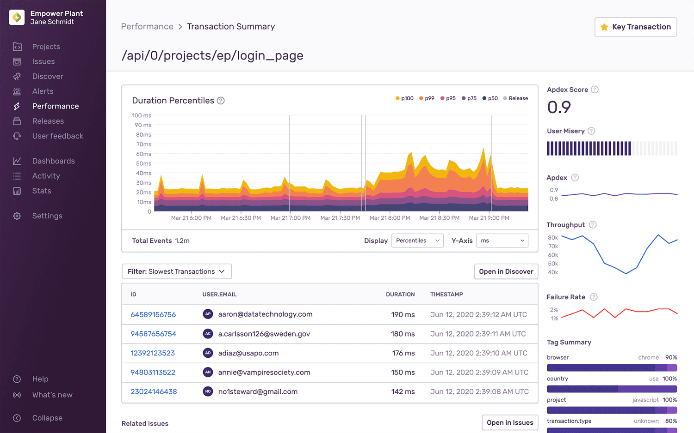

Every transaction has a summary view that gives you a better understanding of its overall health. With this view, you'll find graphs, instances of these events, stats, facet maps, related errors, and more.

## Key Transaction

If you find an important transaction you want to return to, click "Key Transaction" in the upper right corner to star it. This will be saved so you can view this from your [Performance Homepage](/product/performance/). Keep in mind any key transaction you mark will not be shared with others in your organization and are limited to ten per user.

## Web Vitals

Frontend transactions will have a "Web Vitals" tab. Clicking on the tab will take you to the [Web Vitals page](/product/performance/web-vitals), where you can see a detailed view of the web vitals associated with this transaction.

## Graphs

### Duration Breakdown

By graphing [P50](/product/performance/metrics/#p50-threshold), [P75](/product/performance/metrics/#p75-threshold), [P95](/product/performance/metrics/#p95-threshold), [P99](/product/performance/metrics/#p99-threshold), and P100 durations distinctly, you can utilize this display to see their transaction performance over time. Toggle the display of each segment by clicking on the legend (including Releases). Also, zoom in on specific slices to investigate spikes or possible performance regressions from a release.

### Latency Histogram

Visualize the frequency of transactions that occur within each response time segment. This histogram view can help you understand the shape of transaction response times and quickly see outliers. Click on specific segments to drill down for more granularity.

### Duration Percentiles

This graph shows the [average transaction duration](/product/performance/metrics/#average-transaction-duration) across distinct percentiles. For example, see how different the P50 and P99 response time durations are for a given transaction and understand the rate of increase between segments.

### Trends

This graph uses a modified version of [ASAP](https://arxiv.org/pdf/1703.00983.pdf) smoothing. The Trends graph shows the unsmoothed data of the Display data, along with a smoothed version of that data.

## Transaction Table

On initial load, the table displays slow occurrences of the transaction along with the Event ID, User, Transaction Duration, and Timestamp of the event. Click on the Event ID to open the [event detail](/product/performance/event-detail/) for the transaction. Other sets of transactions you can browse through are below.

- Fastest Transactions
- Slow Transactions (p95)
- Outlier Transactions (p100)
- Recent Transactions

The table also updates dynamically if you change any of the selections in the global header or when you drill in on a latency segment (applicable when viewing the Latency Histogram).

When viewing transactions, you may want to create more curated views. Click "Open in Discover" above the table to create a custom query to investigate further. For more details, see the full documentation for the Discover [Query Builder](/product/discover-queries/query-builder/).

_Note_: Currently, only transaction data - the transaction name and any attributes the transaction inherits from its root span - is searchable. Data contained in spans other than the root span is not indexed and therefore cannot be searched.

## Sidebar

The sidebar contains helpful supplementary information about this transaction's [User Misery](/product/performance/metrics/#user-misery), [Apdex](/product/performance/metrics/#apdex), [Throughput](/product/performance/metrics/#throughput-total-tpm-tps), [Latency](/product/performance/metrics/#latency), and more. You'll also find a Tag Summary (facet map) for a list of common tags related to this transaction.

## Related Issues

This table will show you all related issues. In other words, any errors that are associated with this transaction. Click "Open in Issues" to see the full list.
