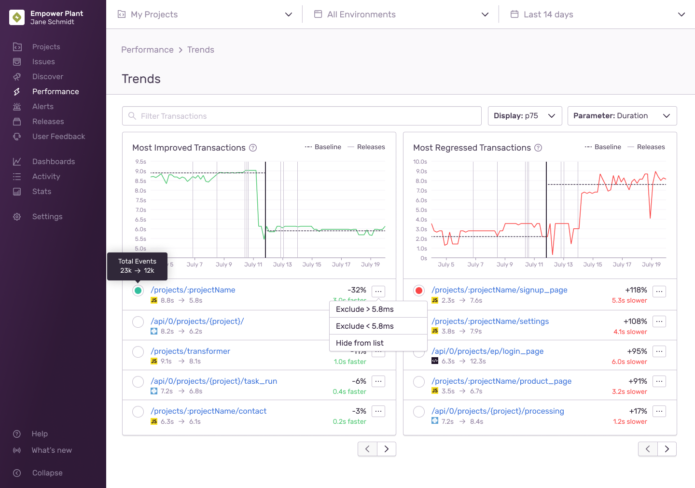

From the Performance homepage, you can find the Trends View by toggling the tab in the Performance homepage's upper right corner. This page surfaces transactions that have had significant changes in their performance over time.

Trending transactions are calculated first by filtering out transactions with large [throughput](/product/performance/metrics/#throughput-total-tpm-tps) fluctuations, determining the baselines of the two halves of the duration, and calculating their percentage change. Regressions are any percentage changes greater than zero, while improvements are percentage changes less than zero.
Sentry uses a [t-test](https://academic.oup.com/beheco/article/17/4/688/215960) to compare the before and after periods of the transaction and assign a confidence score.

This confidence score is unbounded, and by default [sentry.io](https://sentry.io) shows trends with a high confidence score. To view trends regardless of the confidence score, add `confidence():>0` to the search bar.

For example, looking at a transaction over two weeks with the default [P50](/product/performance/metrics/#average-transaction-duration) baseline, if the first week had a `p(50)=100s`, and the second a `p(50)=110s`, the percentage is `(110/100)-1 = 0.1`. The example transaction had a performance regression of `10%`.

The more data is available, the more the accuracy of the trend improves. For this reason, trends perform best over long periods and with transactions with large counts.

While we default the baseline calculation to use P50, you can change the baseline calculation via the dropdown. Other options include P75, P95, P99, and average, and this baseline is used to determine the percentage change.
