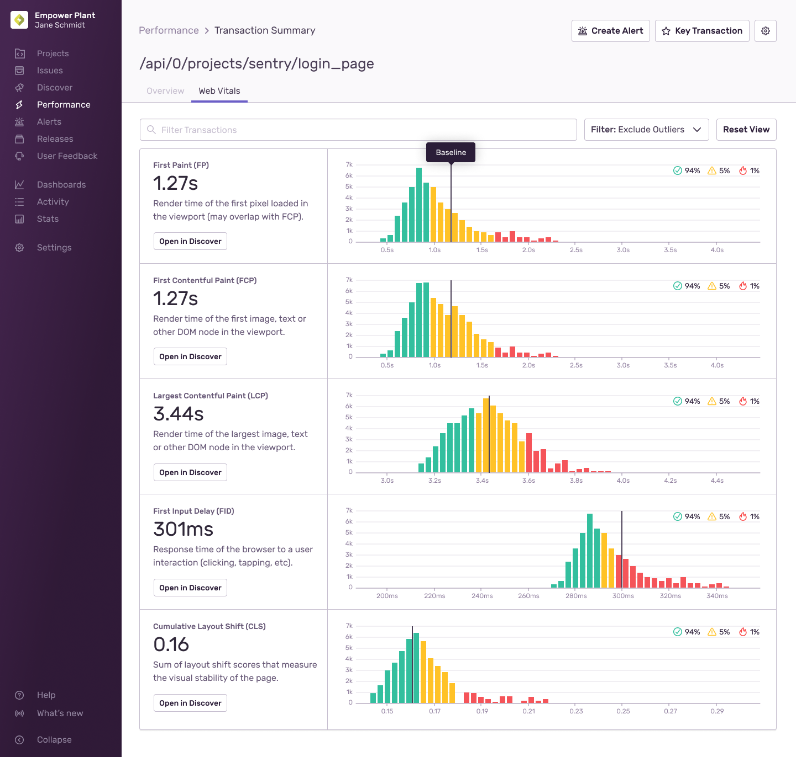
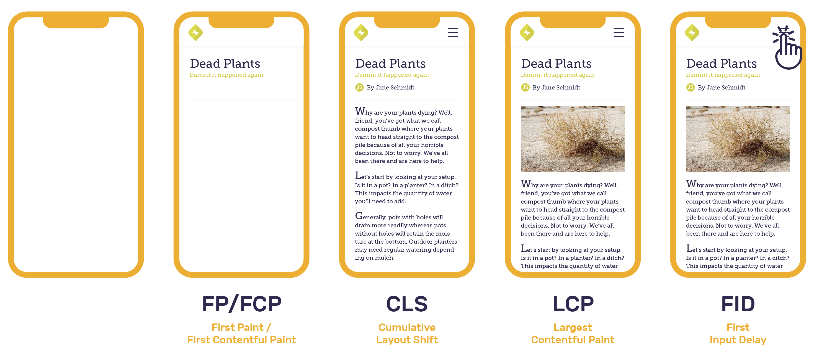

Frontend transactions may contain web vitals information if the browser provides them. With this view, you'll be able to examine a summary of the web vitals.



| Web Vital                                                 | Availability                  | Failure Threshold |
| --------------------------------------------------------- | ----------------------------- | ----------------- |
| [First Paint](#first-paint-fp)                            | Chromium                      | 3 seconds         |
| [First Contentful Paint](#first-contentful-paint-fcp)     | Chromium                      | 3 seconds         |
| [Largest Contentful Paint](#largest-contentful-paint-lcp) | Chromium                      | 4 seconds         |
| [First Input Delay](#first-input-delay-fid)               | Chromium, Firefox, and Safari | 300 milliseconds  |
| [Cumulative Layout Shift](#cumulative-layout-shift-cls)   | Chromium                      | 0.25              |


## Baseline Value

The baseline value for each web vital is the 75th percentile of the observed data points. It is compared against a failure threshold to give a pass or fail for each web vital.

<Note>
Web Vital terminologies such as "75th percentile" and "failure threshold" apply to the specific Web Vitals. Not to be confused with similar terminology for Performance Metrics.
</Note>

## Distribution Histogram

A histogram visualization showing the data distribution can help you identify and diagnose frontend performance problems by revealing anomalies.

By default, outliers will be excluded from the histograms to provide a more informative view of these vitals. Outliers are determined using the [upper outer fence](https://en.wikipedia.org/wiki/Outlier#Tukey's_fences) as the upper bound, and any data points above the upper bound are deemed an outlier.

If you notice a region of interest on any of the histograms, click and drag over the area to zoom in for a more detailed view. You may also want to see more information related to the transactions in the histograms. Click "Open in Discover" beneath the web vital of choice to build a custom query for further investigation. For more details, see the full documentation for the Discover [Query Builder](/product/discover-queries/query-builder/).

If you wish to see all of the data available, open the dropdown and click "View All". You will likely see extreme outliers when you click "View All". You can click and drag over an area to zoom in for a more detailed view.

## Web Vitals

[Web Vitals](https://web.dev/vitals/) are a set of metrics defined by Google to measure render time, response time, and the sum of shifting rendering processes. Each data point provides insights about the overall performance of your application.



<Note>

Some web vitals such as FP, FCP, LCP, and TTFB are measured relative to the beginning of the transaction's timestamp. Values may differ when compared to values generated with other tools such as [Lighthouse](https://github.com/GoogleChrome/lighthouse).

</Note>

### First Paint (FP)

First Paint (FP) measures the amount of time the first pixel takes to appear in the viewport, rendering any visual change from what was previously displayed. This may be in any form from the document object model (DOM), such as background color, canvas, or image. FP helps developers understand if anything unexpected is happening to render the page.

### First Contentful Paint (FCP)

[First Contentful Paint (FCP)](https://web.dev/fcp/) measures the time for the first content to render in the viewport. This may be in any form from the document object model (DOM), such as images, SVGs, or text blocks. FCP frequently overlaps with First Paint (FP). FCP helps developers understand how long it takes before the user sees any content change on the page.

### Largest Contentful Paint (LCP)

[Largest Contentful Paint (LCP)](https://web.dev/lcp/) measures the render time for the largest content to appear in the viewport. This may be in any form from the document object model (DOM), such as images, SVGs, or text blocks. It is the largest pixel area in the viewport, thus most visually defining. LCP helps developers understand how long it takes before the user sees the main content on the page.

### First Input Delay (FID)

[First Input Delay (FID)](https://web.dev/fid/) measures the response time when the user tries to interact with the viewport. Actions may include clicking a button, link, or other custom Javascript controller. FID provides critical data on successful or unsuccessful interactions on an application page.

### Cumulative Layout Shift (CLS)

[Cumulative Layout Shift (CLS)](https://web.dev/cls/) is the sum of individual layout shift scores for every unexpected element shift during the rendering process. Imagine navigating to an article and trying to click a link before the page finishes loading. Before your cursor even gets there, the link may have shifted down due to an image rendering. Rather than using duration for this web vital, the CLS score represents the extent of the disruptive and visually unstable shifts.


Each layout shift score is calculated using an impact and distance fraction. The impact fraction is the total visible area that the element affects between the two rendered frames. The distance fraction measures the distance it has moved relative to the viewport.

```
Layout Shift Score = Impact Fraction * Distance Fraction
```

Let’s take a look at the example above which has one unstable element - the body text. The impact fraction is roughly 50% of the page and moves the body text down by 20%. The layout shift score is 0.1, the product of 0.5*0.2. Thus, CLS is 0.1.
