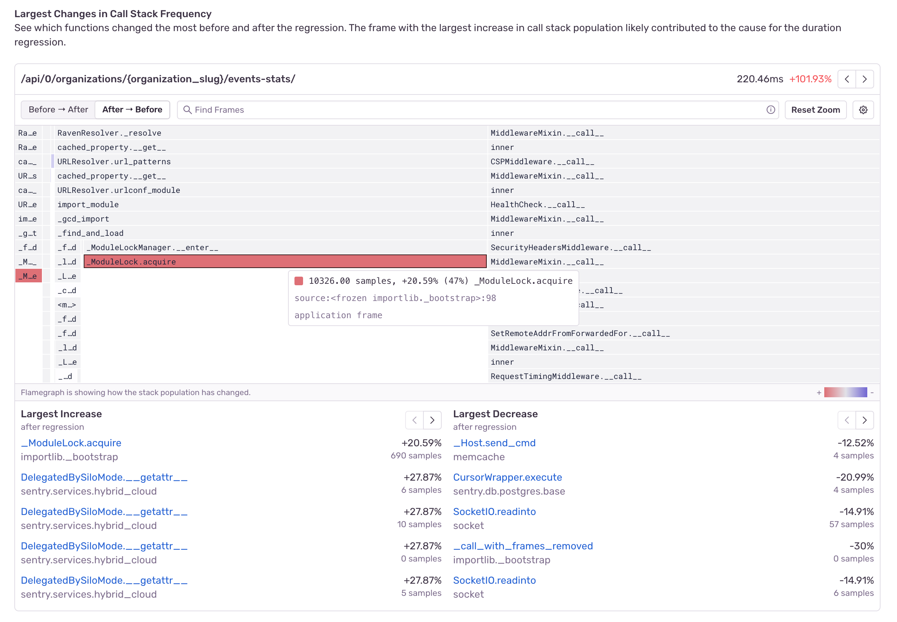
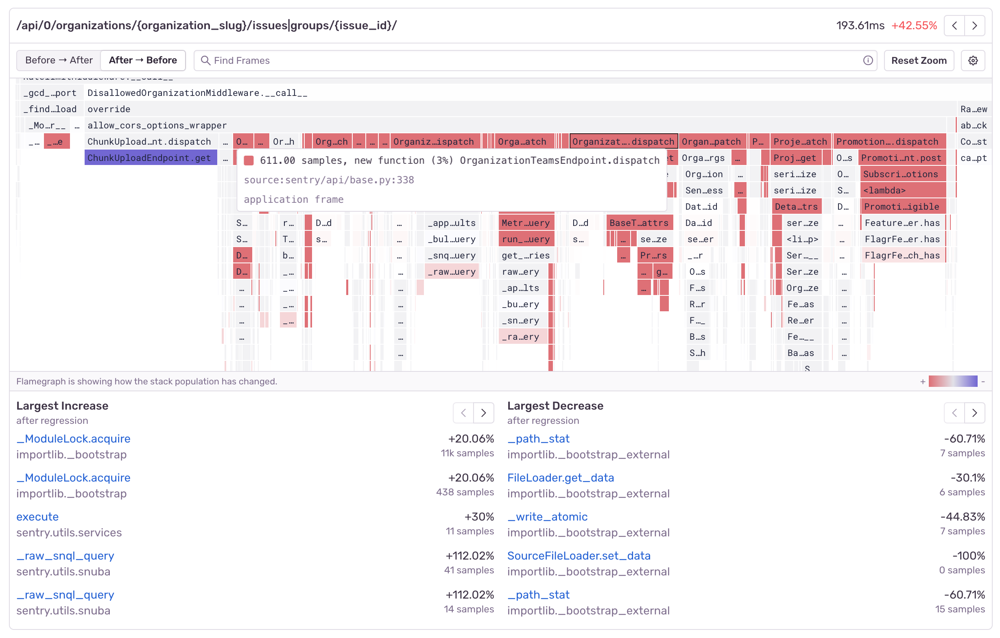
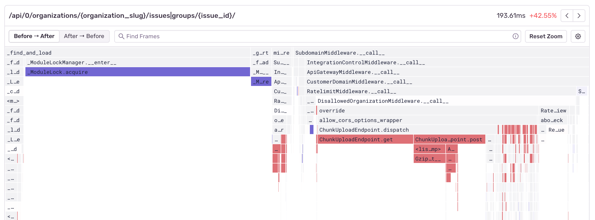
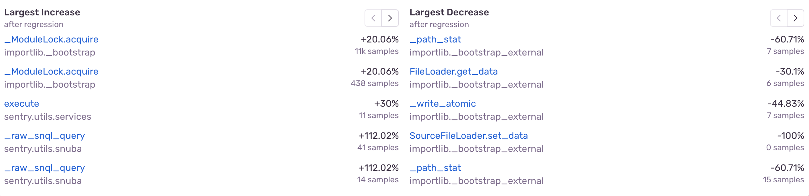

There are multiple ways to visualize and use profiling data, including differential flamegraphs, which can help easily identify function regressions or changes in the execution context.

## What Are Differential Flamegraphs?

Differential flamegraphs are graph visualizations that focus on highlighting the differences between two graphs. Their intent is to highlight how the call stack frequencies of our program have changed, something which can otherwise be quite tedious. They are often used in analysis, finding function regressions and understanding which functions got slower, faster, or which were newly added. While they are a new concept to learn, it might be easier to know that they are really just aggregate flamegraphs, drawn using the colors generated by the diff of two flamegraphs.

At Sentry, differential flamegraphs are shown whenever a function regression has been detected. When this happens, Sentry will generate an aggregate flamegraph from the period leading up to when your regression occurred, an aggregate flamegraph from after the regression had occurred, and use a differential flamegraph to visualize the data.

**When looking at a differential flamegraph, it is important to know that frames drawn red mean that this function's execution time has increased, whereas blue drawn frames means that the execution has decreased. Note that any newly present functions will also be colored red.**

The guiding principle when interpreting differential flamegraphs is to look for red frames - they are the reason why your application code has been performing worse.

The differential flamegraph above has highlighted that the function call to `ModuleLock.acquire` has increased in duration, which hints at a lock contention problem which is now slowing down our code.

Lets look at another example

We can see that new function calls to `OrganizationTeamsEndpoint.dispatch` were introduced which made our code run slower while calls to `ChunkUploadEndpoint.get` have decreased.

If you followed closely, you might have noticed that the top right corner contains a `Before -> After` and `After -> Before` toggle. This is because by default, the differential flamegraphs draw the aggregate flamegraph from after the regression as the source of truth, which means that any code which might have been removed, will no longer be drawn (after all, it's not there anymore). This is why negating the view is useful, as it allows us to compare the data from before and peek into the future of how our code will change.

Let us see an example of how our module lock problem looks like when using the profiling data from after the regression as the source of truth:

And now lets switch to using the data from before the regression as our source of truth

We can see here that `ModuleLock.acquire` was faster before the regression, but we can also see some of the function calls inside our `ChunkUploadEndpoint`, which are no longer being called.

Besides the color scheme and a different source of data, differential flamegraphs follow a similar UI pattern as aggregated flamegraphs. You can pan/zoom around the chart and search for frames like in a regular flamegraph.

The table under the differential flamegraph represents the largest changes in function durations. The functions on the left have increased in duration while the functions on the right have improved in duration.

Differential flamegraphs are a powerful feature that allow us to quickly visualize potential sources of performance regressions or improvements and while they are currently only available as part of the automated function regression workflow, we will be adding them to other parts of the profiling workflow.
