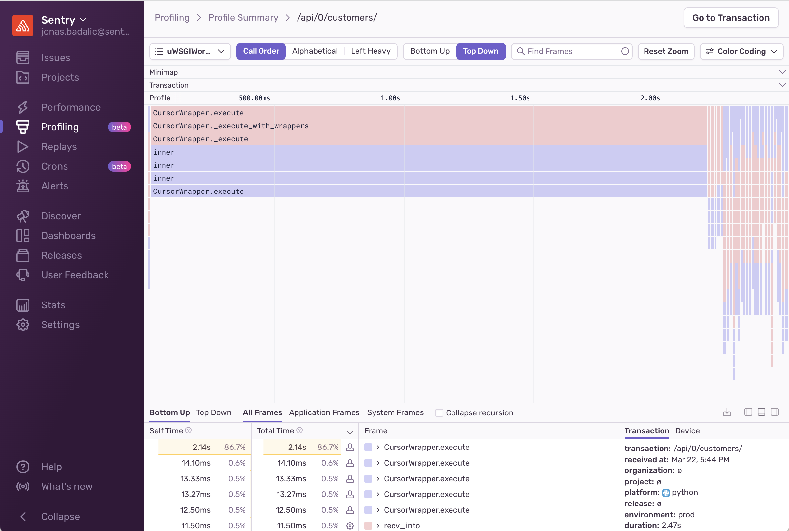
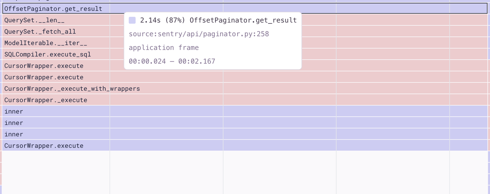
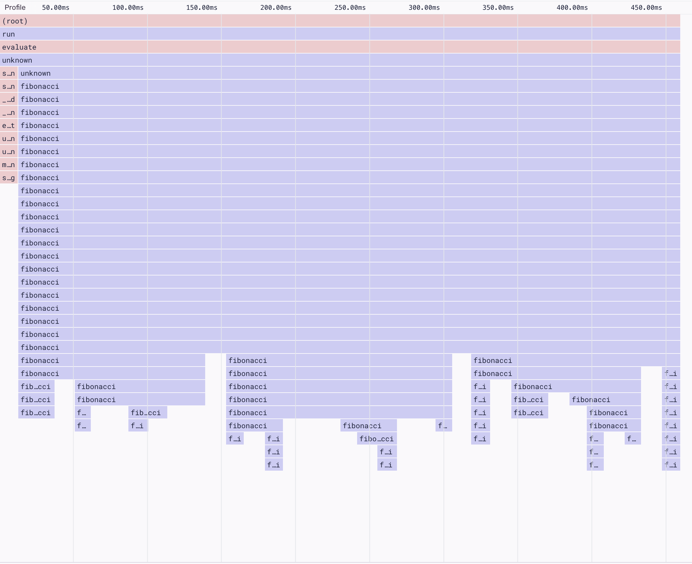
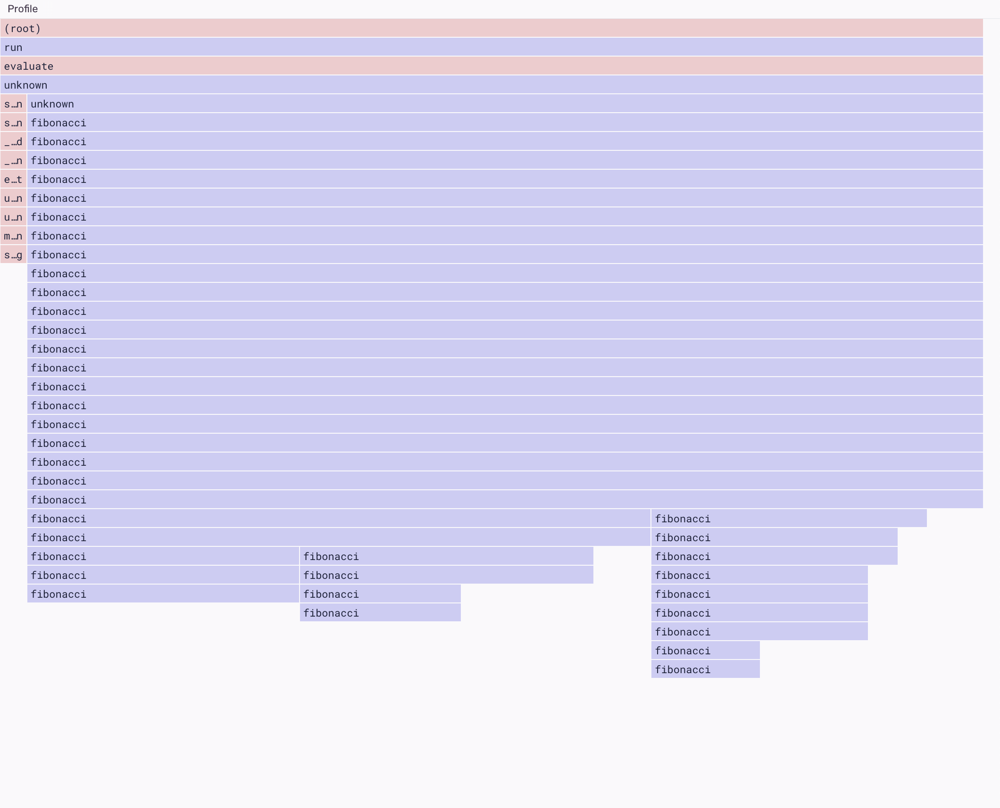
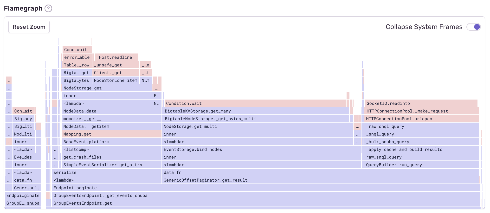

Profiling data can be used to gain insight into what methods and lines of your code are slow. But getting this type of insight requires an understanding of how profiling data is represented and visualized. Sentry uses both flame charts and flame graphs to visualize profile data. We'll explain how to read them below.

## What are Flame Charts?

Flame charts show stack samples in chronological order over the duration of a single profile. Each rectangle in the visualization represents a stack frame. The X-axis on a flame chart represents time, while the Y-axis shows the execution stack at that time. This makes it possible to see what your program was executing at any given point while the profile was being collected.

The most important things to look at when interpreting flame charts are the **color** and **width** of the rectangle representing each frame on the stack.

### Color

Color schemes vary, but in Sentry, system functions are colored red, and application functions are blue.

If your code is slow because of red system frames, there's usually not much you can do to speed it up. However, you can influence the execution of any blue application frames in your code.

As an example, consider a function called `readFile` that reads a file from the disk. While you can't modify the underlying kernel `open()` system call that's called, you can change your application code to only call that function once, and reuse the file contents afterward. This would reduce disk I/O (a common performance bottleneck).

### Width

The width of each stack frame's rectangle represents the time spent in that function. By looking at a flame chart, we can see two key pieces of information: **function total time** and **function self-time**.

Function total time refers to how long it takes for a function _and all of its children to execute_. Function self-time refers to how much time the function itself takes to execute, excluding the time spent in child functions.

Let's look at an example to understand the difference.

This image shows a section of a flame chart, starting with the function `OffsetPaginator.get_result`, which takes 2.14s to execute. 2.14s is the function's **total time**. Looking further down the stack, you can see that nearly the full 2.14s is taken up by the child function, `CursorWrapper.execute`, which executes a slow database query.

In this example, the **self-time** of the parent function, `OffsetPaginator.get_result`, is close to 0ms while both the **self-time** _and_ the **total time** of `CursorWrapper.execute` are nearly 2.14.

## What are Flame Graphs?

The terms flame chart and flame graph are often used interchangeably, but while the two types of visualizations are similar, they're each optimized for seeing different things in your profile data.

While flame charts are used to represent stack samples of a single profile in chronological order, flame graphs represent stack _populations_ of your profiled program. They optimize for merging stacks to display aggregate function durations.

As with flame charts, each rectangle represents a stack frame, but in flame graphs, the X-axis doesn't represent time, instead, it shows all the stack profiles, sorted alphabetically. The wider a frame is, the more _often_ it was present in a stack.

Aggregating stacks this way helps you find performance optimizations by visualizing the code that most frequently occupies your program's call stack.

_The same profile data, visualized in a flame graph on the left and a flame chart on the right._

<Note>

The flame graph above on the left is shown flames down, and the flame graph below is shown flames up. Whether you choose to look at a flame graph in a “flames up” or a “flames down” view is a matter of personal preference. The information is identical.

</Note>

In sentry.io, aggregated flame graphs are displayed on your profile summary page. The flame graphs on this page are created using data from many different profiles so that you can see the most common performance bottlenecks in your program.

