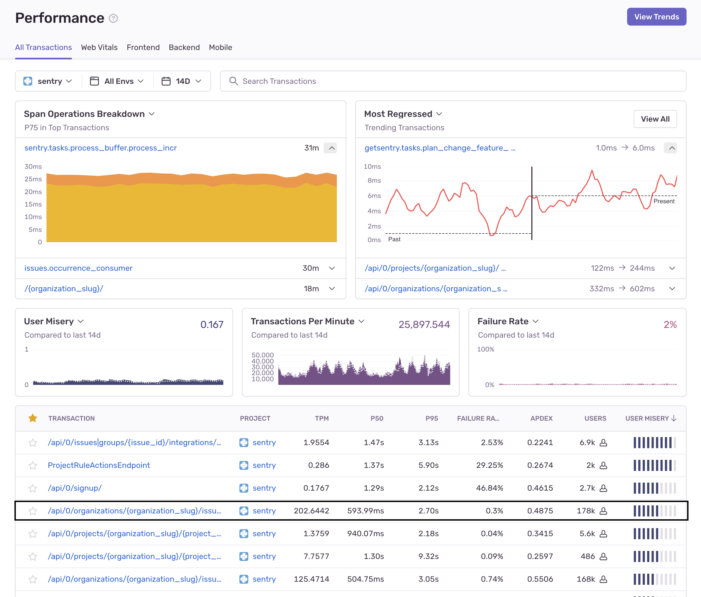
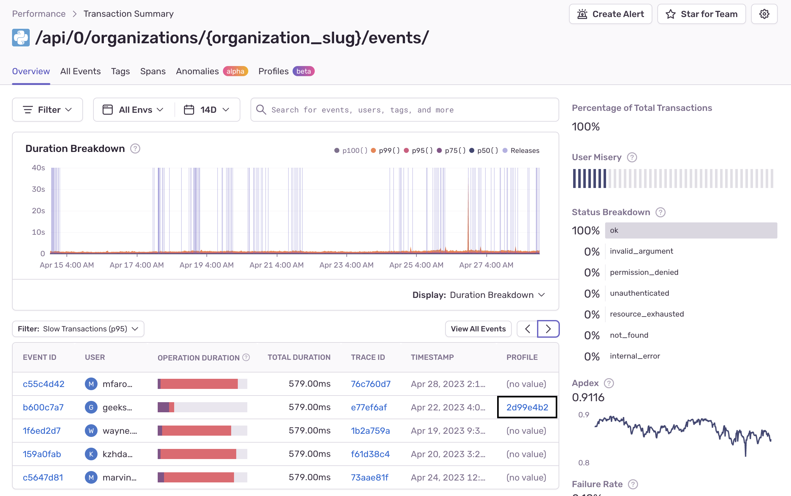
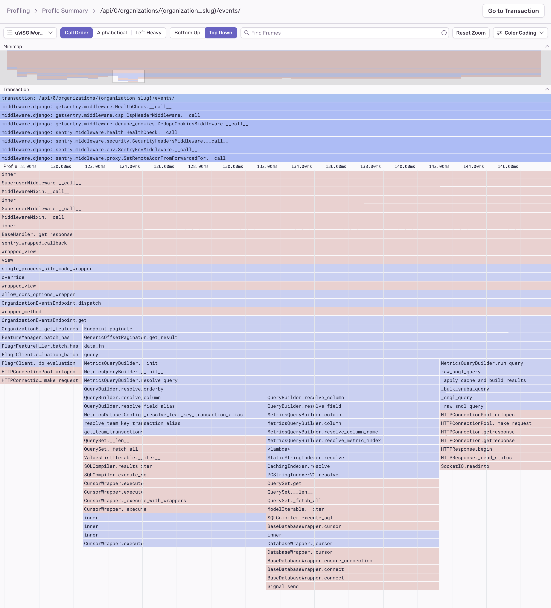
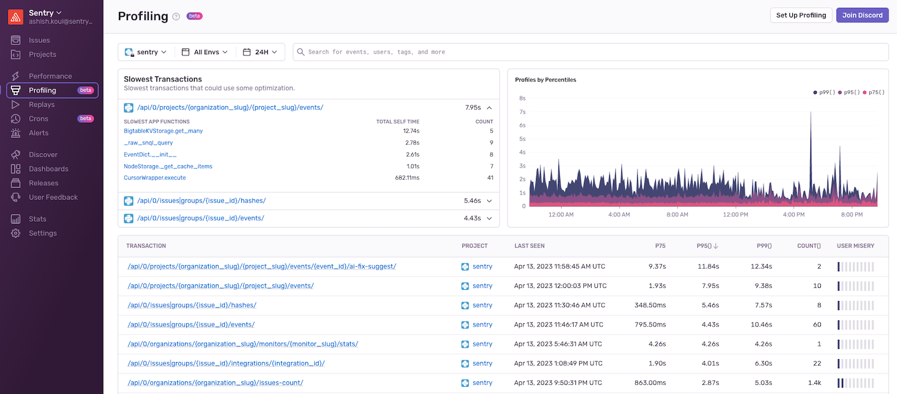
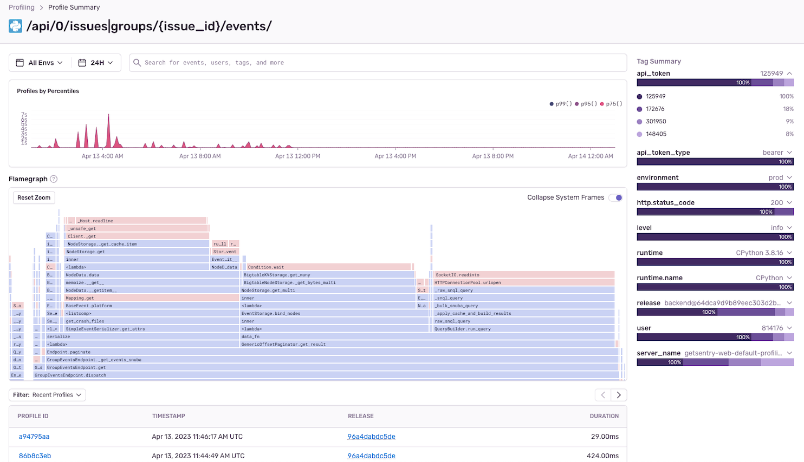

<Note>

**The currently supported platforms are:**

- [Android (Java and Kotlin only)](/platforms/android/profiling/)
- [iOS (Swift and Objective-C only)](/platforms/apple/profiling/)
- [Node.js](/platforms/node/profiling/)
- [Python](/platforms/python/profiling/)
- [PHP (including Laravel and Symfony)](/platforms/php/profiling/)
- [Go [experimental]](/platforms/go/profiling/)
- [Ruby [experimental]](/platforms/ruby/profiling/)
- [Rust [experimental]](/platforms/rust/profiling/)

</Note>

Profiling offers a deeper level of visibility on top of traditional tracing, removing the need for custom instrumentation and enabling you to build in [performance as a feature](https://blog.codinghorror.com/performance-is-a-feature/) from day one. Sentry's profiling feature builds upon our established [Performance Monitoring](/product/performance) capabilities to provide precise code-level visibility into application execution in a production environment. This allows you to quickly identify potential performance bottlenecks and visualize the call stack to find hot paths in your code.

Sentry profiling supports common platforms for both Mobile and Backend applications:

- [Mobile app profiling](/product/profiling/mobile-app-profiling/) makes it possible to collect **profiles from real devices in production**, providing a complete picture of how the app performs in a variety of environments.
- Backend platform profiling makes it possible to easily target the essential code that yields the biggest improvements in backend throughput and resource utilization.

## Zooming In From Performance to Profiling

Sentry profiling data is structured as an extension of performance transactions. This means you can "zoom in" on transactions to see their profiles directly by clicking on any transaction on the **Performance** page.

This will take you to the **Transaction Summary** page where you'll see a list of transaction events.

Transaction events that have a profile contain a link in the "Profile" column which will take you to a flame chart with details about that event. Learn how to read [Flame Charts and Flame Graphs](/product/profiling/flame-charts-graphs).

Alternatively, if you click on the "Event ID" for a transaction, you'll see a span waterfall where you'll can identify suspect spans - operations that may be impacting performance, including slow DB queries and HTTP requests. You can click on a span to see profile information, including the most frequently occurring code path (call stack with with exact line numbers), along with the approximate percentage of time required for that code path.

From this view, you can also click "View Profile" to zoom in on the flame chart.

## Profiling Page

The **Profiling** page shows a list of transactions in descending order of execution time for your selected project(s). It also shows details about the three "Slowest Transactions" including a list of the slowest identified functions in that transaction. The "Profiles by Percentiles" timeline chart can be used to filter the transaction data by highlighting the desired time period. Using the Profiling page is typically an advanced workflow, enabling you to directly select transactions of interest and examine detailed profiling data.

To zoom in further, select from the list of "Slowest App Functions" and see the associated flame chart for the profile.

Selecting one of the transactions will take you to the **Profile Summary** page below. On this page, you can examine the consolidated [flame graph](/product/profiling/flame-charts-graphs) that presents aggregated sample data for the selected transaction.

## Learn More

To learn more about profiling tools, read the docs about [Flame Charts and Flame Graphs](/product/profiling/flame-charts-graphs).

<PageGrid />
