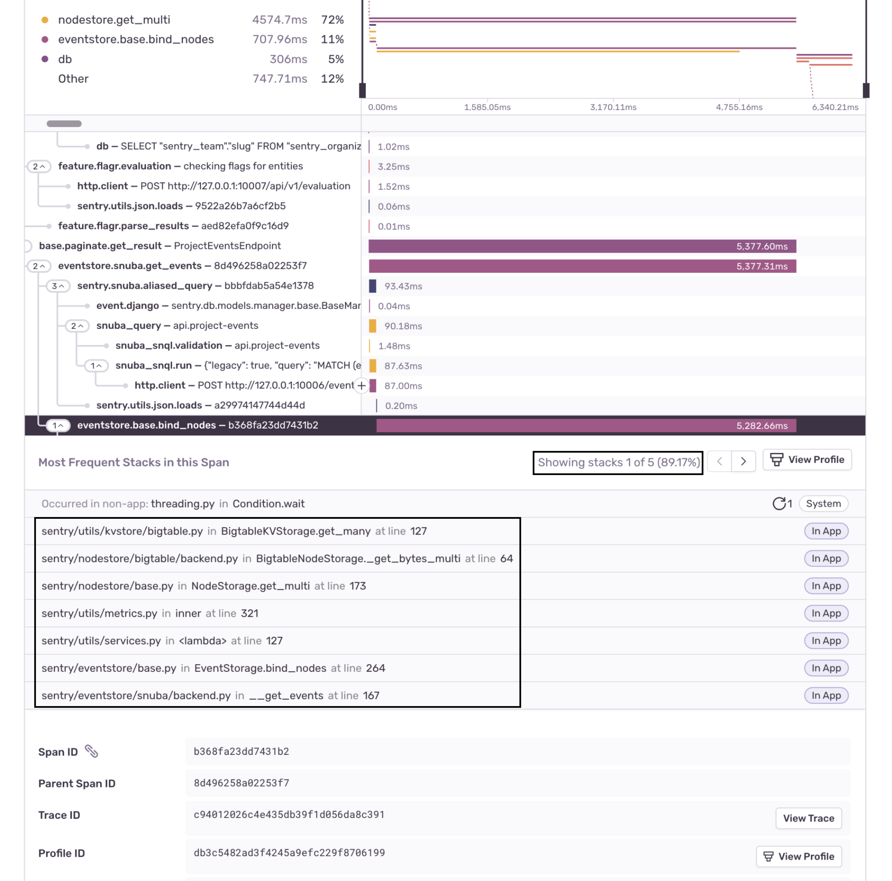

<Note>

**The currently supported platforms are:**

- [Android (Java and Kotlin only)](/platforms/android/profiling/)
- [iOS (Swift and Objective-C only)](/platforms/apple/profiling/)
- [Python](/platforms/python/profiling/)
- [Node.js](/platforms/node/profiling/)
- [PHP (including Laravel and Symfony)](/platforms/php/profiling/)
- [Browser JavaScript [beta]](/platforms/javascript/profiling/)
- [Go [experimental]](/platforms/go/profiling/)
- [Ruby [beta]](/platforms/ruby/profiling/)
- [React Native [beta]](/platforms/react-native/profiling/)

</Note>

Sentry's profiling feature builds upon our established [Performance Monitoring](/product/performance) capabilities to provide precise code-level visibility into application execution in a production environment. Profiling provides context at a deeper level than traditional tracing, enabling you to visualize the precise details of the call stack without the need for custom instrumentation. With Profiilng you can quickly identify hot paths in your code and understand potential performance bottlenecks, enabling you to build in [performance as a feature](https://blog.codinghorror.com/performance-is-a-feature/) from day one.

Sentry profiling supports common platforms for both Mobile and Backend applications:

- [Mobile app profiling](/product/profiling/mobile-app-profiling/) makes it possible to collect **profiles from real devices in production**, providing a complete picture of how the app performs in a variety of environments.
- Backend platform profiling makes it possible to easily target the essential code that yields the biggest improvements in backend throughput and resource utilization.

## Zooming In From Performance to Profiling

Sentry profiling data is structured as an extension of performance transactions. This means you can "zoom in" on transactions to see their profiles directly by clicking on any transaction on the **Performance** page.

This will take you to the **Transaction Summary** page where you'll see a list of transaction events.

Transaction events that have a profile contain a link in the "Profile" column which will take you to a flame graph with details about that event. Learn how to read [Flame Graphs and Aggregated Flame Graphs](/product/profiling/flame-charts-graphs).

Alternatively, if you click on the "Event ID" for a transaction, you'll see a span waterfall where you can identify suspect spans - operations that may be impacting performance, including slow DB queries and HTTP requests. You can click on a span to see profile information, including the most frequently occurring code path (call stack with with exact line numbers), along with the approximate percentage of time required for that code path.

From this view, you can also click "View Profile" to zoom in on the flame graph.

## Profiling Page

The **Profiling** page shows a list of transactions in descending order of execution time for your selected project(s).

The "Profiles by Percentiles" timeline chart can be used to filter the transaction data by highlighting the desired time period. Below that, there are three widgets to choose from.

The "Slowest Functions" widget shows you a list of the functions that took the most time in your application. It lists the transactions the function was called from. Clicking on a transaction will take you to an example profile. The "Most Regressed Functions" and "Most Improved Functions" widgets show you a list of the functions that have gotten slower/faster over time. Clicking on the timings will take you to an example from either before/after the detected regression/improvement.

Using the Profiling page is typically an advanced workflow, enabling you to directly select transactions of interest and examine detailed profiling data.

## Profiling Summary Page

Selecting one of the transactions will take you to the **Profile Summary** page below. On this page, you can examine the aggregated information of this profile.

While the **Profiling** page can be used to view information about the profiles in our application, the **Profile Summary** page shows aggregated information from profiles collected under a single type of transaction.

This information allows you to dive deeper into what your code was executing during this transaction and may get you closer to the root of the problem. 

The top of the page has a percentile chart with profile durations and a search bar. The chart helps you visually identify possible performance regressions or changes. You can isolate the date-time ranges you want to investigate  by clicking and dragging it. If you want to narrow down your investigation to profiles executed under a specific environment, use the search bar filters. 

Our bottom right side of the page has aggregated information about function regressions that Sentry may have detected during the selected time range as well as a list of the slowest functions in your application as well as some general information about the profile. We can see information like when was this profile last seen, p75, p95 and p99 values as well as the total amount of profiles we collected for this transaction.

Below the general information, we have a list of regressions that Sentry may have detected as well as a list of the slowest functions executed during this transactions.
Clicking on the before/after timings in the regressed function list will take you to example flamecharts of the before and after execution so that you can investigate what changed.

The slowest functions list serves as an overview of functions which are consuming the most time in your application - these are usually good candidates for optimization.

The left side of the page contains am aggregate flamegraph as well as digest of the slowest and most regressed functions. We recommend reading the docs about [Flame Graphs and Aggregated Flame Graphs](/product/profiling/flame-charts-graphs) so you can understand what this data is telling us. In short, looking for wide frames that have no children is a good first thing to look at - this will allow you to identify frames that are often occupying the stack and are good candidates for optimization.

The alternative way you can also visualize the flamegraph is by clicking on the Call Tree button which will render the flamegraph as an inverted call tree (leafmost nodes first which expand to their parent nodes). The sample column in the call tree represent how often profiling collected stack samples where that function was on the stack. Expanding of the tree can be done via click interaction on the caret before the function name (holding ⌘ while doing so will expand that entire branch all the way to the root.)

## Learn More

To learn more about profiling tools, read the docs about [Flame Graphs and Aggregated Flame Graphs](/product/profiling/flame-charts-graphs).

<PageGrid />
