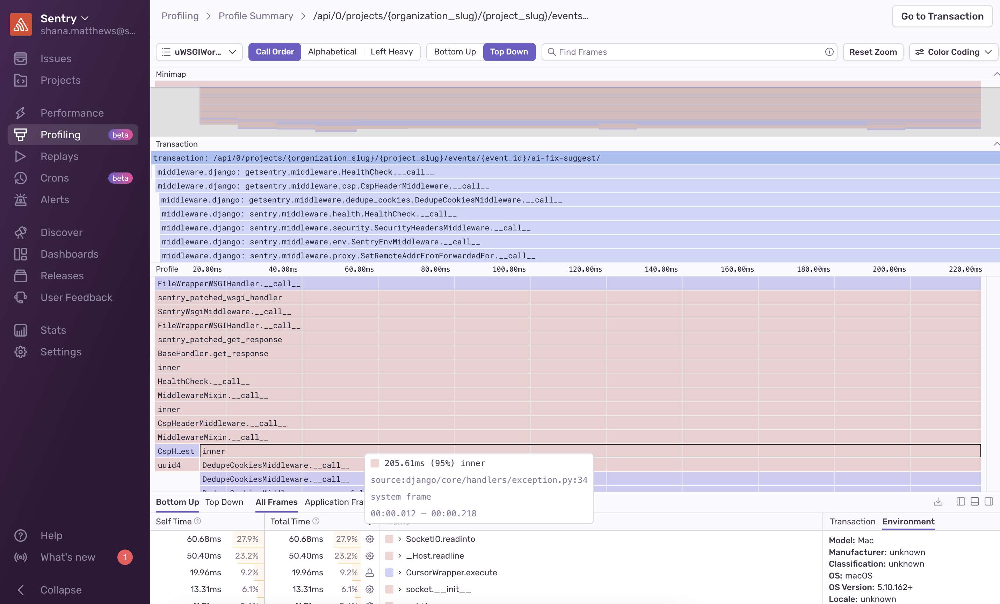
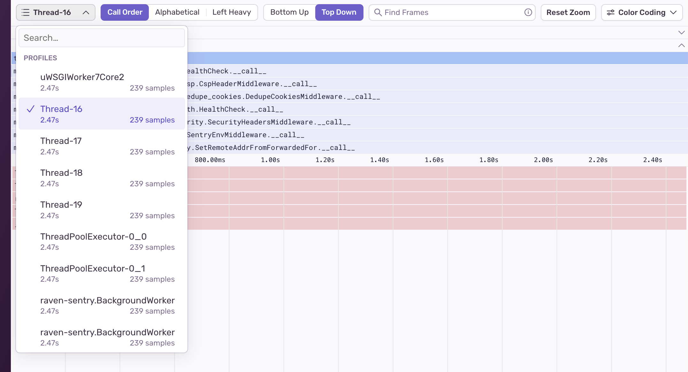
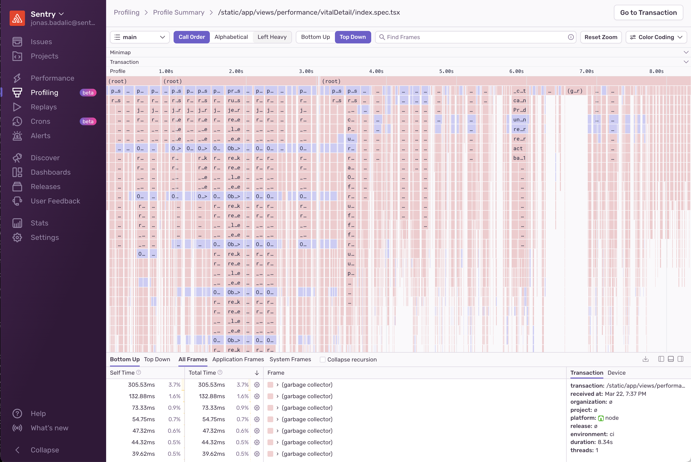
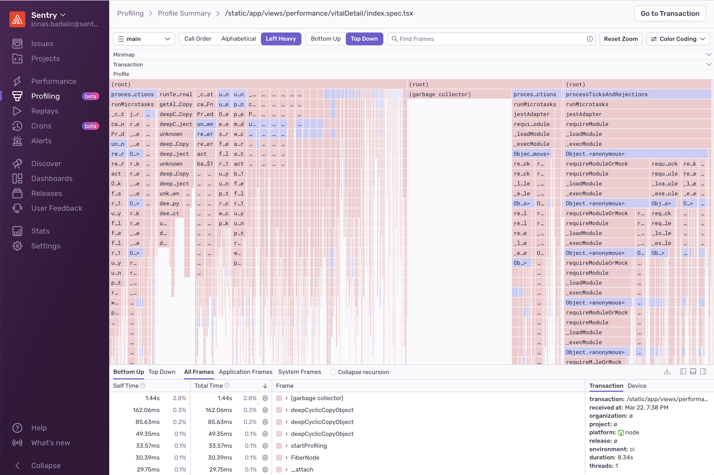
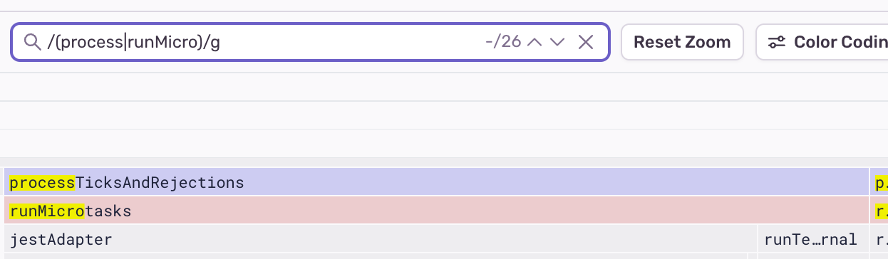
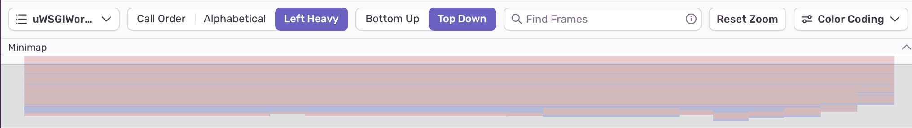
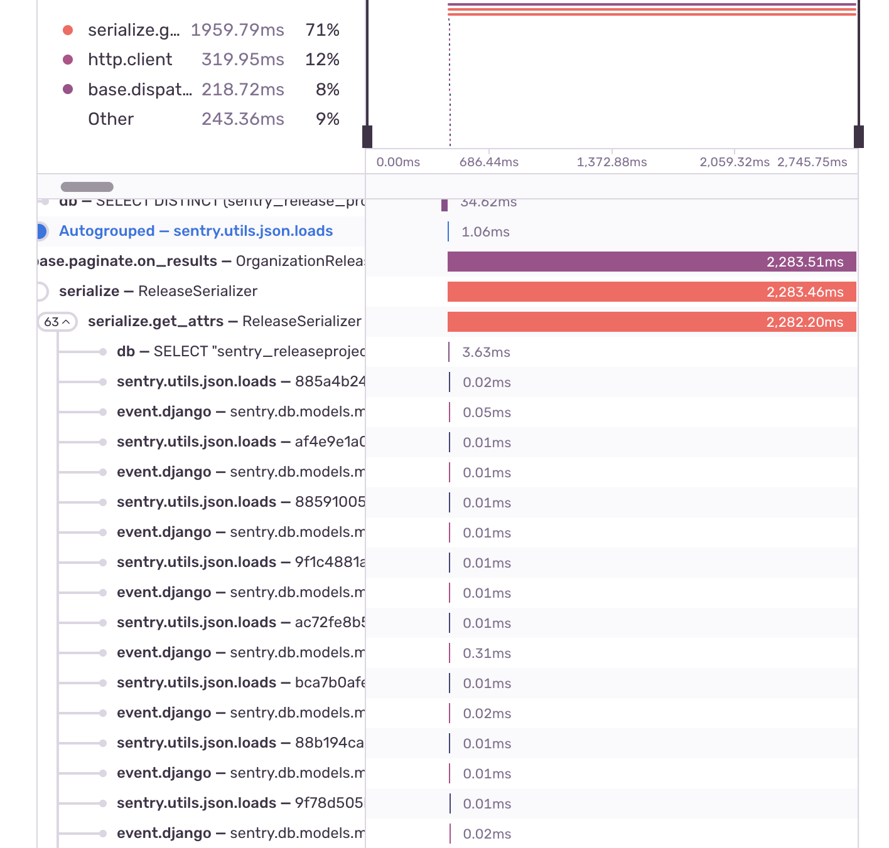
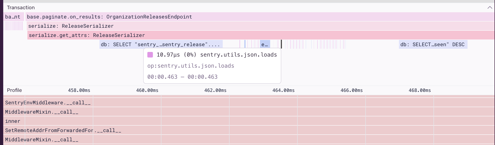

Profiling data can be used to gain insight into what methods and lines of your code are slow. Each profile has a detailed view that gives information about what happened in your code while the profile was collected and offers different ways to explore your profile data. This information can be found by going to the [Profiling page](https://sentry.sentry.io/profiling/) in sentry.io, clicking on a “Transaction” and then selecting a “Profile ID.”

The main visualization on this page is a flame chart. Learn more about flame charts in [Flame Charts and Flame Graphs](LINK HERE) LINK HERE.

## Thread Selector

A flame chart can only show data from one thread at a time. You can use the thread selector dropdown to choose which thread to look at.

## Flame Chart Sorting Options

Samples are displayed in chronological (call) order by default. You can change the way samples are sorted in the flame chart with these options:

- **Call Order:** The default sorting order which displays samples in chronological order.
- **Alphabetical:** Sorts samples by frame name.
- **Left Heavy:** Sorts samples from highest weight to lowest weight.

When you use alphabetical or left heavy sorting, adjacent frames with the same name are merged and their durations are summed. This helps when your profile has a lot of tiny stacks (called “hair”) which are easier to see when summed together.

_Example of a NodeJS flame chart with a lot of “hair” vs the merged visualization. Notice how the right side of the chart now exposes the sum durations for loading our modules._

**Bottom Up/Top Down**

Flame charts represent profile data with leaves either at the top or the bottom. This toggle lets you choose which visualization style your flame charts default to.

## Search

The search bar allows you to search for function names inside the profile. It supports fuzzy search and regular expressions.

## Flame Chart Colors

The **Color Coding** toggle offers different ways to color the flame chart:

- **By System vs. Application Frame** (default)
- **By Symbol Name:** Each unique function frame has its own color. When a unique function appears in different places in the chart it can be identified by its color.
- **By Package:** Frames from different packages or modules share the same color.
- **By System Frame:** System frames each have their own color so you can easily tell them apart. Application frames are grey.
- **By Application Frame:** Application frames each have their own color. System frames are grey.
- **By Recursion:** Only recursive functions are colored, the rest are grey. Supports both indirect as well as direct recursion.
- **By Frequency:** All frames are the same color, but the more often a function appears, the darker it gets.

## Minimap

The “Minimap” shows a zoomed-out view of the profile, with the currently displayed section in a box. You can click and drag the Minimap to quickly navigate to a different part of the profile. Holding the shift key while scrolling will trigger zooming. Releasing the shift key will scroll in both vertical and horizontal directions.

## Transaction

The “Transaction” section below the “Minimap” renders a tree of spans. It's the same view shown on the performance waterfall chart, but condensed to minimize white space. This view is helpful for cross-referencing profiler stack frames with span data.

_Example of the waterfall vs tree span view._

## Table View

The bottom of the screen shows a table representation of the flame chart. It provides an alternate view that enables you to see and sort functions by name, time spent in them, and their type (application or system).

By default, the table displays “Bottom Up”, which shows the leafmost functions, or those with the most time at the top of a call stack. Long-running leaf functions are a good first indicator of performance bottlenecks.

In “Bottom Up” view, expanding a row of the table shows the function's parent functions. In “Top Down” **\*\***\*\***\*\***\*\*\*\***\*\***\*\***\*\***view, expanding a row shows all the children functions that function has called (also known as callees).

## Transaction and Environment View

This section of the **Profiling** page shows metadata about the transaction and device associated with this profile.

