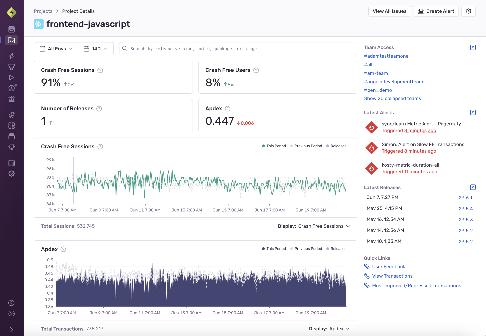

The **Project Details** page provides a consolidated view of various project metrics for the selected time range (14 days by default)

The top four cards display the following:

- Crash free [sessions](/product/releases/health/#session)
- Crash free users
- Number of [releases](/product/releases/)
- [Apdex](/product/performance/metrics/#apdex)

The two graphs below the cards provide insight into a metric for the specified time range.Click on the graph legend to show or hide the overlay of the previous time period and any releases (if set up). By default, the graphs show crash free sessions and Apdex, but you can toggle the **Display** to set the view to any of the following:

- Crash free [sessions](/product/releases/health/#session)
- Crash free users
- [Apdex](/product/performance/metrics/#apdex)
- [Failure rate](/product/performance/metrics/#failure-rate)
- [Transactions per minute](/product/performance/metrics/#throughput-total-tpm-tps)
- Number of errors
- Number of sessions
- Number of transactions

You can also use this page to set up [alerting](/product/alerts-notifications/) or [triage an issue](#triage).

## Create and Review Latest Alerts

You can use the **Project Details** page to access Sentry's alerting feature.

Click the **Create Alert** button at the top right to set up either an [Issue Alert](/product/alerts-notifications/issue-alerts/) or a [Metric Alert](/product/alerts-notifications/metric-alerts/).

<TODO: add create_alert.gif>

The **Latest Alerts** section in the right sidebar shows the 3 latest triggered alerts. Click on an alert to go to the **Alert Details** page. The selected time range does not affect the displayed alerts.

<TODO: add latest_alerts.gif>

## Releases

You can use the Project Details page to assess how often you release new versions of your application:

- Number of releases compared to the previous period in the top card
- Release lines overlaid on top of graphs
- Most recent five releases in the **Latest Releases** section of the sidebar. You can click one of these to navigate to the [Release Details](/product/releases/health/release-details/) page. The selected time range does not affect the displayed releases.

## Triage

To help you triage issues, the **Project Details** page shows you the 5 most frequent unhandled issues, sorted by the number of events in the selected time range. Click on an issue to navigate to the **Issue Details** page.

If you prefer another view, you can also click **Open in Issues** or **Open in Discover** to see issues sorted in the same way on those pages.

## Manage Project Teams
<TODO>
See what teams are involved in this project in the **Team Access** section of the sidebar.

Click on the team to see the team's members and their roles. If you are a team admin, you can also add or remove members from the team or change their role.

Click the open icon to navigate to Project Teams for [Project] to see all the teams that have access to this project. If you are an owner or admin, you can add or remove teams from the project.

## Modify Project Settings

Use the Settings icon at the top of the page to access the Project's Settings; modify as appropriate to your team and organization.
