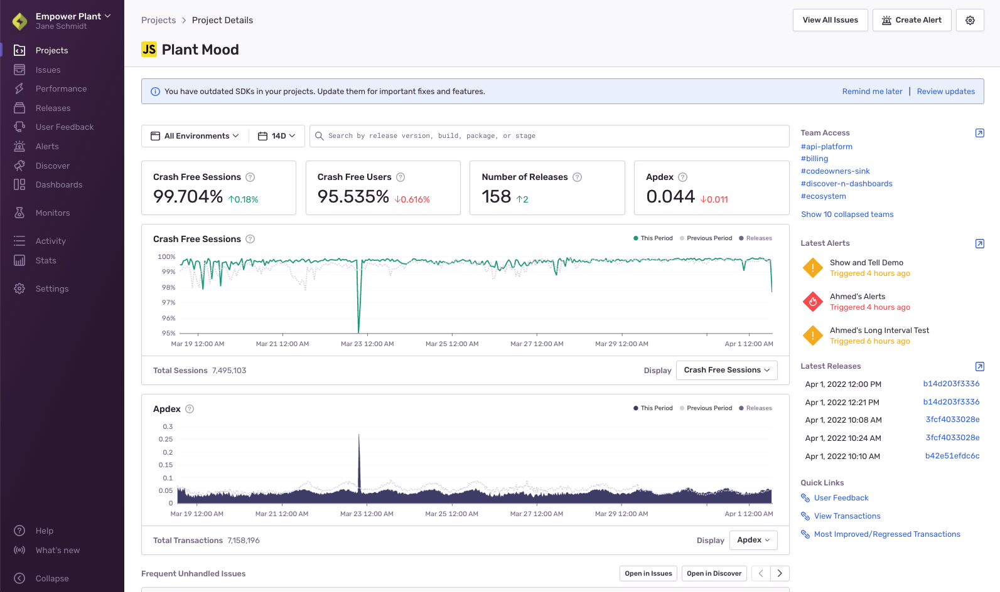

The **Project Details** page provides a consolidated view of what's going on in your project. This page is useful if you have oversight over many teams and many projects. You can also use this page to set up [Alerting](/product/alerts-notifications/) or delve into the Issue stream to [triage an issue](#triage).

After selecting the time range (the default is the last 14 days), the top four cards display:

- Crash free [sessions](/product/releases/health/#session)
- Crash free users
- Number of [releases](/product/releases/)
- [Apdex](/product/performance/metrics/#apdex)

Select one of the predefined time ranges (excluding `Last 90 days`) to view the change in these numbers since the last period.

The two graphs below the cards provide insight into:

- Crash free [sessions](/product/releases/health/#session)
- [Apdex](/product/performance/metrics/#apdex)
- [Failure rate](/product/performance/metrics/#failure-rate)
- [Transactions per minute](/product/performance/metrics/#throughput-total-tpm-tps)
- Daily errors
- Daily transactions

Toggle the **Display** to change the view. You can click on the graph legend to show or hide the overlay of releases and previous period.

## Alerting

You can use the Project Details page to access Sentry's alerting feature. Click the **Create Alert** button at the top right to set up either an [Issue Alert](/product/alerts-notifications/issue-alerts/) or a [Metric Alert](/product/alerts-notifications/metric-alerts/). In the **Latest Alerts** section of the sidebar you can see the three latest triggered alerts. Click on one of them to go to Alert Details page. The selected time range does not affect the displayed alerts.

## Releases

You can use the Project Details page to assess how often you release new versions of your application:

- Number of releases compared to the previous period in the top card
- Release lines overlaid on top of graphs
- Most recent five releases in the **Latest Releases** section of the sidebar. You can click one of these to navigate to the [Release Details](/product/releases/health/release-details/) page. The selected time range does not affect the displayed releases.

## Triage

Use Project Details to view issues associated with this project and to access them for triage. You can navigate to the **Issue Details** page by clicking either **View All Issues** or the **Open in Issues** button located at the top of the **Frequent Unhandled Issues** listed on the page. The issues in the table are sorted by the number of events in the selected time range.

## Modify Project Settings

Use the Settings icon at the top of the page to access the Project's Settings; modify as appropriate to your team and organization.
See what teams are involved in this project in the **Team Access** section of the sidebar.
