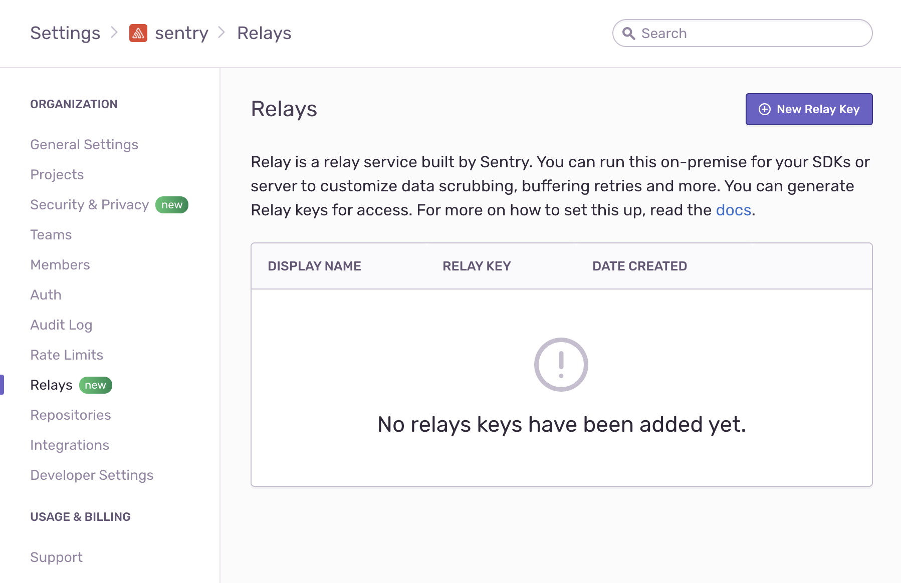
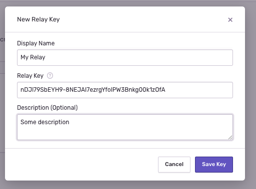

Getting started with Relay is as simple as using the default settings. You can also configure Relay to suit your organization's needs. Check the [Configuration Options](../options/) page for a detailed discussion of operating scenarios.

<Note>

The Relay server is called `relay`. Download binaries from [GitHub
Releases](https://github.com/getsentry/relay/releases). A Docker image is provided on [DockerHub](https://hub.docker.com/r/getsentry/relay/).

</Note>

## Initializing Configuration

To create the initial configuration, use Relay's `relay config init` command,
which puts configuration files in the `.relay` folder under the current working
directory.

<Note>

In Docker, provide the configuration directory using the standard
mechanisms offered by Docker, either by mounting [Docker
volumes](https://docs.docker.com/storage/volumes/) or by building a new
container and copying in the files.

</Note>

```shell {tabTitle:Run in Docker}
# Adjust permissions for the configuration directory
docker run --rm -it                \
  -v $(pwd)/config/:/work/.relay/  \
  --entrypoint bash                \
  getsentry/relay                  \
  -c 'chown -R relay:relay /work/.relay'

# Generate the configuration
docker run --rm -it                \
  -v $(pwd)/config/:/work/.relay/  \
  getsentry/relay                  \
  config init
```

```shell {tabTitle:Run Executable}
./relay config init
```

Select the default configuration to create a minimal configuration file.
You can choose to override the default settings by selecting
_"create custom config"_ and customizing these parameters:

- The `mode` setting, which configures the major mode in which Relay operates. For more information on available Relay modes, refer to [Relay Modes](../modes/).

  <Alert level="warning">

  Currently, only `proxy` and `static` mode are available to all organizations.

  </Alert>

- The `upstream` setting configures the server to which Relay will forward the
  events (by default the main `sentry.io` URL).

- The `port` and `host` settings configure the TCP port at which Relay will
  listen. This is the address to which SDKs send events.

- The `tls` settings configure TLS support (HTTPS support), used when communication between the SDK and Relay needs to be secured.

Settings are recorded in `.relay/config.yml`. Note that all configuration values
are optional and default to these settings:

```yaml {tabTitle:Run in Docker}
relay:
  mode: managed
  upstream: "https://sentry.io/"
  host: 0.0.0.0
  port: 3000
  tls_port: ~
  tls_identity_path: ~
  tls_identity_password: ~
```

```yaml {tabTitle:Run Executable}
relay:
  mode: managed
  upstream: "https://sentry.io/"
  host: 127.0.0.1
  port: 3000
  tls_port: ~
  tls_identity_path: ~
  tls_identity_password: ~
```

Configurations are fully documented in [Configuration Options](../options/).

## Creating Credentials

<Alert level="info">

Not applicable in `proxy` or `static` mode.

</Alert>

In addition to `config.yml`, the `init` command creates a credentials file, `credentials.json`, which is placed in the same `.relay` directory. This file contains both the public and private key Relay uses to authenticate with the upstream server.

**As a result, this file must be protected from modification or view by unauthorized entities.**

A typical credentials file is similar to this example:

```json
{
  "secret_key": "5gkTAfwOrJ0lMy9aOAOmHKO1k6gd8ApYkAInmg5VfWk",
  "public_key": "nDJI79SbEYH9-8NEJAI7ezrgYfoIPW3Bnkg00k1z0fA",
  "id": "cde0d72e-0c4e-4550-a934-c1867d8a177c"
}
```

Use the `public_key` to register your Relay with the upstream server when running it in `managed` mode.

## Registering Relay with Sentry

<Alert level="info">

Not applicable in `proxy` or `static` mode.

</Alert>

To operate in `managed` mode, Relay pulls configuration for PII stripping,
filtering, and rate limiting from your organization and project settings in
Sentry. Since these settings may contain sensitive information, their access is
restricted by Sentry and requires authorization.

To register Relay with Sentry:

1. Copy the contents of the public key, either by inspecting the `credentials.json` file or by running:

   ```shell {tabTitle:Run in Docker}
   docker run --rm -it                \
     -v $(pwd)/config/:/work/.relay/  \
     getsentry/relay                  \
     credentials show
   ```

   ```shell {tabTitle:Run Executable}
   ./relay credentials show
   ```

2. Click on _Settings_ in the main navigation for Sentry, then select _Relays_.



3. Click _New Relay Key_ to add the key and save it:



This process registers Relay with Sentry so it is ready to send messages. See
[Configuration Options](../options/) to learn more about Relay configuration options.

## Running Relay

After registering Relay with Sentry, it is ready to run:

```shell {tabTitle:Run in Docker}
docker run --rm -it                \
  -v $(pwd)/config/:/work/.relay/  \
  -p 3000:3000                     \
  getsentry/relay                  \
  run
```

```shell {tabTitle:Run Executable}
./relay run
```

Under default configuration, Relay emits log output similar to:

```
 INFO  relay::setup > launching relay from config folder .relay
 INFO  relay::setup >   relay mode: managed
 INFO  relay::setup >   relay id: cde0d72e-0c4e-4550-a934-c1867d8a177c
 INFO  relay::setup >   public key: nDJI79SbEYH9-8NEJAI7ezrgYfoIPW3Bnkg00k1z0fA
 ...
 INFO  relay_server::actors::upstream > relay successfully registered with upstream
```

Refer to the [Logging](../monitoring/#logging) page for more information on how to configure Relay's logging.

If you moved your config folder (for example, for security reasons), use the `--config` option to specify the location:

```shell {tabTitle:Run in Docker}
docker run --rm -it                \
  -v $(pwd)/config/:/etc/relay/    \
  -p 3000:3000                     \
  getsentry/relay                  \
  run --config /etc/relay/
```

```shell {tabTitle:Run Executable}
./relay run --config /etc/relay/
```

## Sending a Test Event

Once Relay is running and authenticated with Sentry, send a test event to one of the projects in your organization.

Get the DSN of your project by navigating to your project settings at _Settings > Projects > {YOUR_PROJECT_NAME} > Client Keys (DSN)_, and select one of the existing DSNs, which looks similar to:

`https://12345abcdef10111213141516171819@o1.ingest.sentry.io/2345`

Next, replace parts of the DSN to match the address at which Relay is reachable.
For instance, if Relay listens at `http://localhost:3000`, change the protocol
and host of the DSN to:

<p>
  <code>
    <strong><i>http</i></strong>
    ://12345abcdef10111213141516171819@
    <strong><i>localhost:3000</i></strong>
    /2345
  </code>
</p>

Use the new DSN in your SDK configuration. To test this, you can send a message
with `sentry-cli` ([installation instructions](/product/cli/installation/)):

```shell
export SENTRY_DSN='http://12345abcdef10111213141516171819@127.0.0.1:3000/2345'
sentry-cli send-event -m 'A test event'
```

In a few seconds, the event should appear in the issues stream in your
project.

## Next Steps

- **[Learn more about our Operating Guidelines](../operating-guidelines/)**

With a working Relay instance, you can both monitor and scale your Relay setup.
