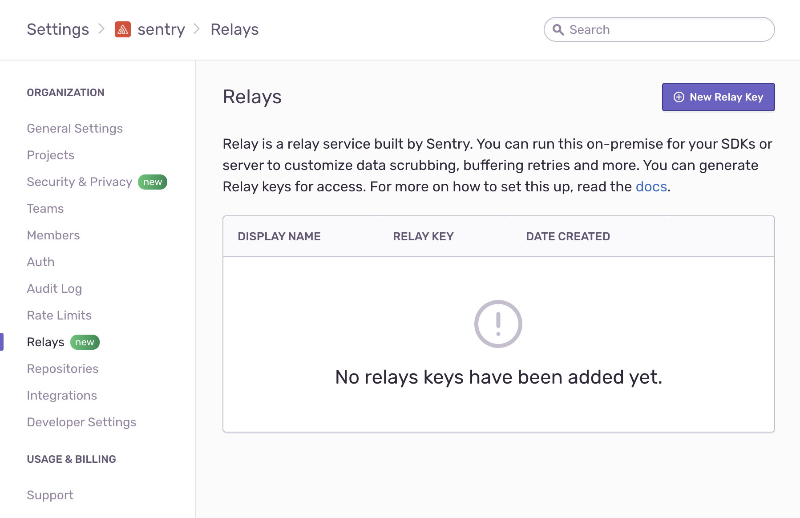

Sentry Relay is a standalone service that allows you to scrub personal
information and improve event response time. It acts as a middle layer between
your application and Sentry.io.

<Alert level="info" title="Note">

Relay is still work in progress. The default Relay mode is at the moment only
supported for on-premise installations and beta testers. If you are using Relay
to connect to Sentry and are not a beta tester you need to use `proxy` or
`static` mode.

If you want to beta test the `managed` mode while connecting to Sentry, please
get in touch with us. See [Relay Modes] for more information.

</Alert>

## Use Cases for Relay

Relay is designed to help you in a few use cases:

### Scrubbing Personally Identifiable Information (PII)

Sentry allows to scrub PII in two places: in the SDK before sending the event,
and upon arrival on Sentry's infrastructure. Relay adds a third option that
allows to scrub data in a central place before sending it to Sentry.

To choose the right place for data scrubbing, consider:

- If you prefer to configure data scrubbing in a central place, you can let
  Sentry handle data scrubbing. Upon arrival, Sentry immediatly applies
  [server-side scrubbing] and guarantees that personal information is never
  stored.

- If you cannot send PII outside your infrastructure but you still prefer to
  configure data scrubbing in one centralized place, run Relay and configure
  your SDKs to send events there. Relay uses the privacy settings configured in
  Sentry, and scrubs PII before forwarding data to Sentry.

- For the most strict data privacy requirements, you can configure SDKs to scrub
  PII using the [`before-send` hooks], which prevents data from being collected
  on the device. This may require you to replicate the same logic across your
  applications and could lead to a performance impact.

### Improved Response Time

Relay is designed to respond very quickly to requests. Having Relay installed
close to your infrastructure will further improve the response when sending
events.

This can particularly reduce the roundtrip time in remote locations.

### Enterprise Domain Name

By default, SDKs need to be configured with a DSN that points to `sentry.io`. If
you need to restrict all HTTP communication to a custom domain name, Relay can
act as an opaque proxy that reliably forwards events to Sentry.

## Getting Started

In this section we will create a simple setup using the default settings. Check
the [Configuration Options] page for a detail discussion of various operating
scenarious for Relay.

The Relay server is called `relay`. Binaries can be downloaded from [GitHub
Releases] and a Docker image is provided on [DockerHub].

### Initializing Configuration

In order to create the initial configuration, Relay provides the `relay config init` command. The command puts configuration files in the `.relay` folder under
the current working directory:

```sh
❯ ./relay config init
Initializing relay in /<current_directory>/.relay
Do you want to create a new config?:
> Yes, create default config
  Yes, create custom config
  No, abort
```

Selecting the default configuration will create a minimal configuration file.
Alternatively, you can choose to override the default settings, by selecting
_"create custom config"_. This allows you to customize the following basic
parameters:

- The `mode` setting configures the major mode in which Relay operates. For more
  information on available relay modes, refer to [Relay Modes].

  **Right now, the only options supported by `sentry.io` are `proxy` and
  `static` mode.**

- The `upstream` setting configures the server to which Relay will forward the
  events (by default the main `sentry.io` URL).

- The `port` and `host` settings configure the TCP port at which Relay will
  listen to. This is the address to which SDKs send events.

- The `tls` settings configure TLS support (HTTPS support), used for
  the cases where the communication between the SDK and Relay needs to be
  secured.

Settings are placed in `.relay/config.yml`. Note that all configuration values
are optional and default to these settings:

```yaml
relay:
  mode: managed
  upstream: "https://sentry.io/"
  host: 127.0.0.1
  port: 3000
  tls_port: ~
  tls_identity_path: ~
  tls_identity_password: ~
```

All configurations are explained in detail in [Configuration Options].

### Credentials

<Alert level="info">

Not applicable in `proxy`/`static` mode.

</Alert>

Besides `config.yml`, the `init` command has also created a credentials file
`credentials.json` in the same `.relay` directory. This file contains the a
public and private key used by Relay to authenticate with the upstream server.

**As such, it is important that this file should be adequatly protected from
modification or viewing by unauthorized entities**.

Here's an example of the contents of a typical credentials file:

```json
{
  "secret_key": "5gkTAfwOrJ0lMy9aOAOmHKO1k6gd8ApYkAInmg5VfWk",
  "public_key": "fQzvlvqLM2pJwLDwM_sXD2Lk5swzx-Oml4WhsOquon4",
  "id": "cde0d72e-0c4e-4550-a934-c1867d8a177c"
}
```

You will be using the `public_key` to register your Relay with the upstream
server when running it in `managed` mode.

### Registering Relay with Sentry

<Alert level="info">

Not applicable in `proxy`/`static` mode.

</Alert>

To operate in `managed` mode, Relay pulls configuration for PII stripping,
filtering, and rate limiting from your organization and project settings at
Sentry. Since these settings may contain sensitive information, their access is
restricted by Sentry and requires authorization.

In order to register Relay with Sentry, get the contents of the public key,
either by inspecting the `credentials.json` file or by running:

```sh
❯ ./relay credentials show
Credentials:
  relay id: 8cd24a0e-384d-4052-9010-68a21392b33c
  public key: nDJl79SbEYH9-8NEJAI7ezrgYfolPW3Bnkg00k1zOfA
```

After copying the public key, go to the organization settings in Sentry by
clicking on _Settings_ in the main navigation on the left, then go to _Relays_.



Click _New Relay Key_ to add the key and save it:


Now your Relay is registered with Sentry and ready to send messages. See
[Configuration Options] to learn more about further Relay configuration options.

### Running Relay

Once you have registered your Relay with Sentry, you are ready to run your
Relay:

```sh
❯ relay run
 INFO  relay::setup > launching relay from config folder .relay
 INFO  relay::setup >   relay mode: managed
 INFO  relay::setup >   relay id: f2119bc9-9a9b-4531-826b-24e9794902f2
 INFO  relay::setup >   public key: QPBITKKtKUuEZGGbPke8iufEXAcVrEv6nmWrkRtc3l8
 ...
 DEBUG relay::server::upstream > relay successfully registered with upstream
```

If you moved your config folder somewhere else (e.g. for security reasons), you
can use the `--config` option to specify the location:

```sh
❯ relay run --config ./my/custom/relay_folder/
```

### Running in Docker

As an alternative to directly running the Relay binary, Sentry also provides a
Docker image that can be used to run Relay. It can be found on [DockerHub].

Similar to directly running the `relay` binary, running the docker image needs a
directory in which it can find the configuration and credentials files
(`config.yml` and `credentials.json`). Providing the configuration directory can
be done with the standard mechanisms offered by docker, either by mounting
[docker volumes] or by building a new container and copying the files in.

For example, you can start the latest version of `relay` as follows:

```sh
❯ docker run -v $(pwd)/configs/:/work/.relay/ getsentry/relay run
```

This example command assumes that Relay's configuration files, `config.yml` and
`credentials.json`, are stored in `./configs/` directory on the host machine.

## Logging and Healthcheck

Now you have a running relay, you might have noticed that relay displays some
`INFO` messages, including:

```sh
INFO  relay::setup >   log level: INFO
```

This is the default logging level and you can change this to show more or less
info. For details about configuring logging please see [Logging] on the options
page.

Relay provides two URLs for checking liveness and readyness of the service:

- `GET /api/relay/healthcheck/live/`: Tests if Relay is running and listening to
  HTTP requests. - `GET /api/relay/healthcheck/ready/`: Tests if Relay is
  authenticated with the upstream and
  operating normally.

In case of success, both endpoints return a _200 OK_ response:

```json
{
  "is_healthy": true
}
```

### Sending a Test Event

Once Relay is running and authenticated with Sentry, it is time to send a test
event.

Get the DSN of your project by navigating to your _Project Settings > Client
Keys (DSN)_. From the _Client Keys_ page, get the DSN, which looks something
like:

```
https://12345abcdb1e4c123490ecec89c1f199@o1.ingest.sentry.io/2244
```

Next, replace parts of the DSN to match the address at which Relay is reachable.
For instance, if Relay listens at `http://localhost:3000`, change the protocol
and host of the DSN to:

```
http://12345abcdb1e4c123490ecec89c1f199@localhost:3000/2244
```

Use the new DSN in your SDK configuration. To test this, you can send a message
with `sentry-cli`:

```sh
❯ export SENTRY_DSN='http://12345abcdb1e4c123490ecec89c1f199@127.0.0.1:3000/2244'
❯ sentry-cli send-event -m 'A test event'
```

After a few seconds, the event should appear in the issues stream in your
project.

## Advanced Configuration

<PageGrid />

[`before-send` hooks]: /platform-redirect/?next=configuration/options/%23hooks
[server-side scrubbing]: /platform-redirect/?next=/data-management/sensitive-data/%23server-side-scrubbing
[github releases]: https://github.com/getsentry/relay/releases
[configuration options]: /product/relay/options/
[relay modes]: /product/relay/modes/
[dockerhub]: https://hub.docker.com/r/getsentry/relay/
[docker volumes]: https://docs.docker.com/storage/volumes/
[logging]: /product/relay/options/#logging
