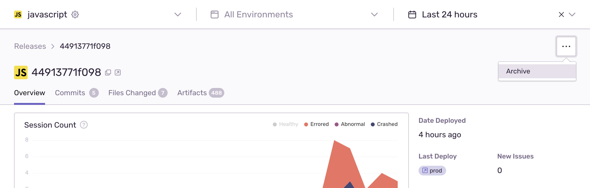
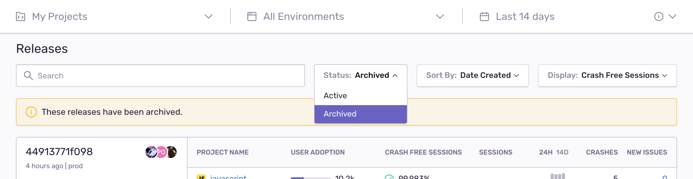
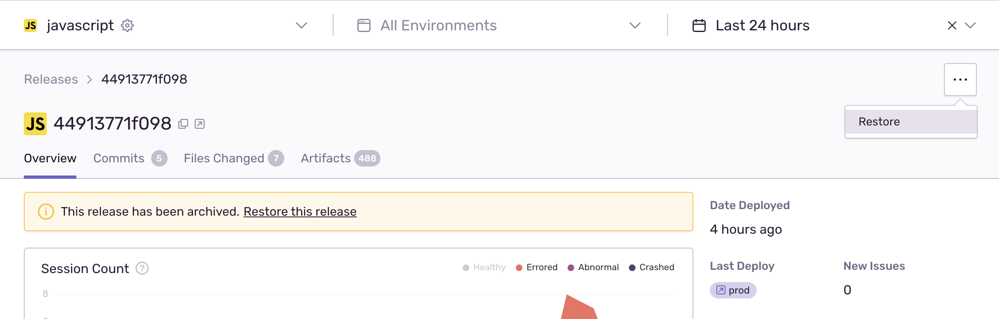

Since an event received from a deleted release automatically recreates it, Sentry has an option to hide releases permanently from sentry.io. In addition, archiving releases can be useful if you're no longer interested in viewing the release or if you've accidentally created a release you no longer want to track.

You can archive releases either using CLI:

```bash
sentry-cli releases archive VERSION
```

or in sentry.io:



Archived releases won't show up in Releases view unless you filter for them:



You can restore archived releases either using using CLI:

```bash
sentry-cli releases restore VERSION
```

or in sentry.io:


