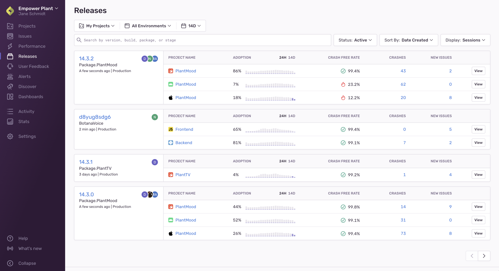

Monitor the health of releases by observing user adoption, usage of the application, percentage of [crashes](#crash), and [session data](#session). Release health will provide insight into the impact of crashes and bugs as it relates to user experience, and reveal trends with each new issue through the release details, graphs, and filters.

## How Release Health Works

Once configured, Sentry's Android, Cocoa, and React Native SDKs will send health data about the usage of your application.

The primary componenent Sentry uses to monitor health is a session. A _session_ represents the interaction between the user and the application. It starts when a user opens the application and ends when a user closes the application or has a prolonged period of inactivity.

Sessions are submitted to Sentry so you can track the usage and adoption of your application. When a user of your application experiences a crash, error, or abnormal exit, the session will be flagged accordingly, and Sentry calculates derived metrics. The metrics include data such as the number of users that didn't experience a crash in the specified time range. Sentry connects the metrics to the specific release of your application and the associated code.

## Releases Index

The releases index page provides a high-level view of:

- Each release version
- The associated project
- The authors of each commit
- The percentage of crash-free users
- The percentage of crash-free sessions

Each release links to one project. If a release has multiple projects, Sentry will duplicate the release data in relation to each project. The data will present adoption of the release from the most recent 24 hours.

## Time Range Change

When you change the date range, Sentry recalculates the values. Sentry doesn't provide the average value of the daily crash-free users or daily crash-free sessions, but the actual value of those metrics calculated for the selected time period. The number can significantly change based on the selected time range. For example:

Let's say you selected the 24-hour time range, have seven users that are using your application for seven days, and each day one of them experiences a crash. The Release Index page will show you that every day there were 85.7% crash-free users on the release.

By contrast, let's say you selected the seven-day time range, have seven users, and each day a different user experiences a crash. By the end of the week, the Release Index page will show you the project had 0% crash-free users.

## Release Details

The release details page focuses on an individual release. Elements of the release are presented in visual trends for crashes and sessions, specifics regarding each issue, and commit author breakdowns.

Hover over specific dates and times in the overview graph for a quick perspective of events that crashed, behaved abnormally, errored, or are healthy.

Crashed

: The app had an explicit unhandled error or hard crash. You'll typically be able to see the corresponding issue in Sentry that captures this event.

Abnormal

: The application timed out, froze, or was forced to quit by the operating system. There is usually no corresponding Sentry issue, as this is a passive action.

Errored

: The app shut down normally, but there were non-fatal errors in the session. Most likely, there are issues/errors in Sentry.

Healthy

: The session ends normally and no errors occurred during its lifetime.

For more information about Sentry's Mobile features, see the full documentation for [Android SDK](/platforms/android/), [iOS SDK](/platforms/apple/guides/ios/) and
[React Native SDK](/platforms/react-native/).

## Getting Started

Currently, we support the health functionality for Android, iOS and React Native applications.

### Android

To benefit from the health data, you must use at least version 2.1.0 of the Android SDK, and enable the collection of release health metrics in the AndroidManifest.xml file.

For more details, see the [full documentation on using Release Health with Android](/platforms/android/configuration/releases/).

### iOS

To benefit from the health data, you must use at least version 5.0.0 of the Cocoa SDK and enable the collection of the release health metrics in the initialization options of the SDK.

For more details, see the [full documentation on using Release Health with iOS](/platforms/apple/guides/ios/configuration/releases/).

### React Native

To benefit from the health data, you must use at least version 1.4.0 of the React Native SDK and enable the collection of the release health metrics in the initialization options of the SDK.

For more details, see the [full documentation on using Release Health with React Native](/platforms/react-native/#release-health).

### Native (C/C++)

To benefit from the health data, you must use at least version 0.4.0 of the Native SDK.
Metrics collection for release health is, by default, enabled, unless you specifically disabled collecting in the initialization options for the SDK.

For more details, see the [full documentation on using Release Health on Native](/platforms/native/configuration/releases/).

## Data Filtering

Sentry has inbound data filters. These filters are exclusively applied at ingest time and not later in processing. This, for instance, lets one discard an error by error message when the error is ingested through the JSON API. On the other hand, this filter doesn't apply to ingested minidumps.
Data filters are only partially supported for session events, and they might be working slightly different:

### Equivalent Filters

Release Filter

: This filter discards events of a particular release. If sessions are started or updated and would match this filter, sessions are silently discarded entirely. This is consistent with error events.

Web Crawler Filter

: When session events send their user agent, they are discarded the same way as error events are. There might be a slight difference in the fallback case where the user agent of the sending SDK is used (browser JavaScript).

Legacy Browsers

: This works exactly like the web crawler filter. No sessions are created or updated for legacy browsers when enabled.

IP Filter

: Throws away sessions of a specific IP.

### Unsupported Filters

Error Message Filter

: This filter does not apply for sessions. Even if a user is discarding such errors, they will count against their stability score. An alternative measure _could be_ to discard such sessions entirely if an error of this type is filtered out, but we believe this would make the system harder to understand.

Browser Extensions

: Since the logic for detecting such errors requires all the error information, we cannot support this filter at the session ingest time. If we want to improve this case, we could retroactively discard such sessions entirely once we identify such an error case.

## Release Health Glossary

#### Session

The time when the user is interacting with the application. (The application is in foreground)

- Session begins with the start of the application. Or, it begins with bringing the already started application back from background to the foreground.

- Session ends with the closing of the application or with the application being sent to the background.

- If the application is in the background for less than 30 seconds, we do not need to start the session again.

- Applications that are active even on the background (for example, music player) should track the sessions manually for the background process.

#### Active Users

Number of users that started the application at least once in the last 24 hours.

#### Crash

The fatal error that caused the crash of the application. Errors that did not cause the end of the application should not be included.
Sentry considers every error event with the field `handled` set to `false` as a Crashed state.

#### Crash Free User

Percentage of the users that did not experience a crash during the specified time period.

#### Crash Free Sessions

Number of sessions in the specified time range that did not end by the crash of the application.

#### Crashed Users

Number of users that experienced a crash in the specified time range.

#### Release Adoption

Number of users that started at least once during the specified time period of a specific release.

#### Release Version

A shorter version of the name = name without the package or short version of the hash.
