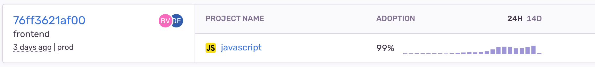
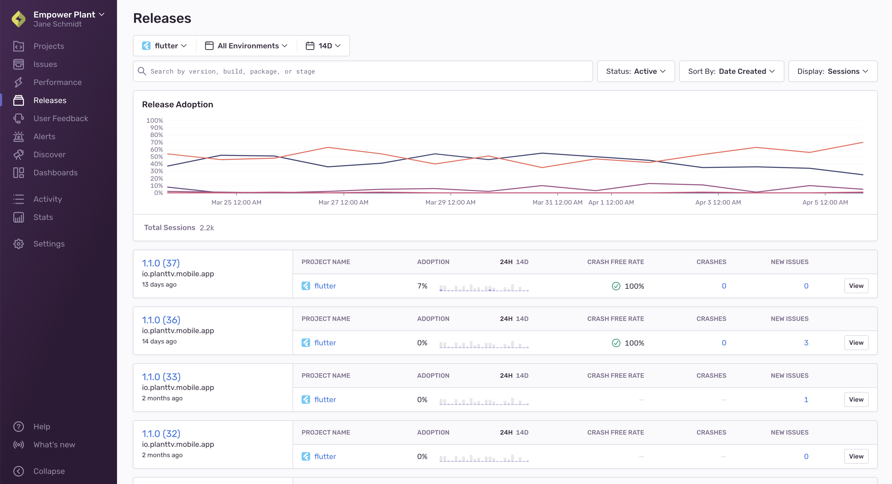

You can monitor the health of releases by observing user adoption, usage of your application, percentage of [crashes](#crash), and [session data](#session). Release health data provides insight into the impact of crashes and bugs related to user experience and reveals trends with each new issue through the release details, graphs, and filters. This data is primarily displayed on the [Releases](/product/releases/) and [Release Details](/product/releases/release-details) pages, but is also reflected in other parts of [sentry.io](https://sentry.io).

> Many SDKs automatically manage the start and end of [sessions](#session) when the SDK is initialized, but release health configuration is key to ensuring you're receiving useful data, so check out our information on [which SDKs support release health](/product/releases/setup/#release-health) for links to configuring the SDK, as needed.

Once you configure your SDK, Sentry connects the data to the specific release of your application and the associated code. This page describes some key release health concepts and what you can learn from each type of release health data.

## Sessions {#session}

The primary component Sentry uses to monitor health is a _session_, which represents the interaction between the user and the application.

Sentry distinguishes between two kinds of sessions:

- User-mode/application-mode sessions
- Server-mode/request-mode sessions

### User-Mode/Application-Mode Sessions {#application-mode-sessions}

<ul>

<li style="list-style-type:none;">
  A user- or application-mode session begins with the start of the application. Or, it
  begins with bringing the already started application back from background to the
  foreground. In this context, a user is defined by one or more of the following: a unique
  ID or UUID, username, or email.
</li>

  

<li style="list-style-type:none;">
  This type of session ends with the closing of the application or with the application
  being sent to the background. If the application is in the background for less than 30
  seconds, we do not start the session again. Applications that are active even on the
  background (for example, a music player) should track the sessions manually for the
  background process.
</li>

</ul>

### Server-Mode/Request-Mode Sessions {#request-mode-sessions}

<ul>

<li style="list-style-type:none;">
  Server- or request-mode sessions roughly correspond to HTTP requests or RPC calls in a
  server setting. A session is started when the server receives a request, and terminates
  when the server sends a response.
</li>

  

<li style="list-style-type:none;">
  These are typically high in volume since each session corresponds to a single request.
</li>

</ul>

Sessions, whether application-mode or request-mode, are submitted to Sentry so you can track the usage and adoption of your application. When a user of your application experiences a crash, error, or abnormal exit, the session will be flagged accordingly, and Sentry calculates derived metrics. The metrics include data such as the number of users that didn't experience a crash in the specified time range.

In terms of which mode a project runs in, Sentry is able to automatically detect if it is in a server setting and so should run in server-mode/request-mode or if it is in an application setting and so should run in user-mode/application-mode.

While the descriptions of a session above cover many cases, the definition of a session can vary by platform. For example, with JavaScript applications, we create a session for every page load and on every navigation change for single-page applications. By contrast, backend applications don't have a well-defined user entity like web and mobile apps, so for those, each new API request represents a new session. Check out the docs for your [specific platform](/platform-redirect/?next=/configuration/releases/%23sessions) for more information.

### Active Sessions/Users

_Active sessions_ are sessions that started in the application in the last 24 hours.

_Active users_ are users who started the application at least once in the last 24 hours.

Depending on your "Display" selection, the sort options for the **Releases** page change. To sort releases by active sessions, select "Sessions" in the "Display" dropdown, and to sort by active users, select "Users".

## Crashes {#crash}

A _crash_ is when the application had an explicit unhandled error or hard crash. You'll typically be able to view the corresponding issue that captures this event in [sentry.io](https://sentry.io), and errors that did not cause the end of the application should not be included. To search for crash events in **Discover** or on the **Issues** page, filter by `error.unhandled:true`. The number of unhandled events is not expected to match the number of crashed sessions because sessions are not subject to [inbound filters](/product/data-management-settings/filtering/) or [sampling](/platform-redirect/?next=/configuration/sampling/).

<Note>

Crash detection is not available for watchOS.

</Note>

### Crash Free Sessions/Users

The _crash free sessions_ number is the percentage of sessions in the specified time range not ended by a crash of the application.

The _crash free users_ number is the percentage of distinct users who did not experience a crash during the specified time period. For example, if a user attempts to complete the checkout process on your application and there's a crash, that represents a [crashed user](#crashed-users). By contrast, if the user is able to successfully complete checkout, they are counted as a crash free user.

You can set [crash rate alerts](/product/alerts/alert-types/#sessions-crash-rate-alerts) to tell you when your crash free percentage for either sessions or users falls below a specific threshold.

Depending on your "Display" selection, the sort options for the **Releases** page change. To sort releases by crash free sessions, select "Sessions" in the "Display" dropdown, and to sort by crash free users, select "Users".

### Crashed Users

The number of users that experienced a crash in the specified time range.

## Release Adoption

Depending on the selected display option, we show either:

- Session adoption - The number of sessions of a specific release in the last 24 hours.
- User-based adoption - The number of users who started the application at least once during the last 24 hours of a specific release.

The adoption progress bar is calculated as a percentage of sessions/users in this release compared to all releases in the project, in the last 24 hours:

### Adoption Chart {#release-adoption-chart}

<Note>

This feature is applicable only if the project selected is available for mobile or desktop devices.

</Note>

If you select a project that has release health configured, and there are releases and user/session data in the selected time period, an adoption chart is displayed. The chart provides you with adoption percentages for each release in the project, over time.

Each release is represented by a line in the chart, and you can navigate to the [Release Details](/product/releases/health/release-details/) by clicking it.

The chart does not display if you don't select a project or if you select multiple projects.

### Adoption Stages

_Adoption stage_ is a high-level overview of the usage your release is seeing relative to other releases. It is calculated every hour by processing your sessions over the last six hours:

<Note>

Adoption stage labels are only displayed for mobile projects and only when you filter down to a single environment.

</Note>

For each release, the release's percentage of sessions is calculated against all sessions in the same environment and project. It's then marked as being in one of three stages, based on a threshold of 10%. These stages are:

- Adopted - The release's percentage of sessions compared to all sessions is above the threshold. That is, the release was seen in 10% or more of sessions over all releases in the last six hours.
- Low Adoption - The release's percentage of sessions compared to all sessions that are below the threshold. That is, the release was seen in less than 10% of sessions over all the releases in the last six hours.
- Replaced - The release was previously tagged as "Adopted", but no longer meets the minimum threshold. "Replaced" releases that reach the threshold will once again be marked as "Adopted".

## Session Status

A session can have one of the following statuses:

### Abnormal

The application timed out, froze, or was forced to quit by the operating system. There is usually no corresponding Sentry issue, as this is a passive action.

### Crashed

The application had an explicit unhandled error or hard [crash](#crash).

### Errored

The application shut down normally, but the session experienced handled errors. Typically, you'll be able to view any issues/errors in sentry.io.

### Healthy

The session ends normally and no errors occurred during its lifetime.

Session status can be defined slightly differently by platform, and not all platforms use all of the statuses above. Check out the docs for your [specific platform](/platform-redirect/?next=/configuration/releases/%23sessions) for more information.
