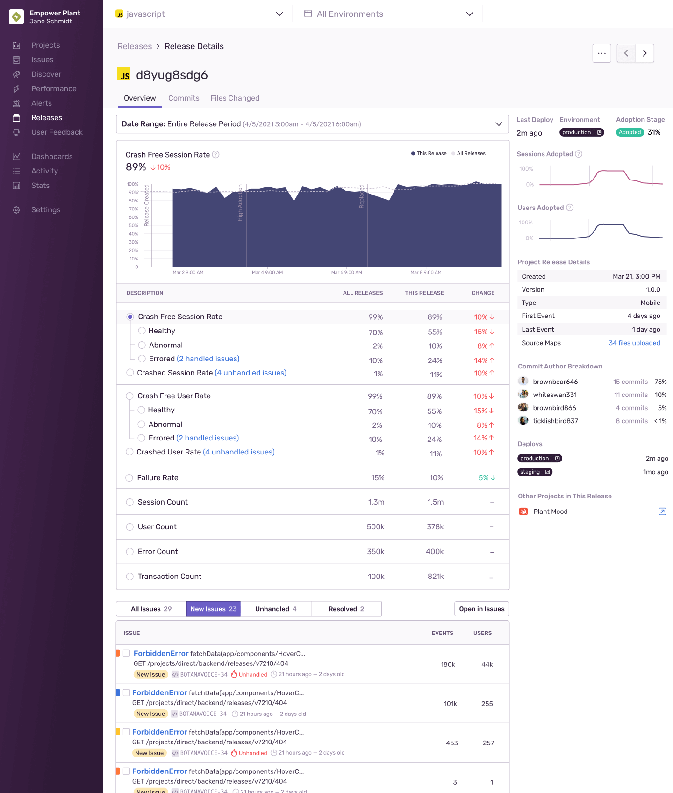
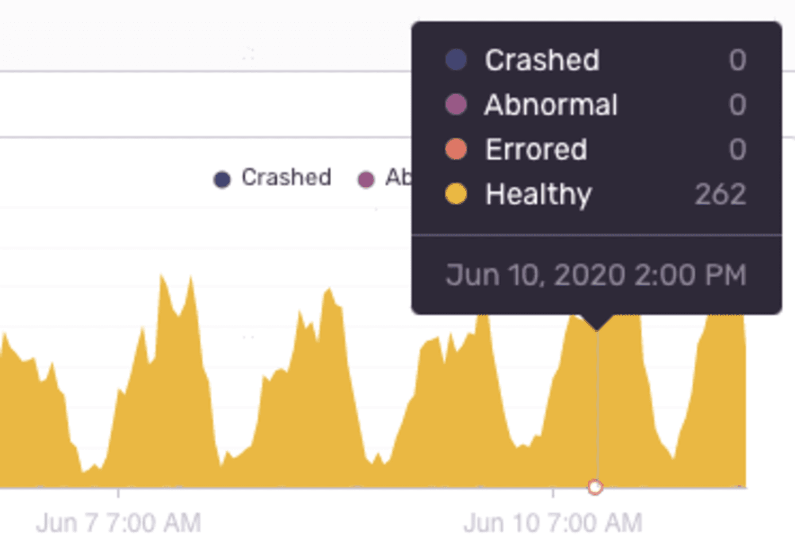

The Release Details page focuses on an individual release. Elements of the release are presented in visual trends for crashes and sessions, specifics regarding each issue, and commit author breakdowns.

Hover over specific dates and times in the overview graph for a quick perspective of events that crashed, behaved abnormally, errored, or are healthy, as defined for [Release Health](/product/releases/health/).

For more information about Sentry's Mobile features, see the full documentation for [Android SDK](/platforms/android/), [iOS SDK](/platforms/apple/guides/ios/) and
[React Native SDK](/platforms/react-native/).
