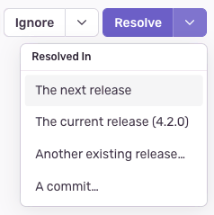

A _release_ is a version of your code deployed to an environment. When you notify Sentry about a <SandboxLink scenario="oneRelease" projectSlug="react">release</SandboxLink>, you can easily identify new issues and regressions, determine whether an issue got resolved, and monitor the health of your newly deployed app. The **Releases** page provides a visualization of your releases. It presents adoption of releases from the past 24 hours and provides a high-level view of:

- Each release version (a short version of the release name without the hash)
- The associated project
- The adoption stage of each release
- The authors of each commit
- The percentage of crash-free users
- The percentage of crash-free sessions

<Note>

Crash and app hang detection are not available for watchOS.

</Note>

Notifying Sentry of a release enables auto discovery of which commits to associate with a release and identifies what we consider "the most recent release" when searching in [sentry.io](https://sentry.io).

Each release links to one or more projects. If a release has multiple projects, Sentry will duplicate the release data in relation to each one. From this page, you can also click any release to go to [Release Details](/product/releases/release-details/) for more information.

Releases offer significant additional features when [fully configured](/product/releases/setup/):

- Determine the issues and regressions introduced in a new release
- Predict which commit caused an issue and who is likely responsible
- Resolve issues by including the issue number in your commit message
- [Receive email notifications when your code gets deployed](/product/alerts/notifications/#deploy-notifications)

<Note>

We recommend notifying Sentry about a new release before deploying it. But if you don't, Sentry will automatically create a release entity in the system the first time it sees an event with that release identifier.

</Note>

You don't need a repository integration for any of these features, though we recommend [installing one as part of an automated release option](/product/releases/setup/release-automation/) for efficiency.

## Associate Commits

With releases, you can [associate commits](/product/releases/associate-commits/), which keeps track of the commits that were used in a release.

You can resolve issues quickly using the **Release Details** page to view which commits were used to create a release as the list of authors of those commits.

## Track Release Health

_Release health_ provides insight into the impact of crashes and bugs as it relates to your user's experience and reveals trends with each new issue. Monitor [release health](/product/releases/health/) by observing user adoption, usage of the application, percentage of crashes, and session data. You can explore the health of a release more closely in the [Release Details](/product/releases/release-details/) page.

You can view release health data either from the <SandboxLink scenario="oneIssue" projectSlug="react">Issue Details</SandboxLink> page by selecting the commit ID listed under Last Seen", or from the **Releases** page.

## Different Ways to Resolve Issues

If you'd like to mark an issue as [resolved](/product/issues/states-triage/#resolve) in both a current and a future release, you can do so by resolving it in a release via the dropdown on the issue details page.

There are several options for resolving a release issue. If you'd like to leave the issue unresolved and be notified of it the next time any event is seen in a release, click the main "Resolve" button. But if you'd like to ignore the release issue until it's seen again in your current or next release, you can select "Resolved In The next release" or "Resolved In The current release" from the dropdown.

### Resolved in the Current Release

The "Resolved in the current release" option records the current release that's displayed in the UI. New events for the release issue are compared against the recorded release version to determine if the issue should unresolve. If the release version is using semver, the issue will be marked as unresolved if the release is from a semver version that's greater than the resolved version. If the release is not using semver, the release creation dates will be compared.

### Resolved in the Next Release

The "Resolved in the next release" option works in a similar way to resolved in the current release. But because we can't record the resolution version since it hasn't been created yet, we record the current release version and update it when a newer release is created.

### Resolved in a Commit

The "Resolved in a commit" option allows you to wait for a release with the specified commit to be created. Once the release is created, new events get checked against the release version or release date. If the new events are from a newer release, the issue gets marked as a regression and appears in your [For Review tab](/product/issues/states-triage/) to be triaged.

## Learn More

<PageGrid />
