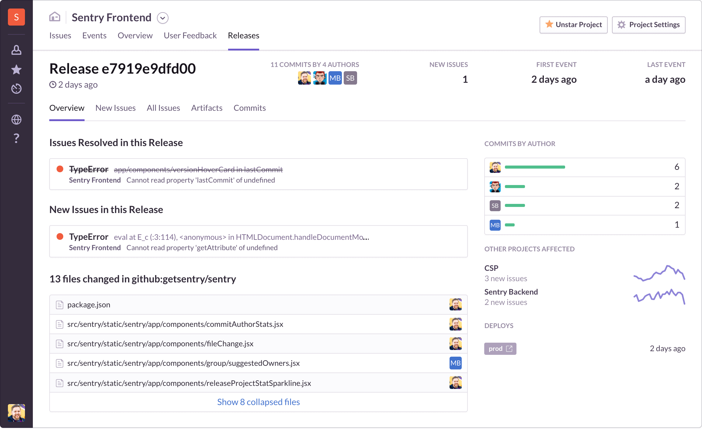

A _release_ is a version of your code deployed to an environment. When you notify Sentry about a release, you can easily identify new issues, regressions, whether an issue is resolved in the next release, and apply [source maps](/platforms/javascript/sourcemaps/).

Releases also offer significant additional features when you fully [configure your SDK](/platform-redirect/?next=/configuration/releases/):

- Determine the issues and regressions introduced in a new release
- Predict which commit caused an issue and who is likely responsible
- Resolve issues by including the issue number in your commit message
- Receiving email notifications when your code gets deployed

<Note>

We recommend notifying Sentry about a new release before deploying it. But if you don’t, Sentry will automatically create a release entity in the system the first time it sees an event with that release identifier.

</Note>

After configuring your SDK and notifying Sentry, you can view information about the release, such as new issues and regressions introduced in the release.

## Track Release Health

_Release health_ provides insight into the impact of crashes and bugs as it relates to your user's experience and reveals trends with each new issue. Monitor [Release Health](/product/releases/health/) by observing user adoption, usage of the application, percentage of crashes, and session data.

## Apply Source Maps

Releases are required to apply [source maps](/platforms/javascript/sourcemaps/) for our JavaScript SDK, which lets you view source code context obtained from stack traces in their original untransformed form. This is particularly useful for debugging minified code (for example, UglifyJS), or transpiled code from a higher-level language (such as TypeScript and ES6).

## Enable Suspect Commits

_Suspect commits_ predict which commit caused an issue and who is likely responsible. Sentry uses commit metadata from your source code repositories to identify the suspect commit.

You can resolve issues quickly using the **Issue Details** page to view suspect commits as well as the list of authors of those commits. In addition, we can automatically assign or alert the issue owner, based on your organization's [ownership rules](/product/error-monitoring/issue-owners/).

<PageGrid />
