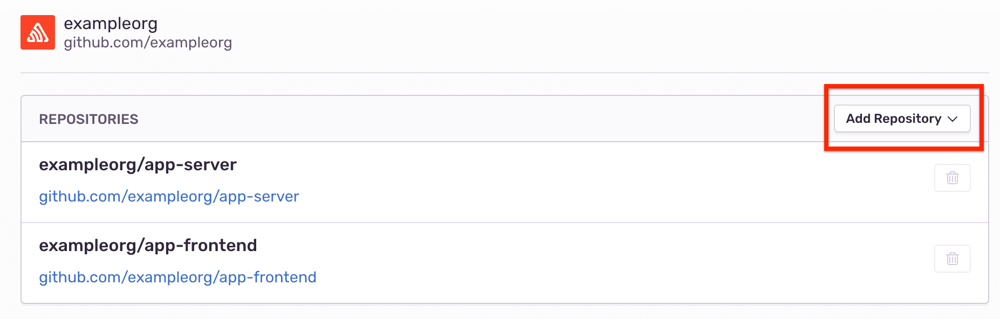
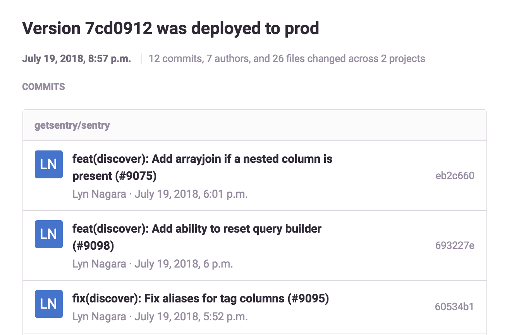

A _release_ is a version of your code eployed to an environment. When you provide Sentry information about your releases, you can:

- Determine the issues and regressions introduced in a new release
- Predict which commit caused an issue and who is likely responsible
- Resolve issues by including the issue number in your commit message
- Receive email notifications when your code gets deployed
- Apply [source maps](/platforms/javascript/sourcemaps/) so JavaScript and React Native projects can utilize release artifacts to unminify or symbolicate error stack traces.

After this set up, you will see information about the release, such as new issues and regressions introduced in the release.


## Set Up

Setting up releases fully requires:

1. [Configuring Your SDK to include a release identifier](/platform-redirect/?next=/configuration/releases/).
2. Notifying Sentry of a release:
    1.  [Install a Repository Integration]
    2.  [Create the Release and Associate Commits]
    3.  [Tell Sentry When You Deploy a Release]

## Notify

Notifying Sentry of a release and providing commit metadata can be done using one of our integrations. We also support a [manual process](/product/releases/manual-setup/without-repo).

### Install a Repository Integration

Using one of Sentry's repository integrations is the most efficient way to provide your commit metadata to Sentry.

<Alert level="warning" title="Required Permissions">

To set up or configure an integration, you need to be an Owner or Manager of your Sentry organization. Learn more about [roles in Sentry](/product/accounts/membership/).

If you’re linking a GitHub repository, you must have Admin or Owner permissions for the repository, and Sentry must be an authorized GitHub app in your [GitHub account settings](https://github.com/settings/applications).

</Alert>

1. Install the applicable integration. The available integrations are listed under your **Organization Settings > Integrations**.

2. Click the "Configure" button next to your instance.

   

3. In the **Repositories** panel, click "Add Repository" to add any repositories from which you'd like to track commits. The integration will then send Sentry metadata (such as authors and files changed) about each commit pushed to those repositories.

  

  <Note>

  If you’re having trouble adding the integration, [disconnect](https://sentry.io/account/settings/identities/) then [reconnect](https://sentry.io/account/settings/social/associate/github/) your GitHub identity.

  </Note>

### Create the Release and Associate Commits

Tell Sentry about a new release and which commits are associated with it so Sentry can pinpoint which commits likely caused an issue. This information allows your team to resolve issues by referencing the issue number in a commit message.

#### Associate Commits with a Release

In your release process, add a step to create a release object in Sentry and associate it with commits from your linked repository. We recommend using Sentry’s Command Line Interface. Alternately, you can use [our API](product/releases/manual-setup/use-the-api).

After this step, suspect commits and suggested assignees will display on the Issues page. We determine these by tying together the commits in the release, files touched by those commits, files observed in the stack trace, authors of those files, and [ownership rules](/workflow/issue-owners/).


Additionally, you will be able to resolve issues by including the issue ID in your commit message. You can find the issue ID at the top of the Issue Details page, next to the assignee dropdown. For example, a commit message might look like this:

```bash
Prevent empty queries on users

Fixes SENTRY-317
```

When Sentry sees this commit, we’ll reference the commit in the issue, and when you create a release in Sentry we’ll mark the issue as resolved in that release.

<Note>

If you’re using GitHub, you may have a privacy setting enabled that prevents Sentry from identifying the user’s actual email address. To use the suggested owners feature, uncheck “Keep my email address private” in GitHub’s [account settings](https://github.com/settings/emails).

</Note>

In this example:
- environment variables configure the CLI (see [Working with Projects](/product/cli/configuration/#sentry-cli-working-with-projects) for alernatives),
- the `propose-version` sub-command determines a release ID automatically.
- a release tagged `VERSION` is created for the organization `my-org` for projects (`project1` and `project2`)
- the `--auto` flag determines the repository name automatically, and associates commits between the previous release’s commit and the current head commit with the release.

<Note>

If the previous release doesn't have any commits associated with it, we’ll use the latest 20 commits.

</Note>

```bash
# Assumes you're in a git repository
export SENTRY_AUTH_TOKEN=...
export SENTRY_ORG=my-org
VERSION=$(sentry-cli releases propose-version)

# Create a release
sentry-cli releases new -p project1 -p project2 $VERSION

# Associate commits with the release
sentry-cli releases set-commits --auto $VERSION
```

For more control over which commits to associate, or if you're unable to execute the command inside the repository, you can manually specify a repository and range:

```bash
sentry-cli releases set-commits --commit "my-repo@from..to" $VERSION
```

This example associates commits (or refs) between `from` and `to` with the current release, where `from` is the previous release’s commit. The repository name `my-repo` should match the name you entered when linking the repo, and is of the form `owner-name/repo-name`. The `from` commit is optional. We’ll use the previous release’s commit as the baseline if it is excluded.

For more information, see our [CLI docs](/product/cli/releases/).

#### Finalizing Releases

By default, a release is created as “unreleased”. Finalizing a release means that we populate a second timestamp on the release record, which is prioritized over `date_created` when sorting releases in sentry.io. Release finalization (and the timestamp) also affects what counts as "the next release" for resolving issues, which release is used as the base for associating commits if you use `--auto`, and creates an entry in the Activity stream.

This can be changed by passing either `--finalize` to the `new` command, which will immediately finalize the release, or you can separately call `sentry-cli releases finalize VERSION` later on, which is useful if you are managing releases as part of a build process.

You can also choose to finalize the release when you've made the release live (when you've deployed to your machines, enabled in the App store, and so forth).

```bash
#!/bin/sh
sentry-cli releases new "$VERSION"
# do your build steps here
# once you are done, finalize
sentry-cli releases finalize "$VERSION"
```
### Tell Sentry When You Deploy a Release

Tell Sentry when you deploy a release to a new environment.


And then, we’ll automatically send an email to Sentry users who have committed to the release that is being deployed.



You must have environment context set in your SDK to use this feature. To let Sentry know you’ve deployed, just send an additional request after creating a release:

```bash
sentry-cli releases deploys VERSION new -e ENVIRONMENT
```

You can also use our [API](/api/releases/create-a-new-deploy-for-an-organization/) to create a deploy.
