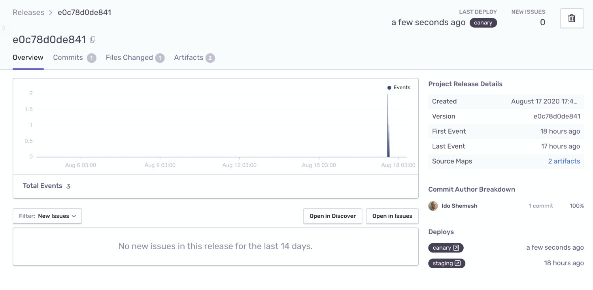

<Note>

You must have the environment [configured in your SDK](/platform-redirect/?next=/configuration/environments/) to use this feature.

</Note>

Notifying Sentry of a release enables auto discovery of which commits to associate with a release and identifies what we consider "the most recent release" when searching in sentry.io. In addition, telling Sentry of a release helps identify new issues, regressions, and whether an issue is resolved in the next release. You do not need a repository integration for any of these features, though we recommend [installing  a repository] for efficiency.

When you notify Sentry that you've deployed a release to a new environment, we can automatically send an email to Sentry users who have committed to the release being deployed.



If you're using [Release Automation](/product/releases/setup/release-automation/), let Sentry know you’ve deployed by sending an additional request after creating a release:

```bash
sentry-cli releases deploys VERSION new -e ENVIRONMENT
```

You can also use our [API](/api/releases/create-a-new-deploy-for-an-organization/) to create a deploy.
