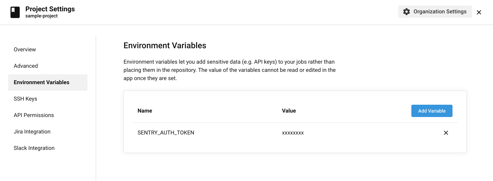

This guide walks you through the process of automating Sentry release management and deploy notifications in CircleCI. After deploying in CircleCI, you'll be able to identify suspect commits that are likely the culprit for new errors. You'll also be able to apply source maps to see the original code in Sentry.

Before starting, confirm that your Sentry project is properly set up to track commit metadata by [installing a repository integration](/product/releases/#install-repo-integration). Once that's installed, and you've added your repository, come back to this guide. If you've already installed a repository integration, you're ready to go.

## Create a Sentry Internal Integration

For CircleCI to communicate securely with Sentry, you'll need to create a new internal integration. In Sentry, navigate to **Settings > Developer Settings > New Internal Integration**.

Give your new integration a name (for example, “CircleCI Deploy Integration”) and specify the necessary permissions. In this case, you need Admin access for “Release” and Read access for “Organization”.

For more details about scopes and API endpoints, see the full documentation on [API Permissions](/api/permissions/).


Click "Save", then record your token, which you'll need in the next section.

## Setting Environment Variables in CircleCI

Next, you'll need a few environment variables to configure the Sentry CLI:

- `SENTRY_AUTH_TOKEN` - Your internal integration token
- `SENTRY_ORG` - Your Sentry organization slug
- `SENTRY_PROJECT` - Your Sentry project slug

To access your internal integration token securely, store it as an [environment variable on your project](https://circleci.com/docs/2.0/env-vars/#setting-an-environment-variable-in-a-project):

1. In the CircleCI application, go to your project’s settings by clicking the gear icon on the Pipelines page, or the three dots on other pages in the application.
2. Click on Environment Variables.
3. Add a new variable by clicking the "Add Variable" button and enter `SENTRY_AUTH_TOKEN` as the name and your internal integration token as the value.



The other variables do not contain sensitive information, so you'll use the environment key to define them as environment variables in your config.yml file.

## Create Release and Notify Sentry of Deployment

To automate your Sentry release management process, you'll need to add the `Create release and notify Sentry of deploy` step below after your deploy step, either in a new job or at the end of your existing deploy job:

```yaml
notify-sentry-deploy:
  executor:
  # Specify executor for running deploy job
  environment:
    SENTRY_ORG: sample-organization-slug
    SENTRY_PROJECT: sample-project-slug
    SENTRY_ENVIRONMENT: production
  steps:
    - checkout
    # ...
    - run:
        name: Create release and notify Sentry of deploy
        command: |
          curl -sL https://sentry.io/get-cli/ | bash
          export SENTRY_RELEASE=$(sentry-cli releases propose-version)
          sentry-cli releases new -p $SENTRY_PROJECT $SENTRY_RELEASE
          sentry-cli releases set-commits $SENTRY_RELEASE --auto
          sentry-cli releases files $SENTRY_RELEASE upload-sourcemaps path-to-sourcemaps-if-applicable
          sentry-cli releases finalize $SENTRY_RELEASE
          sentry-cli releases deploys $SENTRY_RELEASE new -e $SENTRY_ENVIRONMENT
```

For more details about the release management concepts in the snippet above, see the full documentation on [release management](/product/cli/releases/).

**Notes**:

- If you’re not deploying a JavaScript project or have sent source maps to Sentry using another method, omit the `upload-sourcemaps` line.
- If you can’t install a repository integration, send commit metadata via the [create release endpoint](/product/releases/#alternatively-without-a-repository-integration) or omit the `set-commits` line.
- `sentry-cli releases propose-version` defaults to the commit SHA of the commit being deployed. To set this to a different version, modify `SENTRY_RELEASE` to the preferred version.
