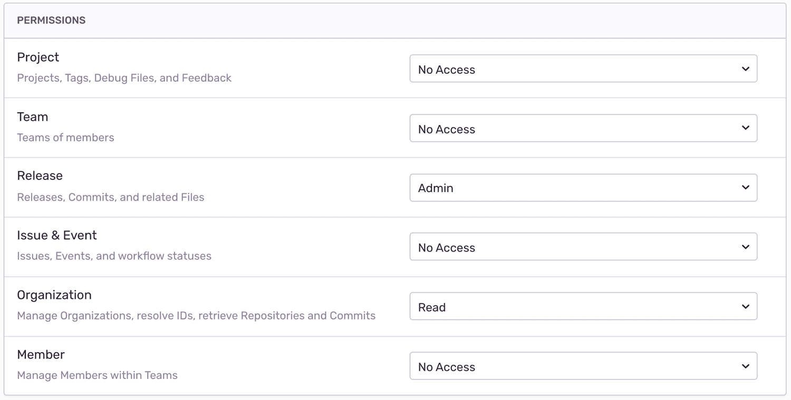
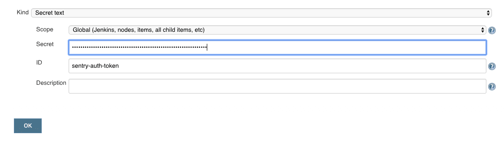
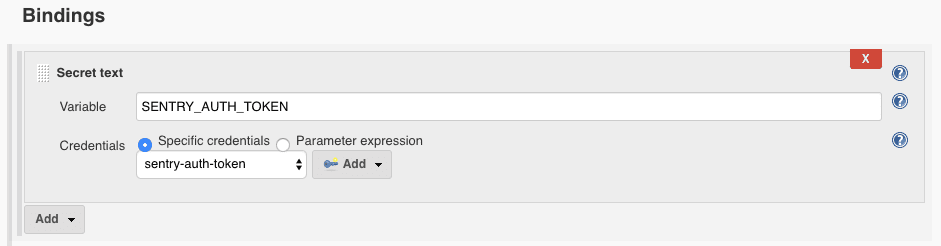
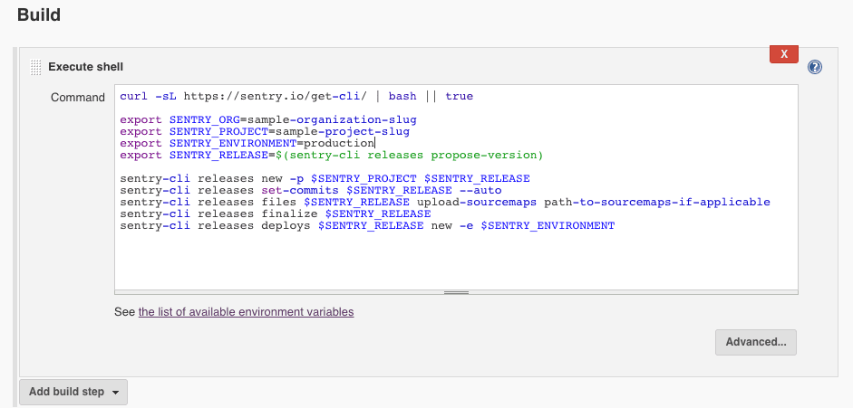

This guide walks you through the process of automating Sentry release management and deploy notifications in Jenkins. After deploying in Jenkins, you'll be able to identify suspect commits that are likely the culprit for new errors. You'll also be able to apply source maps to see the original code in Sentry.

Before starting, confirm that your Sentry project is properly set up to track commit metadata by [installing a repository integration](/workflow/releases/#install-repo-integration). Once that's installed, and you've added your repository, come back to this guide. If you've already installed a repository integration, you're ready to go.

## Create a Sentry Internal Integration

For Jenkins to communicate securely with Sentry, you'll need to create a new internal integration. In Sentry, navigate to **Settings > Developer Settings > New Internal Integration**.

Give your new integration a name (for example, “Jenkins Deploy Integration”) and specify the necessary permissions. In this case, you need Admin access for “Release” and Read access for “Organization”.

For more details about scopes and API endpoints, see the full documentation on [API Permissions](/api/permissions/).



Click "Save", then record your token, which you'll need in the next section.

## Add Token to Jenkins Credentials

To access your internal integration token securely in Jenkins, store it as a [credential](https://www.jenkins.io/doc/book/using/using-credentials/):

1. From the Jenkins home page (the Dashboard of the classic Jenkins UI), click **Credentials > System**.
2. Under **System**, click the **Global credentials (unrestricted)** link to access this default domain.
3. Click **Add Credentials**.
4. From the **Kind** field select Secret Text.
5. Give your credential an **ID** (for example, "sentry-auth-token") and in the **Secret** field paste your internal integration token.
6. Click **OK** to save the credentials.



## Notify Sentry of Deployment

Depending on what type of Jenkins project you're using to build and deploy, you want to follow different steps:

- [Pipeline (Jenkinsfile)](/workflow/releases/release-automation/jenkins/#pipeline)
- [Freestyle project](/workflow/releases/release-automation/jenkins/#freestyle-project)

For more details about the release management concepts below, see the full documentation on [release management](/product/cli/releases/).

### Pipeline

If you're using a Jenkins pipeline, you need to add a new stage with the following snippet after your deploy stage:

```groovy
pipeline {
		// ...
    stages {

        /// ...

        stage('Notify Sentry of deployment') {
            environment {
                SENTRY_AUTH_TOKEN = credentials('sentry-auth-token')
                SENTRY_ORG = 'sample-organization-slug'
                SENTRY_PROJECT = 'sample-project-slug'
                SENTRY_ENVIRONMENT = 'production'
            }
            steps {
                // Install Sentry CLI
                sh 'curl -sL https://sentry.io/get-cli/ | bash'

                sh '''
                    export SENTRY_RELEASE=$(sentry-cli releases propose-version)
                    sentry-cli releases new -p $SENTRY_PROJECT $SENTRY_RELEASE
                    sentry-cli releases set-commits $SENTRY_RELEASE --auto
                    sentry-cli releases files $SENTRY_RELEASE upload-sourcemaps path-to-sourcemaps-if-applicable
                    sentry-cli releases finalize $SENTRY_RELEASE
                    sentry-cli releases deploys $SENTRY_RELEASE new -e $SENTRY_ENVIRONMENT
                '''
            }
        }
    }
}
```

**Notes**:

- If you’re not deploying a JavaScript project or have sent source maps to Sentry using another method, omit the `upload-sourcemaps` line.
- If you can’t install a repository integration, send commit metadata via the [create release endpoint](/workflow/releases/#alternatively-without-a-repository-integration) or omit the `set-commits` line.
- `credentials('sentry-auth-token')` refers to the ID of the credentials just added to Jenkins.
- `sentry-cli releases propose-version` defaults to the commit SHA of the commit being deployed. To set this to a different version, modify `SENTRY_RELEASE` to the preferred version.

### Freestyle Project

If you're using Freestyle projects, you need to add another build step after deployment.

1. Make sure you add a binding to map the environment variable `SENTRY_AUTH_TOKEN` to the internal integration token credential you added in the previous step.

   

2. Add the following build step after your deployment step:

   

   ```bash
   curl -sL https://sentry.io/get-cli/ | bash || true

   export SENTRY_ORG=sample-organization-slug
   export SENTRY_PROJECT=sample-project-slug
   export SENTRY_ENVIRONMENT=production
   export SENTRY_RELEASE=$(sentry-cli releases propose-version)

   sentry-cli releases new -p $SENTRY_PROJECT $SENTRY_RELEASE
   sentry-cli releases set-commits $SENTRY_RELEASE --auto
   sentry-cli releases files $SENTRY_RELEASE upload-sourcemaps path-to-sourcemaps-if-applicable
   sentry-cli releases finalize $SENTRY_RELEASE
   sentry-cli releases deploys $SENTRY_RELEASE new -e $SENTRY_ENVIRONMENT
   ```

   **Notes**:

   - If you’re not deploying a JavaScript project or have sent source maps to Sentry using another method, omit the `upload-sourcemaps` line.
   - If you can’t install a repository integration, send commit metadata via the [create release endpoint](/workflow/releases/#alternatively-without-a-repository-integration) or omit the `set-commits` line.
   - `sentry-cli releases propose-version` defaults to the commit SHA of the commit being deployed. To set this to a different version, modify `SENTRY_RELEASE` to the preferred version.
