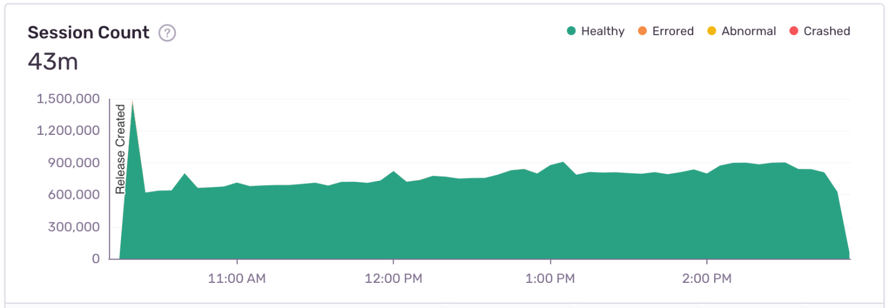
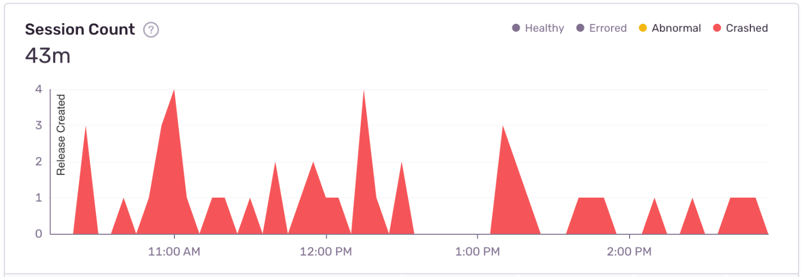

The **Release Details** page focuses on an individual release. Elements of the release are displayed, such as visualized trends for crashes and sessions, specifics regarding each issue, adoption graphs, and commit author breakdowns.

## Graphs

The graph at the top of the page provides insights into the health of your release by allowing you to choose which metric it displays. Select the time range that you want to review (the default range is the entire release period) and choose from these metrics in the table below the graph:

- [Crash Free Session Rate](/product/releases/health/#crash-free-sessionsusers)
- [Healthy](/product/releases/health/#healthy), [Abnormal](/product/releases/health/#abnormal), [Errored](/product/releases/health/#errored) session rate
- [Crash Free User Rate](/product/releases/health/#crash-free-sessionsusers)
- Crashed Session Rate
- [Crashed User Rate](/product/releases/health/#crashed-users)
- [Failure Rate](/product/performance/metrics/#failure-rate)
- [Session Count](/product/releases/health/#session)
- Error Count
- Transaction Count

In the table below the graph, percentage-based metrics of this release are compared to the average of all releases, so you can spot any differences in trend.

[Errored](/product/releases/health/#errored) sessions are likely to result in handled issues, and [crashed](/product/releases/health/#crash) sessions in unhandled issues. Click on the issues links to see them in the [Issues](/product/issues/) page.

Click on any option in the graph legend to hide it. For example, in a "Session Count" graph, you might hide "Healthy" sessions to see "Crashed" ones in better scale. In the image below, the healthy sessions are displayed, but there are so many healthy sessions compared to all other session types that the crashed ones become invisible in the graph:

By hiding the healthy (and errored) sessions, you can actually see the very small number of crashed sessions:

Hover over specific dates and times in the overview graph for a quick perspective of events that crashed, behaved abnormally, errored, or are healthy, as defined for [release health](/product/releases/health/). The graph also displays markers showing adoption stage changes when you view a time period where that is applicable (and you've filtered by a single environment).

## Issues

Use the **Release Details** page to view issues associated with this release and to access them for triage. You can navigate to the [Issues](/product/issues/) page by clicking the "Open in Issues" button located at the top of the issues table. The issues in the table are sorted by the number of events in the selected time range. Click the tabs to see:

- All issues
- New issues
- Unhandled issues
- Regressed issues
- Resolved issues

## Sessions Adopted

See the release adoption percentage over time. This graph compares sessions on this release with sessions on all releases. You can change the main date range to see adoption in a different timeframe.

## Commit Author Breakdown

See the list of people that authored commits in this release together with the absolute and relative counts of commits per person. [Learn how to associate commits with a release](/product/releases/associate-commits/).

## Deploys

See when and to which environments this release has been deployed. Click on the deploy badge to see issues from that environment. [Learn how to set up deploys](/product/releases/setup/#notify-sentry).

## Other Projects in This Release

Releases are global per organization, and this list shows you other projects with the same release version. Click on a project to go to [Project Details](/product/projects/project-details/), and click "View" to see details of that project's release.

For more information about Sentry's mobile features, see the full documentation for [Android SDK](/platforms/android/), [iOS SDK](/platforms/apple/guides/ios/) and
[React Native SDK](/platforms/react-native/).
