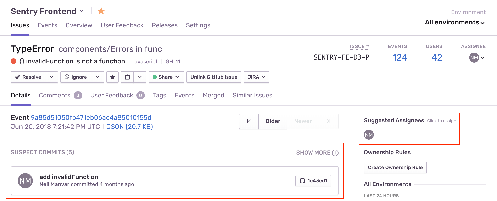

In your release process, add a step to create a release in Sentry and associate it with commits from your linked repository. We recommend using Sentry’s [Command Line Interface](/product/cli/releases/) or [our API](/product/releases/setup/manual-setup-releases/#using-the-api) to add this step in your release process, especially if you're using [Release Automation](/product/releases/setup/release-automation/).

After this, we can tie together the commits in the release, including:

- Files touched by those commits
- Files observed in the stack trace
- Authors of those files
- The issue number in a commit message

This process assumes:

- the SDK is [configured to provide a release identifier](/platform-redirect/?next=/configuration/releases/)
- [Source maps](/platforms/javascript/sourcemaps/) have been uploaded

## Using the CLI

In this CLI example:
- Environment variables configure the CLI (see [Working with Projects](/product/cli/configuration/#sentry-cli-working-with-projects) for alternatives)
- The `propose-version` sub-command determines a release ID automatically
- A release tagged `VERSION` is created for the organization `my-org` for projects (`project1` and `project2`)
- The `--auto` flag determines the repository name automatically, and associates commits between the previous release’s commit and the current head commit with the release.

<Note>

If the previous release doesn't have any commits associated with it, we’ll use the latest 20 commits.

</Note>

```bash
# Assumes you're in a git repository
export SENTRY_AUTH_TOKEN=...
export SENTRY_ORG=my-org
VERSION=$(sentry-cli releases propose-version)

# Create a release
sentry-cli releases new -p project1 -p project2 $VERSION

# Associate commits with the release
sentry-cli releases set-commits --auto $VERSION
```

For more control over which commits to associate, or if you're unable to execute the command inside the repository, you can manually specify a repository and range.

The following example associates commits (or refs) between `from` and `to` with the current release, where `from` is the previous release’s commit. The repository name `my-repo` should match the name you entered when linking the repo using the form `owner-name/repo-name`. The `from` commit is optional; we’ll use the previous release’s commit as the baseline if it is excluded.

```bash
sentry-cli releases set-commits --commit "my-repo@from..to" $VERSION
```

For more information, see our [CLI docs](/product/cli/releases/).

After this step, suspect commits and suggested assignees will display on the Issues page.



Additionally, you will be able to resolve issues by including the issue ID in your commit message. You can find the issue ID at the top of the Issue Details page, next to the assignee dropdown. For example, a commit message might look like this:

```bash
Prevent empty queries on users

Fixes SENTRY-317
```

When Sentry sees this commit, we’ll reference the commit in the issue, and when you create a release in Sentry we’ll mark the issue as resolved in that release.

<Note>

If you’re using GitHub, you may have a privacy setting enabled that prevents Sentry from identifying the user’s actual email address. To use the suggested owners feature, uncheck “Keep my email address private” in GitHub’s [account settings](https://github.com/settings/emails).

</Note>

### Finalize the Release

By default, a release is created as “unreleased”. Finalizing a release means that we populate a second timestamp on the release record, which is prioritized over `date_created` when sorting releases in sentry.io. Release finalization (and the timestamp) also affects:
- What counts as "the next release" for resolving issues
- Which release is used as the base for associating commits if you use `--auto`
- Creates an entry in the Activity stream

You can change this by passing either `--finalize` to the `new` command, which will immediately finalize the release, or by separately calling `sentry-cli releases finalize VERSION` later on, which is useful if you are managing releases as part of a build process.

You can also choose to finalize the release when you've made the release live (such as when you've deployed to your machines or enabled in the App store).

```bash
#!/bin/sh
sentry-cli releases new "$VERSION"
# do your build steps here
# once you are done, finalize
sentry-cli releases finalize "$VERSION"
```
## Using the API

<Note>

Confirm you’re using [Auth Tokens](/api/auth/#auth-tokens), **not** [API Keys](/api/auth/#api-keys), which are deprecated.

</Note>

```bash
# Create a new release
curl https://sentry.io/api/0/organizations/:organization_slug/releases/ \
  -X POST \
  -H 'Authorization: Bearer {TOKEN}' \
  -H 'Content-Type: application/json' \
  -d '
 {
 "version": "2da95dfb052f477380608d59d32b4ab9",
 "refs": [{
 "repository":"owner-name/repo-name",
 "commit":"2da95dfb052f477380608d59d32b4ab9",
 "previousCommit":"1e6223108647a7bfc040ef0ca5c92f68ff0dd993"
 }],
 "projects":["my-project","my-other-project"]
}
'
```

If you’d like to have more control over what order the commits appear in, you can send us a list of all commits. That might look like this:

```python
import subprocess
import requests

SENTRY_API_TOKEN = <my_api_token>
sha_of_previous_release = <previous_sha>

log = subprocess.Popen([
    'git',
    '--no-pager',
    'log',
    '--no-merges',
    '--no-color',
    '--pretty=%H',
    '%s..HEAD' % (sha_of_previous_release,),
], stdout=subprocess.PIPE)

commits = log.stdout.read().strip().split('\n')

data = {
    'commits': [{'id': c, 'repository': 'my-repo-name'} for c in commits],
    'version': commits[0],
    'projects': ['my-project', 'my-other-project'],
}

res = requests.post(
    'https://sentry.io/api/0/organizations/my-org/releases/',
    json=data,
    headers={'Authorization': 'Bearer {}'.format(SENTRY_API_TOKEN)},
)
```

For more information, see the [API reference](/api/releases/create-a-new-release-for-an-organization/).

<Note>

If you receive an "Unable to Fetch Commits" email, take a look at our [Help Center Article](https://help.sentry.io/hc/en-us/articles/360019866834-Why-am-I-receiving-the-email-Unable-to-Fetch-Commits-).

</Note>
