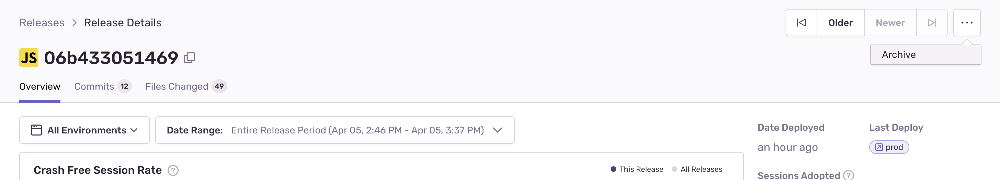
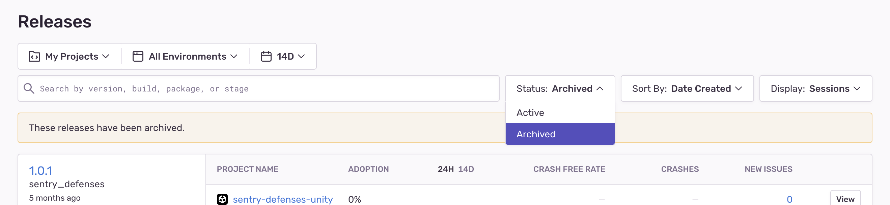

Since an event received from a deleted release automatically recreates it, Sentry has an option to hide releases permanently. In addition, archiving releases can be useful if you're no longer interested in viewing the release or if you've accidentally created a release you no longer want to track.

## Using Sentry.io

Archiving in Sentry.io removes the release from the list of releases you can select to view.



Archived releases won't show up in Releases view unless you filter for them:



## Using the CLI

In the CLI, run this command to archive a release:

```bash
sentry-cli releases archive VERSION
```
