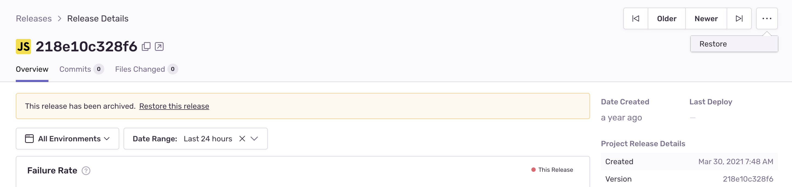

You can restore archived releases using either Sentry.io or the Sentry CLI.

## Using Sentry.io

In sentry.io, you can request a release be restored:



## Using the CLI

In the CLI, restore a release by running this command:

```bash
sentry-cli releases restore VERSION
```
