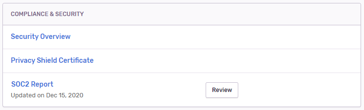

You can find a copy of Sentry's latest SOC2 report by visiting _Your Organization's Settings_ > Legal & Compliance. You will need either the [Owner](https://docs.sentry.io/product/accounts/membership/#owner) or [Billing](https://docs.sentry.io/product/accounts/membership/#billing) role assigned to your account in order to view this report.

