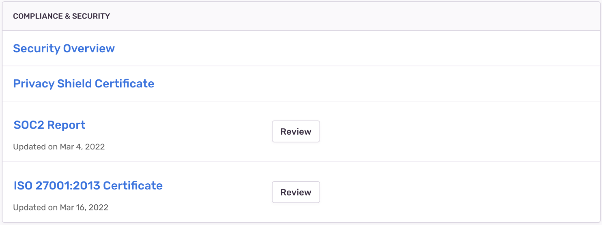

You can find a copy of Sentry's latest SOC2 report and ISO 27001 certificate by visiting _Your Organization's Settings_ > Legal & Compliance. You will need either the [Owner](/product/accounts/membership/#owner) or [Billing](/product/accounts/membership/#billing) role assigned to your account in order to view this report and certificate.

