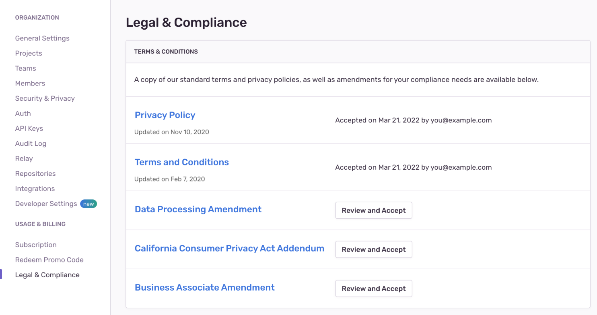

Sentry provides a way to self-serve most legal and compliance documentation for your organization. You'll find these by navigating to _Your Organization's Settings_ > Legal & Compliance. When you are logged in to your Sentry account, you will be able to review and accept these agreements as an authorized individual on behalf of your organization.

Available legal documents include:

- [Terms of Service](https://sentry.io/terms/)
- [Privacy Policy](https://sentry.io/privacy/)
- [Data Processing Addendum (DPA)](https://sentry.io/legal/dpa/2.0.0/)
- [California Consumer Privacy Act Addendum (CCPA)](https://sentry.io/legal/ccpa/1.0.0/)
