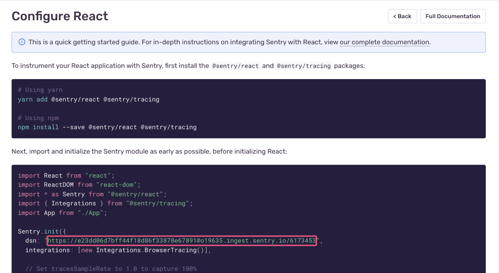

Sentry automatically assigns you a Data Source Name (DSN) when you create a project to start monitoring events in your app.

### What the DSN Does

A DSN tells a Sentry SDK where to send events so the events are associated with the correct project.

If this value is not provided, SDKs will try to read it from the `SENTRY_DSN` environment variable, where applicable. This fallback does not apply in cases like a web browser, where the concept of environment variables does not exist.

If an SDK is not initialized or if it is initialized with an empty DSN, the SDK will not send any data over the network, such as captured exceptions.

### DSN Utilization

DSNs are safe to keep public because they only allow submission of new events and related event data; they do not allow read access to any information.

While there is a risk of abusing a DSN, where any user can send events to your organization with any information they want, this is a rare occurrence. Sentry provides controls to [block IPs](/platform-redirect/?next=/configuration/options/) and similar concerns. You can also rotate (and revoke) DSNs by navigating to **[Project] > Settings > Client Keys (DSN)**.

If your application is shipped to client devices, if possible, we recommend having a way to configure the DSN dynamically. In an ideal scenario, you can "ship" a new DSN to your application without the customer downloading the latest version. We recognize that this may not always be practical, but we cannot offer further advice as this scenario is implementation specific.

### Where to Find Your DSN

If you're in the process of setting up a project, you can find your DSN in the installation or configuration code snippets provided in [sentry.io](https://sentry.io/) during setup:



You can also find the DSN in your project settings by navigating to **[Project] > Settings > Client Keys (DSN)** in [sentry.io](https://sentry.io/).

### The Parts of the DSN

The DSN configures the protocol, public key, server address, and project identifier. It is composed of the following parts:

`{PROTOCOL}://{PUBLIC_KEY}:{SECRET_KEY}@{HOST}{PATH}/{PROJECT_ID}`

For example:

```javascript
Sentry.init({dsn: 'https://public@sentry.example.com/1'});
```

Has the following settings:

- URI = https://sentry.example.com
- Public Key = public
- Project ID = 1

<Note>

The secret part of the DSN is optional and effectively deprecated. While clients will still honor it, if supplied, future versions of Sentry will entirely ignore it.

</Note>
