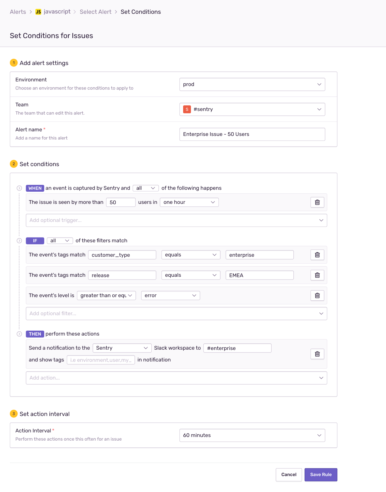
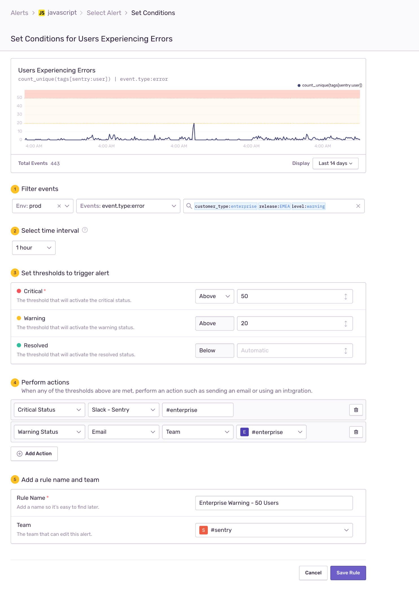
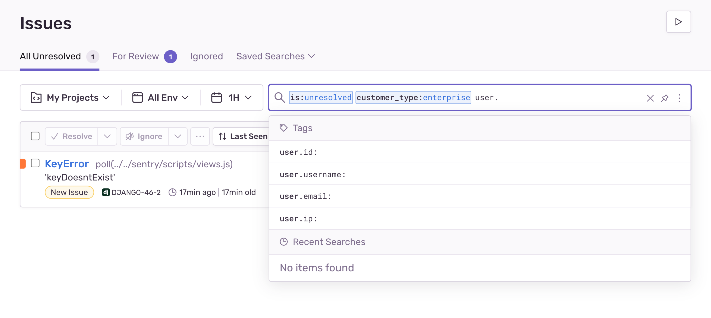
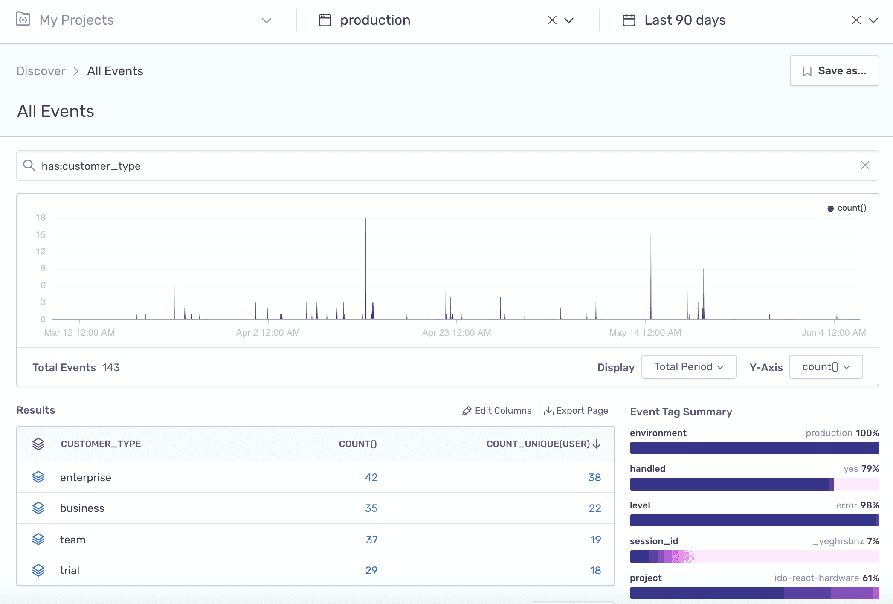
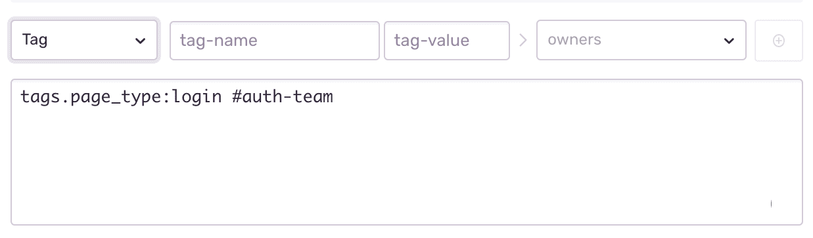
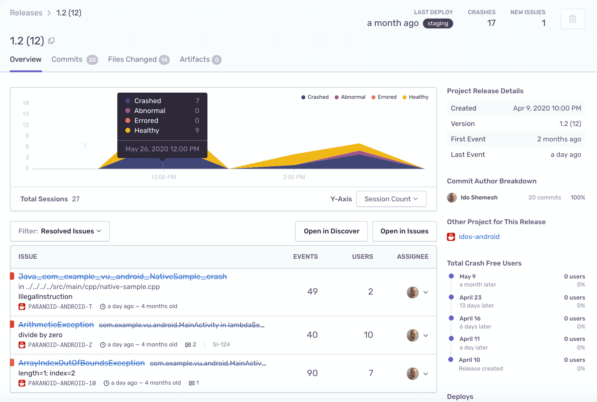

The Sentry SDK captures errors, exceptions, crashes, transactions, and generally anything that goes wrong in your application in real-time.
Once captured, the SDK enriches the data with contextual information that it gets from the application's runtime and sends all this data as an _event_ to your Sentry account.

While Sentry adds a lot of this contextual data by default, we highly encourage you to add your custom data through the SDK. Multiple Sentry workflows and tools can be configured and fine-tuned based on this data, so adapting those to the way you work is very helpful in getting even more value out of Sentry.

## Types of Data

The SDK allows you to set various types of data that are then attached to every event that occurs in your application. Generally, those data types are:

1. **Unstructured Data** - Includes additional data like `Breadcrumbs`, `Extra data`, and `Custom Contexts`. While these fields are **unsearchable**, they enrich your events with information that will help you debug and resolve the associated issues.

2. **Structured Data** - Key/value pairs that are **indexed and searchable**, allowing you to search, filter, and query **through all your events** across projects, in addition to helping you debug specific issues. These include:

   - `Custom Tags` - A way to reflect key characteristics that apply to your applications, dev process, or business in your error data. These might include variants and flavors of your app, a user type, tenant ID, payment plan, and so on.
   - `Release` and `Environment` - Predefined data fields available as SDK configuration options.
   - `User Context` - Comprised of a set of predefined data fields. Setting any one of those (when applicable) allows Sentry to construct a user identity and define user uniqueness.

## Using Your Data {#utilizing-your-data}

Adding custom **structured data** that is unique to your applications, users, and business logic enriches your data and provides valuable context to every event. You can also use that same data to customize Sentry workflows and adapt them to your precise needs. Let's look at those major workflows:

### Alert Rules

Targeted alerts are key to focusing attention when your app breaks and notifying exactly the people who can fix it. The more data you add to your events, the more flexibility you gain to create pinpointed alerts. The following data types can be incorporated in your alert rules by adding the relevant conditions to trigger the alert:

- **User Context**: Once a certain issue has impacted a defined threshold of unique users.
- **Custom Tags**: When events contain custom tag values that match your defined values.
- **Environment**: When events are occurring in a specific environment.

These can all come in handy in both issue and metric alerts. For instance:

1. **Issue Alerts**: The following rule will trigger a Slack message when a **certain issue** with level _error or fatal_, originating from my _EMEA_ releases in my _prod_ environment, impacts more than _50 enterprise_ end-users in _one hour_:
   

2. **Metric Alerts**: The following rule will trigger a Slack message if more than _50 enterprise_ end-users in _one hour_ are impacted by _warning_ level errors (**from multiple issues**) originating from my _EMEA_ releases in my _prod_ environment:

   

Learn more in [Alerts](/product/alerts/).

### Filter, Search, and Order Issues {#filter-search--order-issues}

On the **Issues** page, custom data allows you to:

- Filter issues according to your application's `environments` using the environment filter dropdown.
- Sort issues by the number of (unique) impacted `users`.
- Search through issues by your `custom tags`, `user context` attributes, and `release` ids in the issue search bar.

Learn more in [Search](/product/sentry-basics/search/).

### Discover

Discover is a powerful query engine that builds upon your data, allowing you to reveal patterns, anomalies, and deeper insights in the health of your entire system. With this in mind, the more (custom) data you add to your events, the more flexibility you'll gain in building queries that address your environments, releases, custom development, and business characteristics through _tags_, and the end-users impacted by those events.

For instance, the Discover query below displays all the errors (total of 143 events) that occurred in the _production environment_, distributed by the _customer-type custom tag_, and ordered by the _uniquely impacted end users_.

Learn more in [Discover](/product/discover-queries/).

### Ownership Rules

Ownership Rules allow you to target email notifications and automatically assign issues to members in your project teams by defining rules in your project settings or using code owners functionality. Ownership rules can be defined based on an error's origin `URL`, the `path` of the files in the error's stack-trace, or an error's `tag` value.

Code owners functionality lets you import your GitHub or GitLab CODEOWNERS file, and then we assign issues according to those file paths.

You'll be able to reduce noise by pinpointing notifications to the right people and automatically assigning new issues to their proper owners. You can configure ownership rules in **[Project] > Settings > Ownership Rules**. Learn more in [Ownership Rules](/product/issues/ownership-rules/).

### Release Workflows

Configuring the release version ID on the SDK will associate every error that happens in your application runtime with a specific release version of your code. This way, you know exactly when an error was introduced into your source code. It also unlocks these powerful features and workflows:

1. **Commit Tracking** - With a release in place, Sentry can track which commits were involved with a release and the authors who made them.
2. **Resolve With Release** - When you mark an issue as resolved in a specific release, new events of that issue occurring in previous releases will be ignored and will not trigger any notifications.
3. **Regression Notifications** - If you marked an issue as resolved in a release and new events are still occurring in that same release or any future releases, Sentry will consider that a regression and will notify you.
4. **Release Health** - Sentry can monitor the [health](/product/releases/health/) of your releases by observing various metrics like user adoption, crash-free users and sessions, and others. (Not all release health features are available on all SDKs that support release health.)

Learn more in [Releases](/product/releases/).
