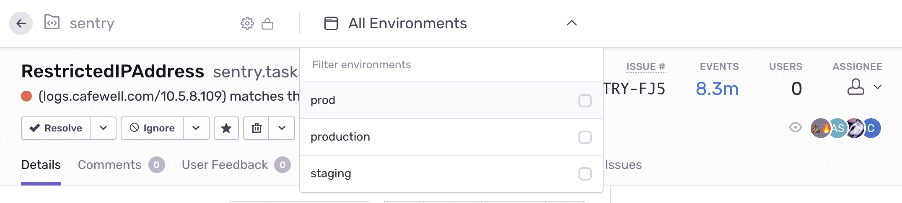
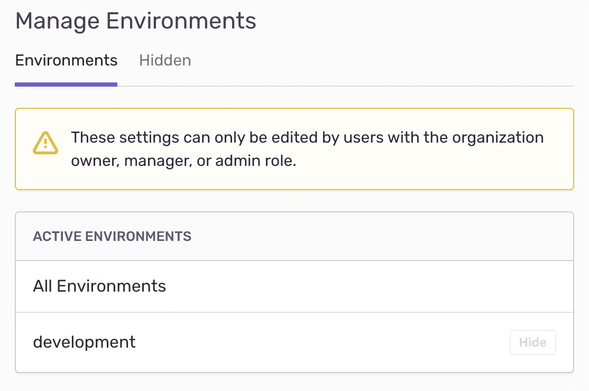

Environments help you better filter issues, releases, and user feedback in the Issue Details page of sentry.io. On that page, you can view information about a specific environment, focusing on the most recent release. If you’re using a multi-staged release process, you can also select a different default environment and set conditions that match the `environment` attribute to restrict alerts to only specific release stages. Sentry environments are available for most features — excluding Dashboards.

Use projects to separate different services or applications, and environments to separate different environments or release stages within each. If you've selected one or more projects in the global header of Sentry's web UI, the environment selector shows only environments associated with events from the selected projects.

Environments are unique to each organization. Environment settings, however, are defined per project since you can hide environments per project.

## Creating Environments

Sentry automatically creates environments when it receives an event with the environment tag. Environments are case sensitive. You can also create an environment when you first `init` your SDK, <PlatformLink to="/configuration/environments/">as documented for each SDK</PlatformLink>.

## Environment Filter

### Issues

If an issue has events from multiple environments, the issue will appear when you select any of those environments. Sentry defines an issue as a grouping of similar events. If you tag one or more events within an issue with a specific environment, that issue will appear in your view when filtered by that environment. For example, if an issue is composed of one event tagged with `Production` and one event tagged with `Staging`, the issue will appear in your view when filtering by `Production`, as well as by `Staging`.

Also, the environment filter affects all issue-related metrics, such as the count of users affected, times series graphs, and event count.

### Releases

A release by itself is not associated with an environment but can be deployed to different environments. When you select an environment on the releases page, it shows releases that were deployed to that environment. For example, a release deployed to the `QA` and `Prod` environment will appear in your view when filtering by `QA`, as well as `Prod`. All issue-related metrics within a given release will be affected by the environment filter. A deploy must have an environment.

For more details about configuring releases and deploys, see the [full documentation on Releases](/product/releases/).

## Hidden Environments

Since you can't delete environments, Sentry has an option to hide it from the UI. Hiding environments can be useful when you're no longer sending events from an environment, or you've accidentally created an environment you no longer want. You can hide environments from your environments dropdown by navigating to **Project Settings > Environments**, and selecting "Hide", but events sent to that environment **will still count against your quota**.

If a project is hidden, you won't see that environment in the environment selector, unless another project with events from the same environment is also selected (and doesn't have it hidden in its project settings).

