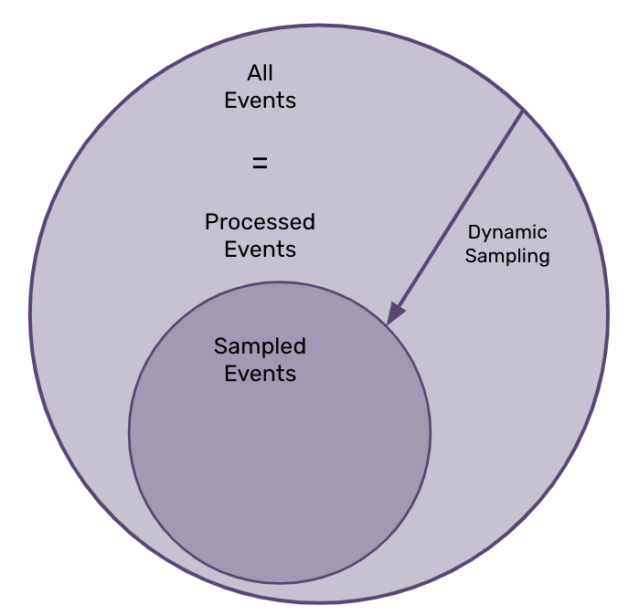

When you're using sentry.io, you are seeing information that's generated by one of two types of events:

- processed events - All the events that you send to Sentry, based on your SDK sample rate. Underlies _metrics-based_ data.
- sampled events - A sub-set of your processed events, based on your dynamic sampling setings. Underlies _events-based_ data.

_Processed_ events can include all the events that occur in your application or a sub-set. This is based on the sample rate that you set in the SDK. These events are aggreated. This is used in areas of the application like **Performance** and **Dashboards**. The larger your set of processed events is large enough, the better able we are to provide you with statisically significant insights into the performance of your application. In sentry.io, you may see the data generated from these events referred to as _metrics_ or _metrics-based_.

Because these events are aggreated, when your viewing information in sentry.io that's based on these events, or based on metrics data, you can't drill down into the specifics of these events.

_Sampled_ events are a sub-set of your processed events, and this sub-set is created based on your [dynamic sampling]() settings. For these events, all of the event data is available to you, so you can drill down into each event for further insights. In sentry.io, you may see the data generated from these events referred to as _transaction data_ or _events-based_.

We recommend that you send all of your events to Sentry - that is, your number of processed events is the same as the number of all the events that you have. Like the image below:

However, this isn't required in every situation.

TO DO: TALK ABOUT DIFFERENT USE CASES HERE
