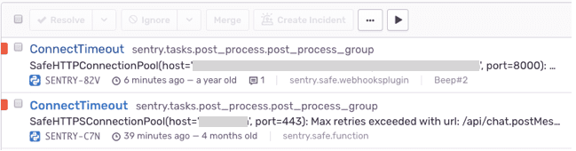
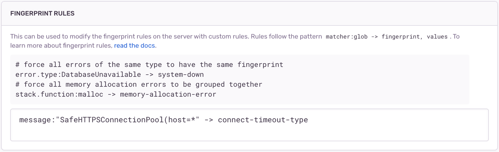

Have you ever had a set of similar-looking issues like this?

Ever wonder why some events group into a single issue but others group into separate issues?

Let's first understand how errors and transactions group into an issue. In the example above, the issue `testTypeIssue14` has 718 events that Sentry grouped into an issue because they share the same _fingerprint_.

**What is a fingerprint?**
A fingerprint is a way to uniquely identify an event. Sentry sets a fingerprint for you by default, using built-in grouping algorithms based on information such as a stack trace, exception type, and message. Events with the same fingerprint are grouped together.

**Do I need to do anything?** No. Sentry automatically generates a fingerprint based on the event type and other data in the event. If events have the same root cause, they will group into one issue. If you want to change the way events are grouped, see Changing How Events are Grouped below.

**How do I see the fingerprint?** Open an issue, click the JSON link, and find the _fingerprint_ property. If the default grouping was used, you'll see `"{{ default }}"` written there. If a different grouping was used, you'll see the fingerprint value itself.

## Why are similar-looking issues not grouping together?

Even if a set of issues in the Issues Stream looks similar, if they are separate then there is something that still differs. In this example, it's the function name at the top of the stack trace:

## Changing How Events are Grouped

<Note>

The solutions described in this section are only applicable to [error issues](/product/issues/issue-details/error-issues/). Other categories of issues (such as [performance issues](/product/issues/issue-details/performance-issues/)) do not support this feature.

</Note>

There are four different ways to change how events are grouped into issues.

**Merging Similar Issues**: This allows already-existing issues to be merged together. No settings or configuration are required to do this.

**Fingerprint Rules**: This allows you to configure rules for directly setting the fingerprint of future events.

**Stacktrace Rules**: This allows you to configure rules for which stacktrace frames are used when applying grouping rules to future events.

**SDK-side Fingerprinting**: This allows you to set a fingerprint directly on an event before it's sent to Sentry.

Note that neither configuring fingerprint and stacktrace rules nor using SDK-side fingerprinting will affect existing events or issues, only change how future events are grouped.

See below for more details on each approach.

### Merging Similar Issues

This allows two or more existing issues to be combined, such that any future event which would have fallen into one of the issues will then be added to the merged issue.

Before merge

After merge, we see that `testTypeIssue7` and `testTypeIssue8` were merged together.

You can also do this from inside a single issue. Click the Similar Issues tab

**Warning:** This will not affect the creation of future issues. In other words, any future event which would have created a new issue will still do so, regardless of similarity. Only events from the merged issues will be included in the new combined issue.

If you'd like to unmerge issues, you can go to the **Issue Details** page and click the "Merged Issues" tab. You will see the fingerprints that have been merged into that issue. Select the appropriate checkbox(es) and click "Unmerge".

### Fingerprint Rules

In order to use fingerprint rules, there are two steps.

1. Identify the match logic for grouping issues together. In the examples below, we'll use either the error's **type** or its **message**.
2. Set the match logic and the corresponding fingerprint in project settings.

#### 1. Identify Match Logic

Let's say you want the following two issues to group together:

You can do it based on the error **type**:

Or you can do it based on the **message**:

#### 2. Add Rules to Project Settings

Here's how to set the match based on the error **type** in **[Project] > Settings > Issue Grouping > Fingerprint Rules**:

Now all `ConnectTimeout` events will get a fingerprint of `connect-timeout-type` and will get grouped into a single issue, regardless of stacktrace. Note that this only applies to future events.

Here's how to set the match based on the error **message**. Note the use of `*` to allow the message to match on any `host` value.

You can also do this based on the file path of the erroring function, or on the function name itself. See [Fingerprint Rules](/product/data-management-settings/event-grouping/fingerprint-rules/).

### Stacktrace Rules

Sometimes two stack traces are the same function execution path but differ by one or more frames corresponding to code in middleware, third-party libraries, or the framework itself. Sentry will automatically try to detect and ignore such frames, but this is also configurable. See [Stack Trace Rules](/product/data-management-settings/event-grouping/stack-trace-rules/).

### SDK-side Fingerprinting

For information on setting fingerprints directly on events themselves, see the relevant [SDK docs](/platform-redirect/?next=/usage/sdk-fingerprinting/).
