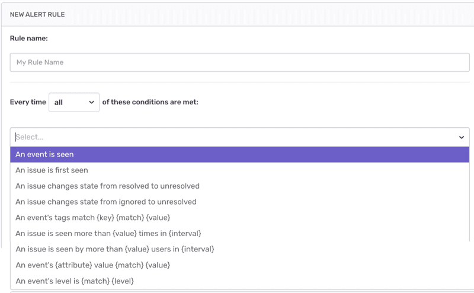
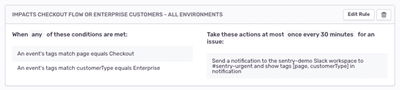
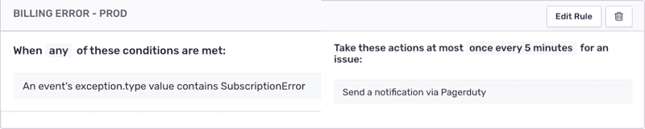
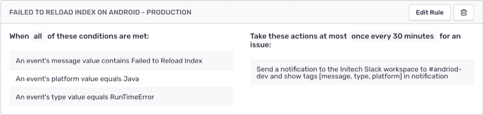
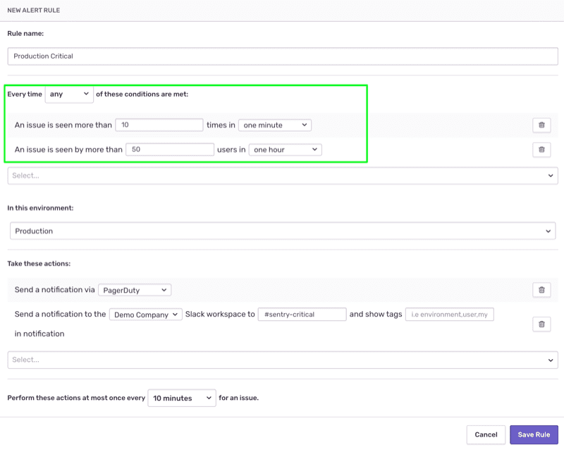
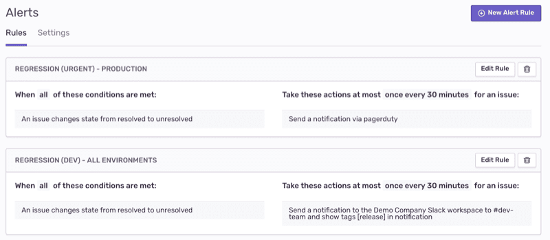
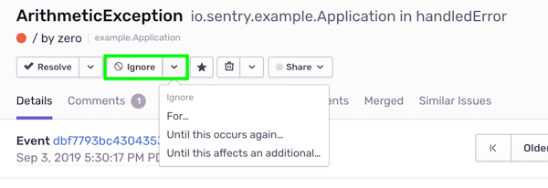
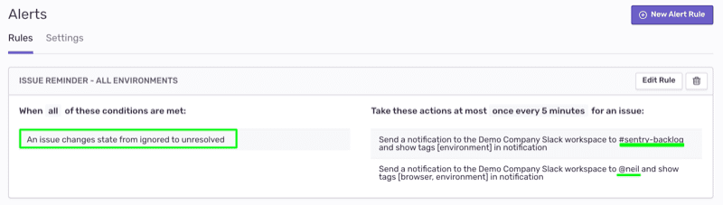
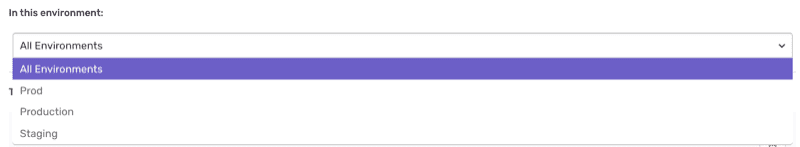

When it comes to being notified on your errors, there's a wide range of options between notifying all your project team members on each and every error instance and notifying them only once when an _Issue_ is first seen. Ideally, when an error happens, you want the right people to know about it in real time. For that, create custom **Alert Rules** in your project settings and define **who** to notify, about **what** error, **when** and **how**, making sure that errors are getting the right attention by the relevant team members.

## Alert Rules

Alert Rules enable powerful rule creation to notify developers of inbound errors through any channel or tool your team may be using. Alert rules are configured per project under `[Project Settings] > Alerts > Rules` tab where you’ll see a list of all active rules and can add new rules or modify existing ones.

Alert rules consist of:

- A set of self-explanatory `Conditions` connected in an _ALL_, _ANY_, or _NONE_ relation.
- The `Environment` where your code is deployed and running in which you'd like the alert rule applied.
- The `Actions` that should be taken when the associated conditions are met. Mainly -- where you'd like to channel this alert.

#### **Creating a good set of alert rules means:**

1. Identifying the critical show-stopping errors and routing them appropriately (to PagerDuty for instance) so they can be resolved by the right people as soon as possible.

2. Maintaining awareness and visibility to all other errors, in terms of where the alerts are routed to (mail, specific Slack channels) and at what frequency.

Generally, we recommend you configure these rules and fine-tune them as you go, adapting to your teams workflows and preferences. With that said, there are some common best practices that you should consider.

## Selecting Conditions

The `New Alert Rule` wizard allows you to compose alert rules combining multiple conditions. These conditions are pretty self explanatory and rely on event `Tags` and `Attributes` values, event `Frequency`, and `Issue State` changes. Essentially, allowing you to combine the conditions bellow to fit your specific use-case.



### **Event Tags**

Tags are key-value pairs that Sentry assigns to each event. Some of the tags are added by default depending on the platform and type of SDK. Developers can also add **Custom Tags** through the SDK. You can find the list of tags available in your project under `[Project Settings] > Tags`. The list is an aggregation of all of the tag keys (default and custom) that have been encountered in events in this project.

Event tags are useful for various reasons. First, tags are indexed and this allows you to query your errors in the Sentry `Event Stream` and `Issue Stream` based on specific tag values. In addition, adding the right tags in your code will allow you tell Sentry to notify you only when events with specific details occur.

To create a rule based on a tag's value, select the condition

```
An event's tags match {key} {match} {value}
```

A tag-based condition can be used as the sole condition for an alert rule or in conjunction with additional conditions to fine tune the rule:



> In this rule we're leveraging custom tags that our developers added through the Sentry SDK, telling Sentry to notify us via our _#sentry-urgent_ **Slack** channel when _Enterprise_ customers are experiencing errors in critical parts of our application.

### **Event Attributes**

The alert rule system in Sentry is capable of picking out attributes from an event's payload. There are 15 different kinds of attributes that a rule can target. Those include attributes like: `Error Message`, `Error Type`, the `Platform`, `user.id`, `http.method`, `stacktrace.filename`, and others.

To set an attribute-based condition in your rule, select the condition:

```
An event's {attribute} value {match} {value}
```



> In this example, any event with type “SubscriptionError” indicating an error the billing flow will be routed directly to PagerDuty for our on-call engineer to handle.

In addition, you can also set up rules that account for multiple different attributes at once, and chain that logic together.



> In this more advanced example, a notification containing the message, platform, and type attribute values gets routed to the _Android Dev_ team in _Slack_ if a _RunTimeError_ with the message _Failed to Reload Index_ comes in from our _Java platform_.

### **Event Thresholds**

Often, it’s necessary to create a rule based on a frequency threshold to help determine the significance of an error’s impact and escalation priority. Among other use-cases, threshold conditions can be set in conjunction with tag and attribute based conditions to indicate a spike in errors in a certain environment, release, or page in your app or package in your code.

Sentry provides two threshold conditions based either on the event occurrence or number of affected users:

```
An issue is seen more than {value} times in {frequency}
An issue is seen by more than {value} users in {frequency}
```



### **Issue State Changes**

Every Issue in Sentry has a defined state - _Unresolved_, _Resolved_ or _Ignored_. Read about [Issue States](/product/alerts-notifications/notifications/#issue-states) for more information.

#### **1. Regression Alert**

When Sentry captures new event instances of an Issue that was previously marked as _Resolved_, it will change the issue state back to _Unresolved_. By default, Sentry will apply the regression workflow and notify all project team members about the **Regression** through mail. However, when it comes to regressions, you may want to put specific notifications in-place. To set up a regression rule, use the condition

```
An issue changes state from resolved to unresolved
```



> For instance, set-up two regression alert rules to
>
> - Notify your on-call personal via **PagerDuty** when a regression is identified in your **production environment**.
> - Notify your engineering team via **Slack** channel when a regression is identified in **any environment.**

#### **2. Unresolved Issue Reminder**

Sentry users can choose to ignore specific Issues in their issue stream for a defined threshold of time, occurrences, or number of affected users.


To set-up a reminder that a previously **Ignored** issue has become **Unresolved** again, use the condition

```
An issue changes state from ignored to unresolved
```



> In this rule we're sending a "reminder" alert via **Slack** to a _#sentry-backlog_ channel and a direct message to the project manager _@neil_.

## Selecting an Environment

`Environment` is a Sentry supported tag that you can (and should) add to your SDK. Generally, the tag accepts any value but is targeted to refer to the naming convention of your code deployments such as -- _Development_, _Testing_, _Staging_, _Production_, etc. This enables various features and filtering capabilities within your Sentry account.

When creating a new alert rule, select the environment in which you want the rule applied. The environment drop-down list is populated with the 'environment' tag values available in your Event Stream.



This will allow you to refine your rules based on the environment where your project errors originated. This is quite useful, as the urgency and workflows you apply to **Production** alerts might differ from the ones you apply to alerts originating from your **QA** environment.

## Next

[Routing Alert Notifications](/product/sentry-basics/guides/alert-notifications/routing-alerts/)
