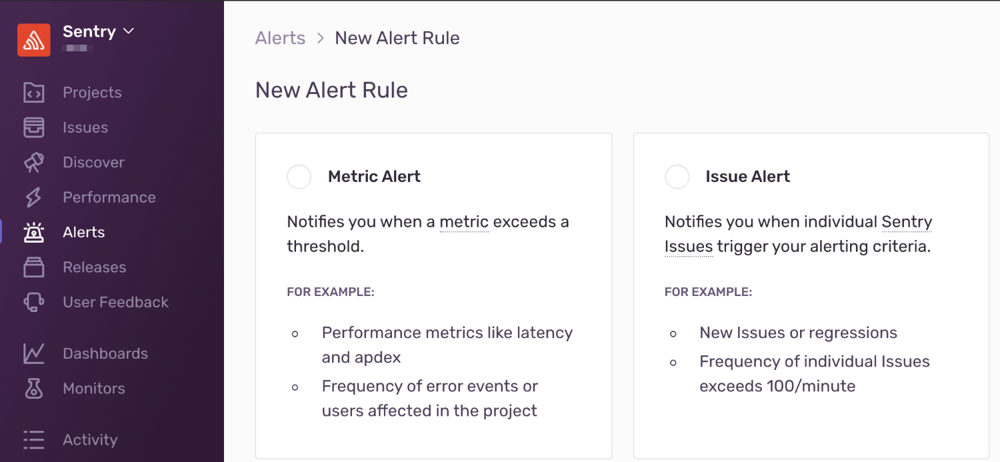

Both Sentry's alerts and notifications provide real-time visibility into errors happening in your code and the impact on your users regardless of where your code is deployed. Alerts uncover meaningful and customizable information about an error and its context. In addition, Sentry sends notifications to your project team members regarding various workflow activities.

## Alerts

When you create a new project in Sentry, you can choose from a few default alerts, or choose to create alerts at a later time. To create an alert, navigate to **Alerts > New Alert Rule**, then select whether to create a [Metric Alert](/product/sentry-basics/guides/alert-notifications/metric-alerts/) or an [Issue Alert](/product/sentry-basics/guides/alert-notifications/issue-alerts/).

Metric alerts are usually more straightforward than issue alerts because you know upfront what you're monitoring. In contrast, issue alerts power a triage workflow — you cast a wide net for potential problems and review them as they happen.

Choosing a default alert, such as getting notified only **once** when an error is first seen, is generally useful for catching new errors in real-time, but means Sentry will not alert you about subsequent instances of the same error. With only the default alert rule in place, you might be losing visibility into critical issues building up in your code.

### Creating a Good Set of Alert Rules

1. Identify the critical errors and route them appropriately (for example, to [PagerDuty](/product/integrations/pagerduty/)) to be resolved by the relevant teammates as soon as possible.

2. Maintain visibility to all other errors and transactions, in terms of where the alerts are routed (email, specific [Slack](/product/integrations/slack/) channels) and at what frequency.

Generally, we recommend you configure these rules and fine tune them as you go, adapting to your team's workflows and preferences.

## Notifications

[Notifications](/product/sentry-basics/guides/alert-notifications/notifications/) are emails triggered by changes in [issue state](/product/alerts-notifications/notifications/#issue-states), [releases](/product/releases/), and [quota usage](/product/accounts/quotas/). Types of Sentry notifications:

- [**Workflow notifications**](/product/sentry-basics/guides/alert-notifications/notifications/#workflow-notifications): Activity involving user actions and state changes on issues. Includes activities such as resolution, assignment, comments, and regressions.

- [**Deploy notifications**](/product/sentry-basics/guides/alert-notifications/notifications/#deploy-notifications): When a release is deployed, Sentry automatically sends an email to users who have committed to the release.

- [**Quota & Usage notifications**](/product/accounts/quotas/): Emails about approaching quotas, exceeded quotas, and spike protection.

### Creating a Good Set of Notifications

1. Identify critical activity in your development process and route the email notifications to the relevant teammates and stakeholders.
2. Maintain visibility into workflows and deploys by fine tuning notifications according to Sentry project or organization.
