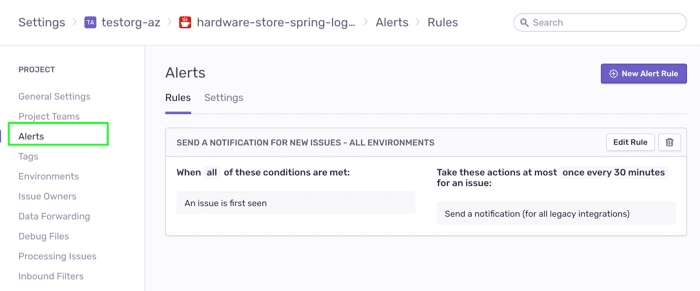
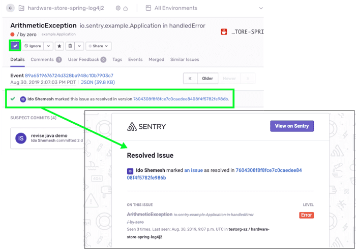
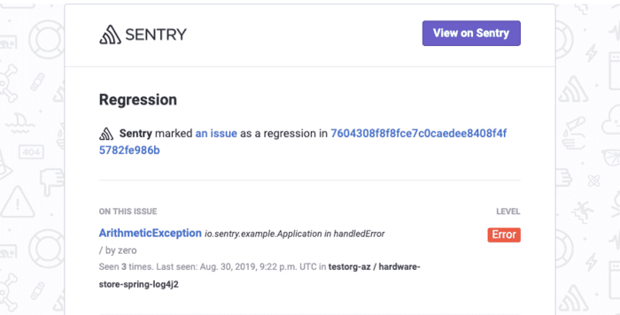
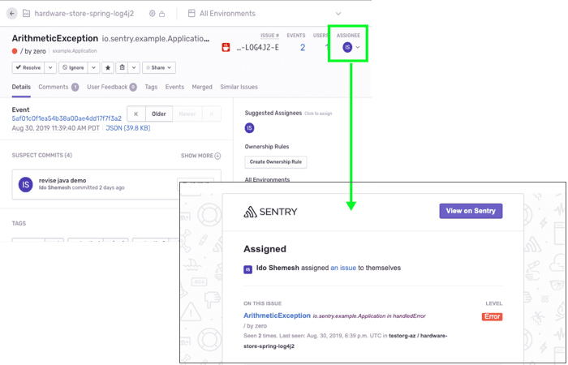

Sentry’s alert notifications give real-time visibility into errors happening in your code and the impact they are having on your users regardless of where your code is deployed. They explain why you’re being notified and uncover meaningful and customizable information about the error and its context. In addition, Sentry will also notify your project team members about various workflow activities.

## **Alert Notifications**

When you create a new project in Sentry, a **default alert rule** populates within the project's Alerts view. The default alert notifies **all** project team members any time an error is **first** encountered (for example, when a new **issue** is created) in this project. This notification is sent via email and any other _Legacy Integration_ services you might have enabled.

Getting notified **once** when an error is first seen is generally useful for catching new errors in real-time, but will not notify you about subsequent instances of the same errors. This means that with only the default alert rule in place, you might be losing visibility into critical issues building up in your code.

For tighter control over the alerts you're receiving, create **custom alert rules** in your project settings.

## **Workflow Notifications**

Various workflow related activities within Sentry will generate a workflow notification to the relevant team members via email. Core workflow notifications include:

- **Issue Resolved** - When a new issue is spotted in your code, it's marked with an `unresolved` state. The state changes to `resolved` when a project team member resolves it (either by manually changing its state in the UI or by [submitting a fix](/product/releases/#after-associating-commits)) or when the project’s auto-resolve feature is configured. Once the state changes to resolved, an email is sent to all project team members.

  

- **Regressions** – A regression happens when the state of an issue changes from `resolved` back to `unresolved`. An email is sent to all project team members.

  

- **Comments** - when a team member adds a new comment to an issue's `Comments` thread.

- **Assignment** - when a team member is assigned to an issue, they are notified via email.

  

For more information, take a look at the [Notifications](/product/alerts-notifications/notifications/) documentation.

## Next

[Creating Custom Alert Notifications](/product/sentry-basics/guides/alert-notifications/creating-custom-rules/)
