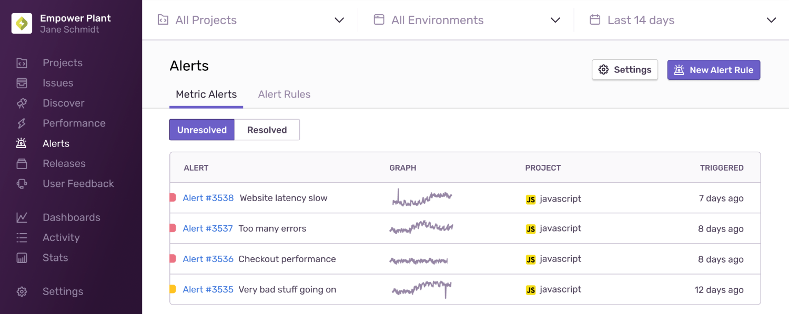

Create and manage Metric Alerts by navigating to Alerts and clicking the "Alert Rules" tab, where you'll see a list of all active rules and can add new rules or modify existing ones. Then, select your project and choose Metric Alert.

The minimum role required to create alerts is member. Sentry users with manager or owner permissions can change the minimum role requirement in **Settings > General Settings > Let Members Create and Edit Alerts**.

## 1. Choose Errors or Transactions

In the Alert Conditions section, choose between [Errors](/platforms/javascript/usage/#capturing-errors) or [Transactions](/product/performance/). Errors provide data around a break, such as new issues or total errors in your project. Transactions provide data on the performance of your application, such as [latency](/product/performance/metrics/#latency) and [failure rate](/product/performance/metrics/#failure-rate).

## 2: Choose a Metric

Errors and Transactions each have different metrics for alerting.

### Error Metrics for Alerting

- `count()`
- `count_unique(...)`

### Transaction Metrics for Alerting

- `avg(...)`
- `percentile(...)`
- `failure_rate()`
- `apdex(...)`
- `count()`
- `p50()`
- `p75()`
- `p95()`
- `p99()`
- `p100()`

## 3: Choose a Time Window

Choose the time period over which to evaluate your metric. Your choices range between one minute and one day.

<Note>

Sentry evaluates the specified window each minute. For example, if you specify an hour time window, Sentry evaluates:

- 3:00pm: 2:00pm - 3:00pm
- 3:01pm: 2:01pm - 3:01pm
- 3:02pm: 2:02pm - 3:02pm
- ...

</Note>

## 4: Choose an Environment

Specify which [environment(s)](/platforms/javascript/configuration/environments/) will use this particular alert rule. `Environment` is a Sentry supported tag that you can (and should) add to your SDK. Generally, the [tag](/platforms/javascript/enriching-events/tags/) accepts any value but is targeted to refer to your code deployments' naming convention such as _Development_, _Testing_, _Staging_, or _Production_. The environment drop-down list is populated with the environment tag values available in your [Event Stream](/product/accounts/quotas/manage-event-stream-guide/).

Each environment typically necessitates different levels of urgency and workflow. The urgency and workflows you apply to Production alerts might differ from those you apply to alerts originating from your QA environment, for example.

## 5: Set a Threshold

Thresholds are numerical values that help define an alert trigger. The Warning trigger's threshold **must be breached** before the Critical trigger. Triggers are evaluated approximately every minute from the highest to lowest severity.

## 6: Set an Action

Actions define how you and your team will be alerted. Possible actions include:

- Send an email to a member or team. If sent to a member, the member's personal project alert opt-out settings are overridden.
- Send a [Slack](/product/integrations/slack/) notification.
- Trigger a [PagerDuty](/product/integrations/pagerduty/) incident.
- Send a request to a webhook via [internal integrations](/product/integrations/integration-platform/#internal-integrations).

## 7: Give the Alert Rule a Name & Save

1. Manage your alert rule by giving it a descriptive name. A descriptive alert rule name specifies the team affected and the topic of the alert. For example, "Frontend Latency," "Backend Failure Rate," or "Billing Apdex."

2. Click "Save Rule".

## Alert Stream

The alert stream's default view shows unresolved alerts. Use auto-resolve (the default) in a metric alert if you mostly care about a sustained (not transient) change in your metric. For example, if there's an occasional latency spike in an endpoint caused by a single user, that's just noise. You can set the alert to auto-resolve.

On the other hand, if you get an alert for a spike in errors, that could indicate a real incident even if it subsides. You probably want the alert to stick around and show up in your default view. Therefore, you should unset the auto-resolve option.

