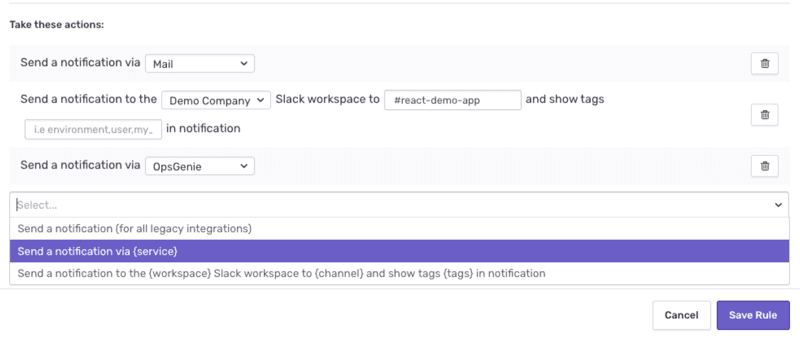
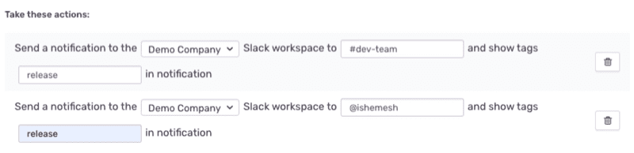
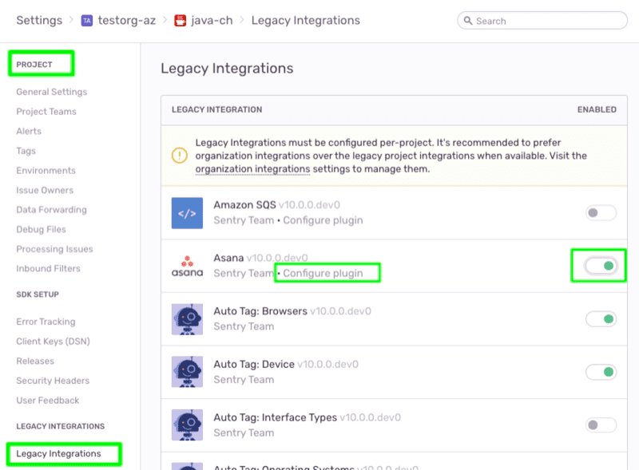
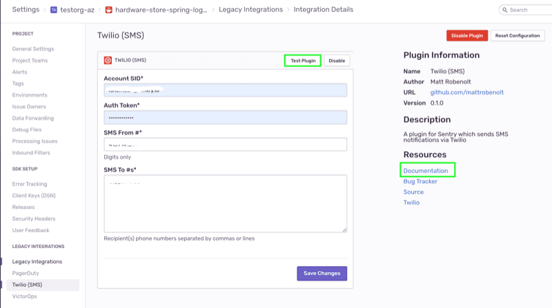
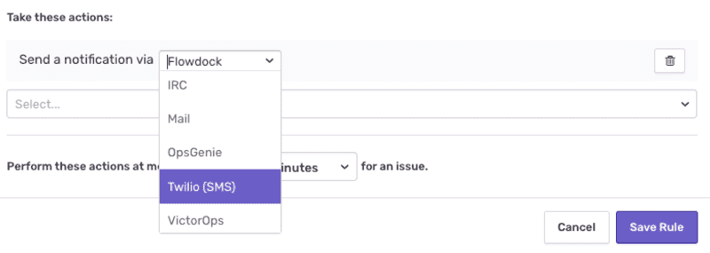
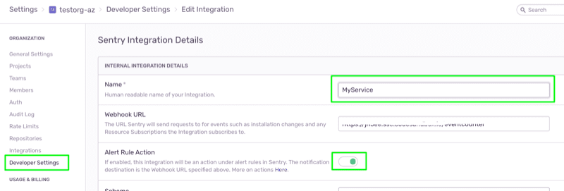
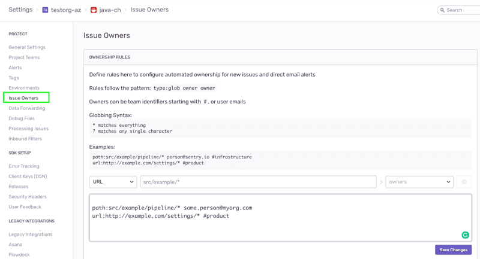

By customizing alert rules and integrating into the tools you already use, you can receive alerts when, where (and if) you want them, without disruption. In this section, you will learn about the various channels to which you can route alert notifications and the steps you can take to fine-tune the target audience of these alerts amongst the project team members.

## Alert Rule Actions

When creating custom alert rules, you can determine what action (or actions) should be taken when the defined conditions are met, basically configuring who to notify and where. Alert notifications in Sentry can be routed to **Slack**, multiple **supported integrations**, and custom integrations through **webhooks** but by default are aimed at the project team members' **email**.

### **Slack Alerts**

A Sentry Org owner or manager can install and configure the Slack integration in their Sentry account. For more information see [Slack Configuration](/product/integrations/slack/).
Once configured, this will make the following action available in your alert rules:

`Send a notification to the {workspace} Slack workspace to {channel} and show tags {tags} in notification`.

The action enables routing alert notifications to selected _Channels_ (using the `#` prefix) or _Direct Messages_ (using the `@` prefix) in your Slack Workspaces.

Then once you receive a Slack notification, you can use the `Resolve`, `Ignore`, or `Assign` buttons to update the Issue in Sentry directly from Slack.

### **Routing Alerts to 3rd Party Integrations**

In addition to email and Slack, alert notifications in Sentry can be routed to supported 3rd party solutions using integration plugins like `PagerDuty`, `Twilio` and others. These plugins are maintained and supported by the Sentry community and are configured on the project level. To view the list of available integrations, enable and configure them, go to `[Project Settings] > Legacy Integrations`.

Enable the desired integration and click on `Configure plugin` to open the configuration settings page for the selected integration. On this page, you'll also find the link to the integration's `Documentation`. Click on the `Test Plugin` button to verify your set-up.

You can configure your alert rule to channel notifications through a configured integration by adding the `Send a notification via {service}` action and selecting the desired integration.

For more details about specific integrations:

- [PagerDuty + Sentry Integration](/product/integrations/pagerduty/)
- [Opsgenie](https://docs.opsgenie.com/docs/sentry-integration)
- [Twilio](https://github.com/mattrobenolt/sentry-twilio/blob/master/README.md)
- [VictorOps](https://help.victorops.com/knowledge-base/sentry-integration-guide-victorops/)

### **Webhooks**

If you would like to route alert notifications to other solutions that Sentry doesn't have an out-of-the-box integration with, you can leverage our `Integration Platform`. It provides a way for external services to interact with the Sentry SaaS service using the REST API and webhooks. When you create a new integration and select the `Alert Rule Action` - your integration will show up as a service in the action section when creating a new alert rule.

Once added to an alert rule, your service will start receiving webhook requests for triggered alerts in the `Webhook URL` destination you entered.

For more information take a look at our documentation for [Integration Platform](/product/integrations/integration-platform/)

## Fine-tune your Audience

The tricky thing about alerts is that you want to notify the right people at the right time. If you end up sending too many notifications to too many people, you risk having those notifications considered as spam and ignored. When routing your notifications through one of the `Integration Plugins` the target audience is determined by the specific integration configuration. With `Slack`, you can easily select the specific **workspace**, **channels** and **direct messages** you want to send your alerts to. However, when routing notifications to `Mail` - the default setting will send an email notification to **all** project team members. Below are some suggestions to fine-tune mail notifications.

### Issue Owners

The Issue Owners feature allows you to reduce noise by directing notifications to specific teams or individual **users** through ownership. Ownership is determined based on two indicators:

1. `Path` - an obsolete or relative path in your source code file hierarchy. Allowing you to associate ownership of individual teams and users to specific packages, modules, or even files within the associated code repository. When Sentry captures an error in this project, it will associate ownership (and alert) based on matches in any of the paths in the exception’s stack trace.

2. `URL` - The Sentry SDK adds a `url` tag to the errors caught in your applications. The value marks the runtime domain of the executed code at the time of the error. Sentry evaluates whether the exception’s URL tag matches the URL you specified in the ownership rule.

You can configure ownership rules from your `[Project Settings] > Issue Owners`

For more information go to [Issue Owners](/workflow/issue-owners/)

### User Settings

Sentry team members can configure and personalize their notifications from their personal notifications settings in `User Settings > Notifications`. Users can disable or enable all **Project Alerts & Workflow Notifications** or fine-tune these settings per project.

