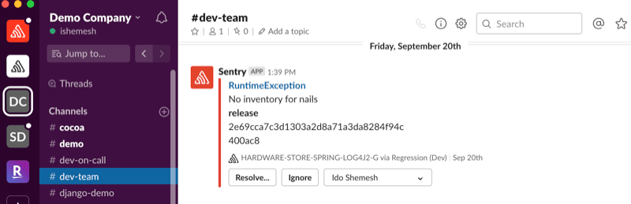
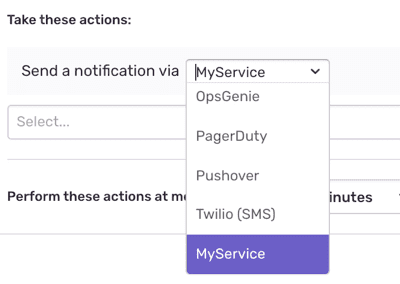
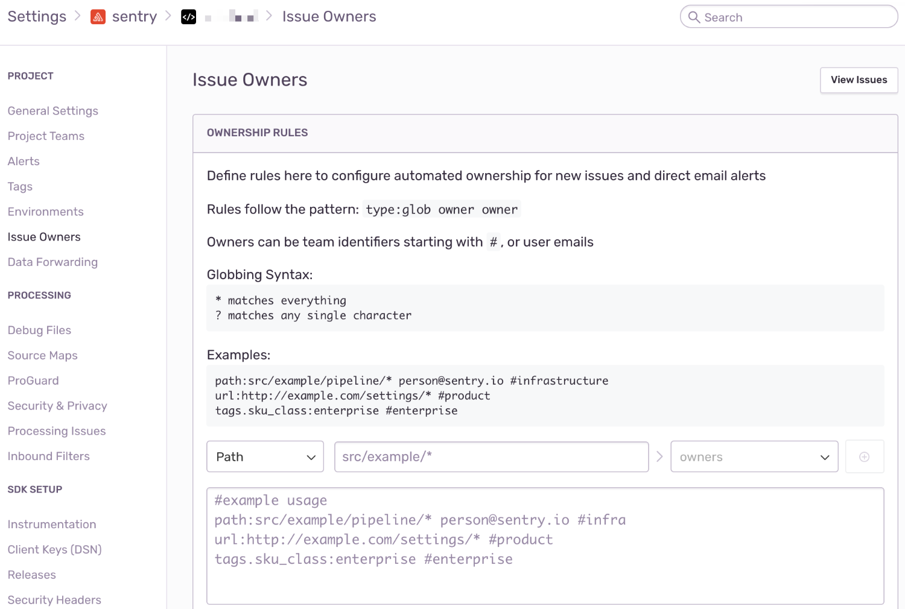
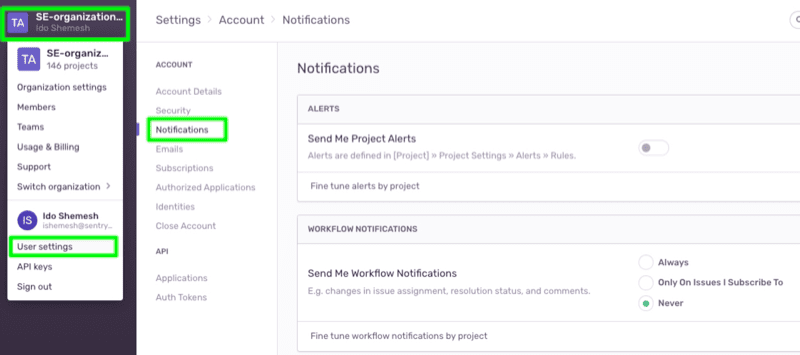

By customizing [alert](/product/sentry-basics/guides/alert-notifications/#alerts) rules and integrating the tools you already use, you can receive alerts when, where (and if) you want them, without disruption. In this section, you will learn about the various channels to route alert notifications and the steps you can take to fine tune the target audience of these alerts among project team members.

## Alert Rule Actions

When creating custom alert rules, you can determine what action (or actions) should be taken when the defined conditions are met, basically configuring who to notify and where. Alert notifications in Sentry can be routed to [Slack](/product/integrations/slack/), multiple [supported integrations](/product/integrations/), and custom integrations through [webhooks](/product/integrations/integration-platform/webhooks/).

### Slack Alerts

A Sentry organization owner or manager can install and configure the Slack integration in their Sentry account. For more information, see [Slack Configuration](/product/integrations/slack/). Once configured, this will make the following action available in your alert rules: `Send a notification to the {workspace} Slack workspace to {channel} and show tags {tags} in notification`.

The action enables routing alert notifications to selected _Channels_ (using the `#` prefix) or _Direct Messages_ (using the `@` prefix) in your Slack Workspaces. Then once you receive a Slack notification, you can use the `Resolve`, `Ignore`, or `Assign` buttons to update the Issue in Sentry directly from Slack.

### Routing Alerts to Third-Party Integrations

In addition to email and Slack, alert notifications in Sentry can be routed to support third-party solutions using integration plugins like [Heroku](/product/integrations/heroku/), [Amazon SQS](/product/integrations/amazon-sqs/), and others. These plugins are maintained and supported by the Sentry community and are configured on the project level.

After setting up the desired integration, you can create an alert rule to channel notifications through a configured integration by adding the `Send a notification via an integration` action and selecting the desired integration.

### Webhooks

If you would like to route alert notifications to other solutions that Sentry doesn't have an out-of-the-box integration with, you can leverage our [Integration Platform](/product/integrations/integration-platform/). It provides a way for external services to interact with the Sentry SaaS service using the REST API and webhooks. When you create a new integration and select "Alert Rule Action", your integration will show up as a service in the action section when creating a new alert rule.

Once added to an alert rule, your service will start receiving webhook requests for triggered alerts in the `Webhook URL` destination you entered.

## Fine Tune Your Audience

The tricky thing about alerts is that you want to notify the right people at the right time. If you send too many notifications to too many people, you risk having those notifications considered spam and ignored. When routing your notifications through one of the Integration Plugins, the target audience is determined by the specific integration configuration. With Slack, you can easily select the specific workspace, channels, and direct messages you want to send your alerts to. However, when routing notifications to email, the default setting will send an email notification to all project team members. Below are some suggestions to fine tune alerts and notifications.

### Issue Owners

The [Issue Owners](/product/error-monitoring/issue-owners/) feature allows you to reduce noise by directing notifications to specific teams or individual users through ownership. Ownership is determined based on two indicators:

1. `Path` - An obsolete or relative path in your source code file hierarchy. It allows you to connect ownership of individual teams and users to specific packages, modules, or even files within the associated code repository. When Sentry captures an error in this project, it will associate ownership (and alert) based on matches in any of the paths in the exception’s stack trace.

2. `URL` - The Sentry SDK adds a `url` tag to the errors caught in your applications. The value marks the runtime domain of the executed code at the time of the error. Sentry evaluates whether the exception’s URL tag matches the URL you specified in the ownership rule.

You can configure ownership rules from **Settings > [Organization] > [Project] > Issue Owners**. If you'd like a specific owner to be the fallback, end your ownership rules with a rule like `*:<owner>`.

### User Settings

Sentry team members can configure and personalize their notifications from their personal notifications settings in **User Settings > Notifications**. Users can disable or enable all Project Alerts & Workflow Notifications or fine tune these settings per project.

### Alert Frequency

- If you're repeatedly seeing alerts you've seen before, try filtering your alerts to issues created in the last few days, or [ignoring](/product/alerts-notifications/notifications/#issue-states) the issue. Ignored issues don't alert you when ignore conditions are met; they only become unresolved. So if you're worried about ignored issues disappearing, create an alert to notify you when issues change state from ignored to unresolved.
- Often there are transient issues that happen only a few times in quick succession and never again. For this scenario, use the `issue has happened at least {X} times` filter.
- Use the `release = latest` filter to have your alert apply only to the latest release.
- Use [tags](/platforms/javascript/enriching-events/tags/) to categorize errors. For example, you can filter on the auto-captured `url` tag to identify business-critical pages, or filter on a custom tag like `VIP customer` to treat those alerts with more importance.
