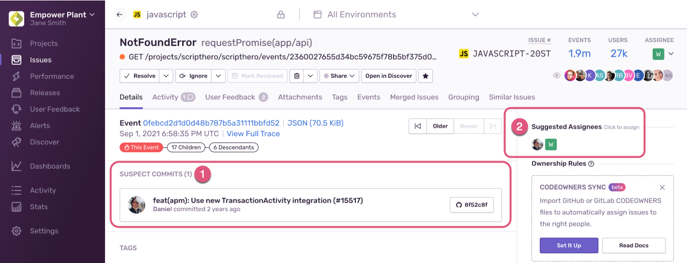
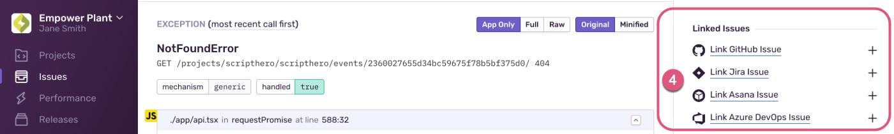

Getting started with Sentry error monitoring can be easy and straightforward. In this guide, we'll provide the recommended checklist for setting up your Sentry organization account and making the most of it.

<!-- should this guide be about more than setting up error monitoring -->

We understand that some of you are running enterprise organizations while others of you are hobbyists, coding for fun. We've linked below where you should get started depending on your situation (of course, everyone is welcome to do all the steps).

- Enterprise or Business Plan or running an organization of x size? [Start at step 1.](#1-enable-single-sign-on-access)
- Team Plan or organization of x size? [Start step 2](#2-set-up-teams)
- Developer Plan or working alone? [Start at step 3.](#3-configure-integrations)

<!-- is org size a good approach or is there a better way to talk about this to finish off bullet points above-->

## 1. Enable Single Sign-On Access

[Single Sign-On (SSO)](/product/accounts/sso/) lets your team to log in quickly, streamlines the on/off-boarding process for member accounts, and strengthens your login with secure credentials. Sentry provides out-of-the-box configuration for integrating SSO providers like [Okta](/product/accounts/sso/#okta) and [Azure Active Directory](/product/accounts/sso/#azure-active-directory) (SAML) or [Google](/product/accounts/sso/#google-business-app) and [Github](/product/accounts/sso/#github-organizations) (Oauth). In addition, we provide a generic configuration option for any other [SAML2 Identity Provider](/product/accounts/sso/saml2/).

Sentry also supports a subset of the specification for System for Cross-Domain Identity Management (SCIM) for [Okta](/product/accounts/sso/okta-sso/okta-scim/) and [Azure AD](https://product/accounts/sso/azure-sso/#scim-integration).

## 2. Set Up Teams

<!-- do we need this? #2-set-up-teams -->

Now that SSO is configured and members have created their accounts, add them to their Sentry Teams. Teams are associated with your [Sentry Projects](#4-create-projects) and their members become issue owners and receive issue notifications. We recommend creating teams that align with your internal team structure (for example, _#Frontend_, _#Ops_, _#SDK_, and so on). To add a new team, go to **Settings > Teams** and click "Create Team".

Click on a team name to open the team settings and manage its associated members and projects.
Under the "Members" tab, add existing members to your team by clicking on "Add Member > [Member Name]".

You can also invite multiple new (external) members to join your organization and team by clicking on "Add Member > Invite Member".

Learn more in [Organization Management](/product/accounts/membership/).

## 3. Configure Integrations

Sentry integrates into your existing workflows by providing out-of-the-box integrations with widely-used apps and services. To enable and configure integrations, navigate to **Settings > Integrations**.

### Alert Notifications {#31-alert-notifications}

By default, Sentry will notify you about errors in your apps by email and [Slack](/product/integrations/notification-incidents/slack/) once you enable the integration. You can also enable team notifications in Slack so that the right people in your organization always receive the alerts that they need. In addition to Slack, Sentry offers several [notification and incident integrations](/product/integrations/notification-incidents/), like [Microsoft Teams](/product/integrations/notification-incidents/msteams/) and [PagerDuty](/product/integrations/notification-incidents/pagerduty/), to help you stay informed about the errors you need to see. , or a several other notification and incident integrations.

Learn more about setting up alerts with integrations in [Alert Routing With Integrations](/product/alerts/create-alerts/routing-alerts/).

### Source Code Management {#32-source-code-management}

When you enable an integration with your Source Code Management (SCM) provider, Sentry will analyze your commit data to:

1. Identify **suspect commits** that likely introduced an error.
1. **Suggest assignees** who can best resolve the error based on your suspect commits and your [codeowners file](/product/issues/issue-owners/#code-owners).
1. Mark an issue as **Resolved via Commit or PR** to stop notifications about similar errors in past releases and notify you upon regression.
1. Link a Sentry issue to a new or existing issue in your integrated [issue tracking](#33-issue-tracking) solution.

   

   

Sentry has built-in integrations with:

- [Azure DevOps](/product/integrations/source-code-mgmt/azure-devops/)
- [GitHub](/product/integrations/source-code-mgmt/github/)
- [GitLab](/product/integrations/source-code-mgmt/gitlab/)
- [Bitbucket](/product/integrations/source-code-mgmt/bitbucket/)

If you're using a different SCM provider or don't want Sentry to connect to your repository, check out our [Releases documentation](/product/releases/setup/manual-setup-releases/) to learn how you can still enable most of these features (#1 - #3) by telling Sentry about your commit metadata.

### Issue Tracking {#33-issue-tracking}

Enabling the 2-way integration with your issue tracking solution allows you to create a new issue from within the Sentry **Issue Details** page, or link it to an existing one. In addition to GitHub, GitLab, and Bitbucket issues that are associated with the respective SCM integration, Sentry also integrates with: [Azure DevOps](/product/integrations/source-code-mgmt/azure-devops/), [Clubhouse](/product/integrations/project-mgmt/clubhouse/), [Jira](/product/integrations/project-mgmt/jira/), and others.

For a list of all supported integrations, check out out our [full Integrations documentation](/product/integrations/).

While you can manually link Sentry issues to issues in your project management software, for [Azure DevOps](/product/integrations/source-code-mgmt/azure-devops/#automatically)  and [Jira](/product/integrations/project-mgmt/jira/#automatically), when you create alerts, you can set up automated issue management so that external issues are created for new Sentry issues on your behalf. When you set up this automation, Sentry retrieves your configured fields in Azure DevOps or Jira workspace so that you can set how these fields should be populated.

<Note>

Automatic issue management is available only if your organization is on a Business or Trial plan.

</Note>

## 4. Create Projects

To start monitoring errors in your app with Sentry, you'll need to initialize the SDK with a DSN key. To obtain a key, add a new Sentry project by going to **Projects** and clicking "Create Project". Give the project a name and assign the responsible [team or teams](#2-set-up-teams). Now, any error that occurs in your code (wherever it may be deployed and running) will be associated with that specific project.

<!-- definitely update screenshot -->

If you didn't set up any teams because you skipped to step 3, don't worry; even on a free Developer plan, Sentry automatically sets up a team for you based on the name of your organization and adds you to it.

### What's in a Project? {#-whats-in-a-project}

A Project is a logical entity that connects between the errors in your application (or a part of it) to the team members assigned to that project. The **Project Settings** configuration determines:

- Which errors should be ingested into your Sentry account and which should be dropped, through [Inbound Filters](/product/accounts/quotas/#inbound-data-filters)
- Who to notify, about what error, and how, using [Alert Rules](/workflow/notifications/alerts/)
- Which errors should be automatically assigned to which member or team through [Issue Owners](/workflow/issue-owners/)
- Custom rules to fine-tune [Event Grouping](/product/data-management-settings/event-grouping/) into issues

Also, when displaying the **Issues** and **Discover** pages, the top-level filter bar prioritizes the projects you're a member of by default. This way, developers are looking at information that is relevant to their work, and they see the errors that they might need to work on.

<!-- definitely update screenshot -->

### How Many Projects Should I Create? {#-how-many-projects-should-i-create}

You could theoretically put all your errors into a single project. This isn't limited in [sentry.io].  However, considering [What's in a Project?](#-whats-in-a-project), setting up multiple projects to reflect your application landscape with finer granularity goes a long way with regards to how visible and actionable errors are, and thus how productive your team is.

Here are some points to consider:

- If your application's source code is managed in **multiple repositories**, create a **separate project for each repo**.
- If your app is made up of **several micro-services**, **split them into projects** accordingly.
- If you have a **monolithic codebase**, set up **separate projects for the backend and frontend**.
- Give **each language its own project** (for example, if your backend code contains NodeJS and Java components, separate those into two different projects).

## 5. Define Environments

Depending on your development life cycle, your applications are probably deployed and running in multiple environments — _QA_, _Staging_, _Production_, and so on. Configuring the environment in your Sentry SDK, will add the tag to every error event and will help you associate events to the environment in which they occurred. You can do that by creating a `SENTRY_ENVIRONMENT` environment variable or by explicitly defining it in the SDK configuration. Learn more in [Environments](/platform-redirect/?next=/configuration/environments/).

<!-- definitely update screenshot -->

Having the environment defined in your SDK will allow you to:

- Create environment-specific alert rules
- Filter the **Issues** page based on the environment
- Gain comparative insights based on the environment through queries in **Discover**
