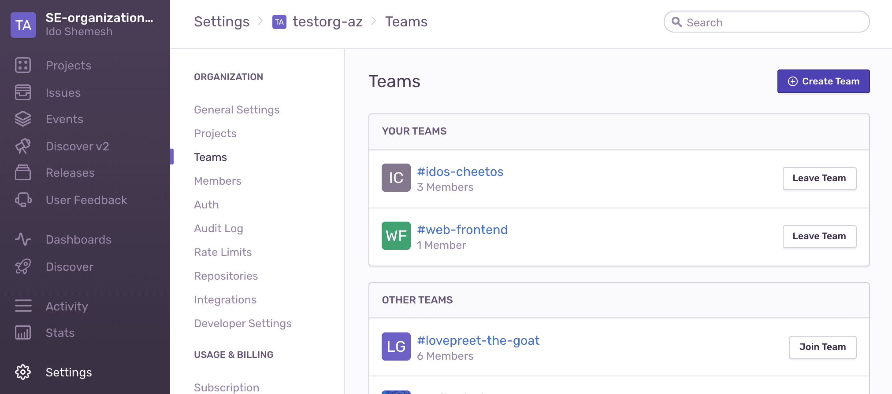

[Getting started](/platforms/) with Sentry error monitoring is easy and straightforward. In this guide, we will provide the recommended checklist for setting up your Sentry organization account and making the most of it.

## 1. Enable Single Sign-On Access

SAML2 Single Sign-On (SSO) enables your team to log in quickly, streamlines the on/off-boarding process for member accounts, and strengthens your login with secure credentials. Sentry provides out of the box configuration for integrating SSO providers like **Okta**, **OneLogin**, **AuthO**, and others, in addition to a generic configuration option for any other **SAML2 Identity Provider**.

> 
>
> Configuring SSO with Okta

For more information see:

- [Single Sign On (SSO)](/product/accounts/sso/)
- [Integrating Generic SAML2 Providers](/product/accounts/sso/saml2/)

## 2. Set-up Teams

Now that SSO is configured and members have created their accounts, add them to their Sentry Teams. Teams are associated with your [Sentry Projects](#4-create-projects) and their members are on the receiving end of issue notifications and issue ownership. We recommend creating teams that align with your internal team structure (e.g. _#Frontend_, _#Ops_, _#SDK_, etc ). To create a new team, go to `Settings > Teams > Create Team`.

Click on a team name to open the team settings to manage its associated members and projects.
Under the `Members` tab add existing members to your team by clicking on `Add Member > [Member Name]`.

You can also invite multiple new (external) members to join your organization and team by clicking on `Add Member > Invite Member`

For more information see: [Organization Management](/product/accounts/membership/)

## 3. Configure Integrations

Sentry integrates seamlessly into your existing workflows by providing out of the box integrations with your favorite apps and services. To enable and configure integrations, navigate to `Organization Settings > Integrations`.

### 3.1. Alert Notifications

By default, Sentry will notify you about errors in your apps via **email**. To receive real-time notifications about your errors where you work, enable Sentry integrations with: [Slack](/product/integrations/slack/), [PagerDuty](/product/integrations/pagerduty/).

> 
>
> _Enabling alert notifications through the **Slack** integration._

Sentry supports additional solutions on a project level. After creating a project, **Hipchat**, **Twilio**, **OpsGenie**, and other solutions can be configured and used to channel notifications through alert rules. For more information, check out:

- [Per-Project Integrations: Issue Notifications](/product/integrations/)
- [Routing Alerts to 3rd Party Integrations](/product/sentry-basics/guides/alert-notifications/routing-alerts/#routing-alerts-to-3rd-party-integrations)

### 3.2. Source Code Management

By enabling Sentry's integration with your Source Code Management (SCM) provider, Sentry will:

1. Identify **suspect commits** that likely introduced an error.
2. **Suggest assignees** who can best resolve an error.
3. Mark an issue as **Resolved via Commit or PR** to stop notifications about similar errors in past releases and notify you upon regression.
4. Link a Sentry issue to a new or existing issue in your integrated [Issue Tracking](#33-issue-tracking) solution

   

Sentry has built-in integrations with:

- [GitHub](/product/integrations/github/)
- [GitLab](/product/integrations/gitlab/)
- [Bitbucket](/product/integrations/bitbucket/)

If you're using a different SCM provider or don't want Sentry to connect to your
repository, check out our
[releases documentation](/product/releases/#alternatively-without-a-repository-integration)
to learn how you can still enable most of these features (#1 - #3) by telling
Sentry about your commit metadata.

### 3.3. Issue Tracking

Enabling the 2-way integration with your Issue Tracking solution allows you to create a new issue from within the Sentry issue page, or link it to an existing one. In addition to **GitHub**, **GitLab**, and **Bitbucket** Issues that are enabled with the respective SCM integration, Sentry also integrates with: [Azure DevOps](/product/integrations/azure-devops/), [Clubhouse](/product/integrations/clubhouse/), [JIRA](/product/integrations/jira/), and others.

> 
>
> 2-Way integration with JIRA issue tracking.

For a full list of all supported integrations, go to our documentation on [Integrations](/product/integrations/).

## 4. Create Projects

To start monitoring errors in your app with Sentry, you'll need to initialize the SDK with a DSN key. To obtain a key, create a new Sentry project by going to `Settings > Projects > + Create Project`. Give the project a name and assign the responsible [Team/s](#2-set-up-teams). Now, any error that occurs in your code (wherever it may be deployed and running) will be associated with that specific project.

### > **What's in a Project?**

A Project is a logical entity that connects between the errors in your application (or a part of it) to the team members assigned to that project. The **Project Settings** configuration determines:

- Which errors should be ingested into your Sentry account and which should be dropped, through [Inbound Filters](/product/accounts/quotas/#inbound-data-filters)
- Who to notify, about what error, and how, using [Alert Rules](/workflow/notifications/alerts/)
- Which errors should be automatically assigned to which member or team through [Issue Owners](/workflow/issue-owners/)
- Custom rules to fine-tune [Event Grouping](/platform-redirect/?next=/data-management/event-grouping/) into issues.

Also, when displaying the **Issue Stream** and **Discover** views, the top-level filter bar considers the projects you are a member of by default. This way, developers are looking at information that is relevant to their work, and see the errors that they might need to jump on.

### > **How Many Projects Should I Create?**

You could theoretically pour all your errors into a single project. The Sentry UI will not limit you. However, considering the above ([What's in a Project?](#-whats-in-a-project)), setting up multiple projects to reflect your application landscape with finer granularity, will go a long way with regards to visibility, actionability, and productivity.

Here are some points to consider:

- In case your application's source code is managed in **multiple repositories**, create a **separate project for each repo**.
- In case your app is made up of **several micro-services**, **split them into projects** accordingly.
- If you have a **monolithic codebase**, set up **separate projects for the backend and frontend**.
- Give **each language its own project** (for example, your backend code contains NodeJS and Java components, separate those into two different projects).

## 5. Define Environments

Depending on your development life cycle, your applications are probably deployed and running in multiple environments -- _QA_, _Staging_, _Production_, etc. Configuring the environment in your Sentry SDK, will add the tag to every error event and will help you associate events to the environment in which they occurred. You can do that by creating a `SENTRY_ENVIRONMENT` environment variable or by explicitly defining it in the SDK configuration. For more information, see our documentation on [Environments](/platform-redirect/?next=/configuration/environments/).

Having the environment defined in your SDK will allow you to:

- Create environment-specific alert rules
- Filter your Issue and Events Streams based on the environment
- Gain comparative insights based on the environment through queries in Discovery
