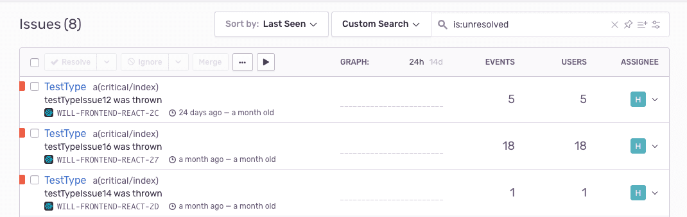
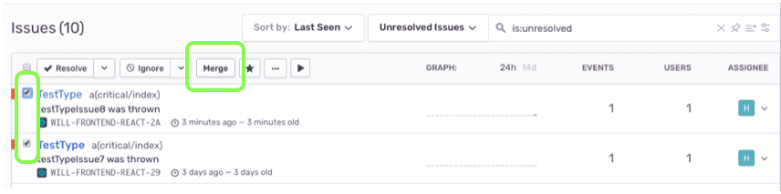
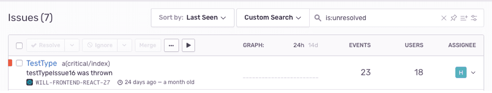
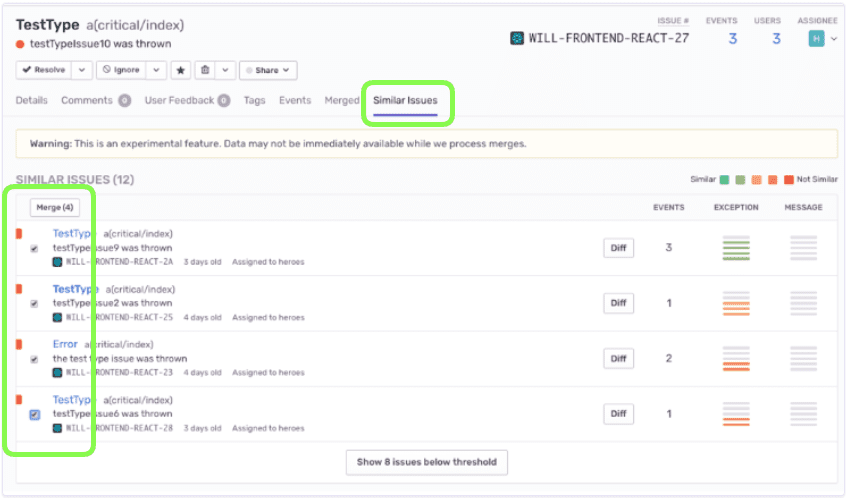
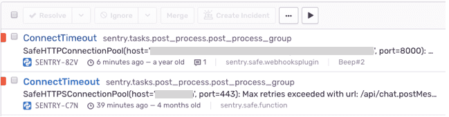
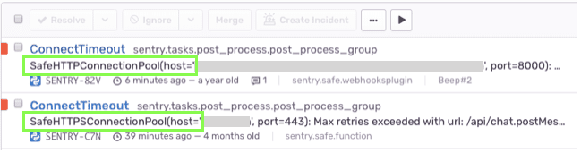
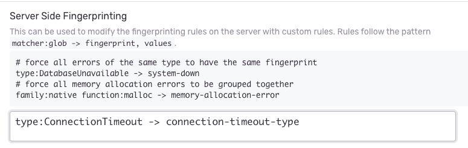
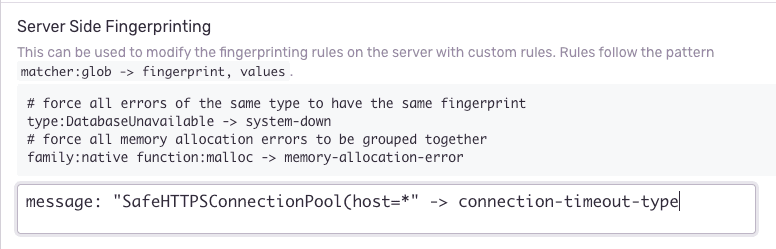

Have you ever had a set of similar-looking issues like this?

Let's first understand what makes events group into an issue. `testTypeIssue15` is an issue that had four events. These events grouped into the issue because they shared the same _fingerprint_

**What is a fingerprint?**
A fingerprint is a way to uniquely identify an event. Sentry sets a fingerprint by default for you. Sentry uses its own built-in grouping algorithms to generate a fingerprint based on information available within the event such as a stack trace, exception, and message. Events with the same fingerprint are grouped together.

**Do I need to do anything?** No. A stack trace is used by default if it's available. So if two events have the same stack trace, then they will group into one issue. If you have separate issues that you'd like to group together, then this guide will show you how.

**How do I see the fingerprint?** Open an issue, click the JSON link, and find the _fingerprint_ property. If the default grouping was used, you'll see default written there. If a different grouping was used, you'll see the actual fingerprint value itself.

## Why are similar looking Issues not grouping together?

If a set of issues in the Issues Stream looks similar, there is something that still differs: the stack trace, and therefore the fingerprint. Let's compare two similar looking issues side-by-side:

Notice the only difference is one had function testTypeIssue15 and the other had testTypeIssue14. This means the stack traces are not identical.

Sometimes two stack traces are the same function execution path but differ by one frame. This can be due to several things like middleware you've configured, node_modules, the framework itself, or library imports. To have greater control over which stack frames are included or excluded, see [Custom Grouping Enhancements](/platform-redirect/?next=/data-management/event-grouping/grouping-enhancements/).

<Note><markdown>

Fortunately you can change the default grouping behavior to make certain issue types match on something other than stack trace. You can do this from both the **Server side** and the **SDK side**

</markdown></Note>

# Solutions

There are three different approaches for updating how events group into issues. The first approach is for merging together historical issues already created. We'll call this **Merging Similar Issues**. The second is for setting rules so next incoming issues will get grouped together. We'll call this **Server-side Fingerprinting**. The third is **SDK Side Fingerprinting**. The difference between SDK side and Server side is the data elements on the exception and stack traces which you can use for matching issues.

In **Merging Similar Issues** we'll see how historical issues can be merged together. No settings or configuration are required to do this.

In **Server-side Fingerprinting** we'll see how to set rules for new incoming issues of our choice to get grouped together by. This will not affect historical issues.

More on **SDK Side Fingerprinting** [here](/platform-redirect/?next=/data-management/event-grouping/sdk-fingerprinting/).

## Merging Similar Issues

This is for merging similar issues and will not auto merge the next occurrence of this issue coming in.

Before merge

After merge, we see that testTypeIssue7 and testTypeIssue8 were merged together.

You can also do this from inside a single issue. Click the Similar Issues tab

**Warning:** Future issues will get added to the merged set only if they match one of the stack traces in the merged set.

## Server-side Fingerprinting

Here's an overview of what we'll do using **Server-Side Fingerprinting**

1. Identify the match logic for grouping issues together. We'll use either the error's **type** or **message**
2. Set the match logic and its fingerprint for it, in your Project's Settings.

### 1. Identify Match Logic

Let's say you want the following 2 issues to group together:

You can do it based on the **type** as in:

Or you can do it based on the **message** as in any value after the word host:

### 2. Implement

Here's how to set the match based on the error **type**

Now, all events coming in with ConnectionTimeout will get a fingerprint of connection-timeout-type and will get grouped into a single issue. This only applies to future events coming in. Each event for this issue could have a different stack trace, but stack trace is no longer used as the default grouping rule.

Here's how to set the match based on the error **message** where you want to include all hosts.

You could also do this based on the file path of the erroring function, or on the function name itself. See [Server-Side Fingerprinting](/platform-redirect/?next=/data-management/event-grouping/server-side-fingerprinting/)
