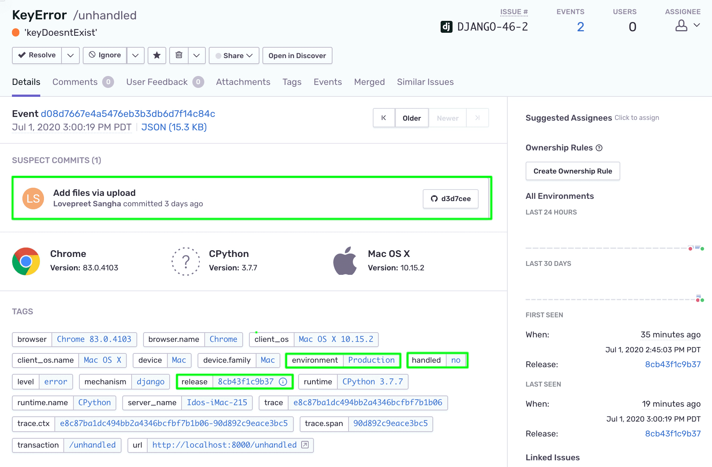

Once initialized in your code, the Sentry SDK will capture various types of events and notify you about them in real-time, depending on the alert rules you've configured. With the Django app already running on your [localhost](http://localhost:8000/), let's try them out.

> **Note:** If you're using your own source code, follow [Capturing your first event](/platforms/python/guides/django/) to introduce an error into your app.

## Unhandled Errors

The Sentry SDK will automatically capture and report any Unhandled Error that happens in your application runtime without any additional configuration or explicit handling. Generally, Unhandled Errors are errors the aren't caught by any except (or try/catch) clause.

1. In your browser, launch the local Django app in the following endpoint to trigger an unhandled error: `http://localhost:8000/unhandled`.

2. If you've set up an alert rule, you should be notified about the error. Otherwise, open the `Issues` view in your Sentry account.

3. Notice the unhandled exception appears in your _Issues Stream_.

   

4. Click on the issue, to open the issue details page.

   

5. Notice that the event:

   - Is tagged with the `environment` and `release` options we've set in the previous tutorial and `handled:no` - marking this event as an unhandled error.
   - Contains a `Suspect Commit` enabled by the commit tracking feature we enabled previously.
   - Contains the custom breadcrumb we added through the SDK.

     

## Handled Errors

The Sentry SDK contains several methods that you can utilize to **explicitly** report errors, events, and custom messages in except clauses, critical areas of your code, etc.

### Capture Exception

1. Open the `views.py` file. Notice that we import `sentry_sdk` lib which contains the `capture_exception` method

   ```python
      import sentry_sdk
   ```

2. The method is utilized to capture the exception handled by the except clause in `HandledErrorView`.

   

3. To try it out on your localhost, trigger the following endpoint: `http://localhost:8000/handled`.

4. Similar to the unhandled error, open the new issue's detail page.

5. Notice that the event is tagged with the same `environment` and `release` configuration options. Hover over the `i` icon in the release tag to reveal the release information and the commits associated with it.

   

6. Click on the release's `i` icon to navigate to the release page.

### Capture Message

Typically, `capture_message` is not emitted but there are times when a developer may want to add a simple message within their app for debugging purposes and `capture_message` is great for that.

1. In the `views.py` file, the `capture_message` method is made available through the `sentry_sdk` lib import.

2. You can use it anywhere within your app. In our example, we've created a dedicated view class `CaptureMessageView` to trigger and capture a message we want to track

   ```Python
      sentry_sdk.capture_message("You caught me!")
   ```

3. To try it out on your localhost, trigger the following endpoint: `http://localhost:8000/message`.

4. As before, open the new issue’s detail page from your _Issues Stream_.

   

   > By default captured messages are marked with a severity level tag `level:info` as reflected in the tags section. However, the `capture_message` methods accept an **optional** severity level paramete.

5. In the `views.py` file, go ahead and change the `capture_message` method to:

   ```Python
      sentry_sdk.capture_message("You caught me!", "fatal")
   ```

6. Save the changes and trigger the `/message` endpoint again. (Changes should be applied immediately through `StateReloader`)

7. Notice that the severity level tag on the new event now shows `level:fatal`.

## Enriching your Event Data

You can enrich your event and error data through the Sentry SDK by adding custom tags and user context attributes. In addition to providing more context to your errors, those will expand your options to search, filter, and query through your event metadata. For more information on the advantages of enriching your data see [Put your Data to Work](/product/sentry-basics/guides/enrich-data/).

Let's enrich the data of the message events we've captured with `capture_message`.

1. In the `views.py` file, locate the line that triggers `sentry_sdk.capture_message`.

2. Replace that line with the following code:

   ```Python
   with sentry_sdk.push_scope() as scope:
      scope.set_tag("my-tag", "my value")
      scope.user = { "email" : "my.email@your.domain.com" }
      scope.set_extra("someVariable", "some data")

      sentry_sdk.capture_message("You caught me!", "fatal")
   ```

   > Note: we're using the `push_scope` method that allows us to send data with one specific event on a local scope. We're setting a custom tag, user context attribute (email), and extra data on the local scope to enrich the data on the message event.

3. Save your changes and trigger the `/message` endpoint again.

4. Open the issue’s detail page from your _Issues Stream_.

5. Notice that:

   - The **user email** is now displayed on the details page and the number of unique users impacted by this event is reflected in the issue's header.
   - The **custom tag** is now available (and searchable) in the list of tags.
     
   - The **extra data** we set on the SDK is reflected in the Additional Data context
     
