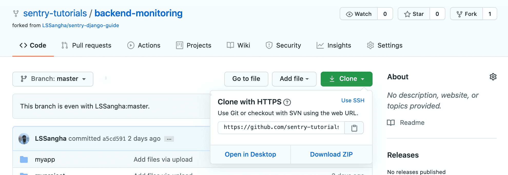
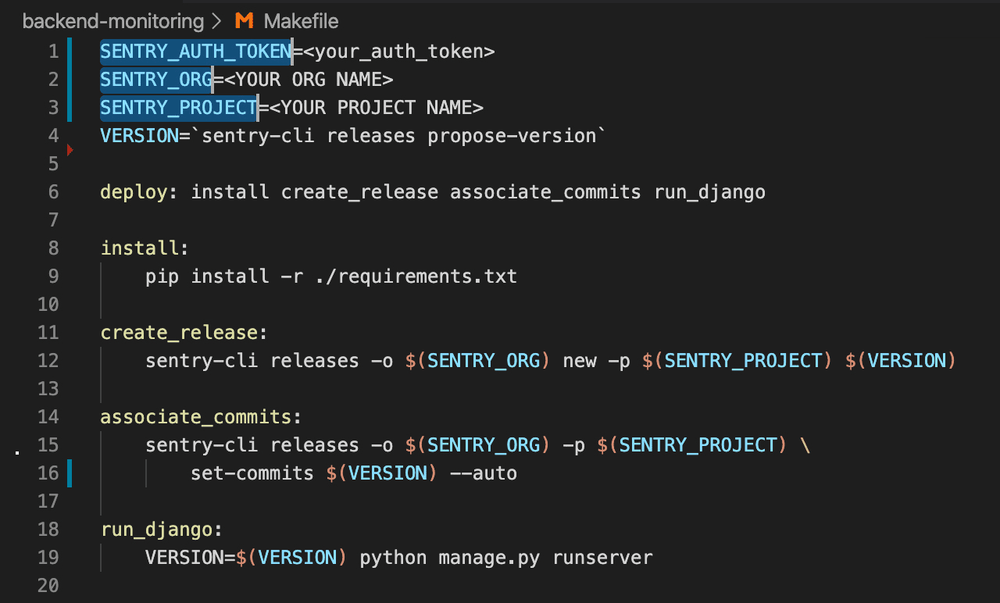
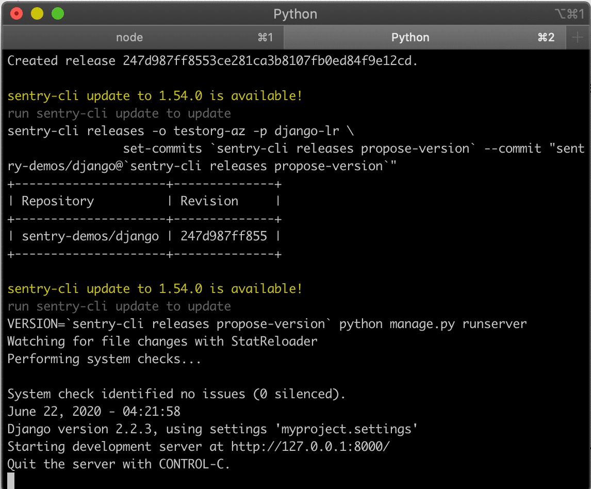

In this tutorial, you will import the backend app source code into your local development environment, add the Sentry SDK, and initialize it.

> **Note:** If you're using your source code you can skip this tutorial and instead
>
> - Follow the instructions in our [Getting Started](/platforms/python/guides/django/) docs. Notice that you can select the desired platform.
> - Continue with [Configuration Options](/guides/integrate-backend/configuration-options/)

## Prerequisites

1. The demo app source code requires a `Python` development environment to build install and run the application. Make sure that you have the following in place:

   - A source code editor (like [VS-Code](https://code.visualstudio.com))
   - [Python3](https://www.python.org/download/releases/3.0/)
   - [Sentry-CLI](/product/cli/)
   - [NPM](https://www.npmjs.com/)

2. To start monitoring errors in your application you'll need to create a new project in your Sentry account. **Please** view the [frontend tutorial](/guides/integrate-frontend/create-new-project/) to learn more about how to create a project and define alert rules.

## Step 1: Get the Code

1. Open the sample [code repository](https://github.com/sentry-tutorials/backend-monitoring) on GitHub

2. Click on `Fork` and select the target GitHub account you wish this repository to be forked in to

3. Once the fork is complete, click on `Clone or download` and copy the repository HTTPS URL

   

4. Clone the forked repository to your local environment

   ```bash
   > git clone <repository HTTPS url>
   ```

5. Now that the sample code is available locally, open the `backend-monitoring` project in your preferred code editor

## Step 2: Enable Commit Tracking for your Repository

Sentry can help you resolve your errors faster by suggesting a suspect commit that might have introduced the error into your codebase. This is enabled by configuring **Commit Tracking**. Integrating your source code management solution and adding your code repositories is required to enable commit tracking, for more information see [this link](/product/releases/?platform=node/suspect-commits/).

1. Open your Sentry account and navigate to `Settings > Integrations` to enable the GitHub integration and add your `backend-monitoring` repository. For more information follow the steps described in [Global Integrations > GitHub](/product/integrations/github/).

## Step 3: Install the SDK

Sentry captures data by using a platform-specific SDK within your application runtime. To use the SDK, import, initialize and configure it in your source code.

1. To start working with the SDK in our Django app we install the `sentry-sdk` by defining the dependency in the `requirements.txt` file. The SDK documentation and release information are available in the [Sentry SDK](https://github.com/getsentry/sentry-python) GitHub repository.

2. Open the `settings.py` file (located under \_./backend-monitoring/myproject/settings.py). This is where we initialize and configure the Sentry SDK in our application.

3. After importing the Sentry SDK to the app, it is important to import the Sentry Django integration as well. Integrations extend the functionality of the SDK for some common frameworks and libraries.

   ```python
    import sentry_sdk
    from sentry_sdk.integrations.django import DjangoIntegration
   ```

4. In the Sentry SDK configuration, enter the `dsn` key value you copied from the project created in the previous tutorial.

   ```python
   sentry_sdk.init(
       dsn="YOUR_DSN",
       integrations=[DjangoIntegration()]
   )
   ```

## Step 4: Install Dependencies & Run the Demo App

To build and run the Demo application on your localhost

1. Open a shell terminal and change directory to the `backend-monitoring` project root folder

2. If you haven't installed Python3, do so by running the following:

   ```bash
    brew install python3
   ```

3. Install `virtualenv` and `virtualenvwrapper`:

   ```bash
    pip3 install virtualenv virtualenvwrapper
    echo "source /usr/local/bin/virtualenvwrapper.sh" >> ~/.bashrc
    exec bash
   ```

4. Install Sentry's command-line tool to use release tracking and GitHub integration for commit data:

   ```bash
    npm install -g @sentry/cli
   ```

5. Setup and activate a Python 3 virtual environment in the project root.

   ```bash
    mkvirtualenv --python=python3 sentry-demo-django
   ```

   > You can name the virtual environment whatever you feel that is appropriate, in our case we named it sentry-demo-django

6. To activate the virtual environment run:

   ```bash
    workon sentry-demo-django
   ```

7. Open the `Makefile` included in the project's root folder. The file is used here to mimic a CI/CD flow.

8. Follow the `deploy` target execution flow.

   > Notice that in addition to installing Python requirements and running the server, we also utilize the `sentry-cli` to create a new Sentry Release, and associate commits to that release. Sentry will lookup through those commits when suggesting a suspect commit for your project issues.
   > Commands mentioned within the Makefile will be explained in detail in the next part [Configuration Options](/product/sentry-basics/guides/integrate-backend/configuration-options/)

9. To execute the `sentry-cli` commands, follow the instructions described [here](/product/sentry-basics/guides/integrate-frontend/upload-source-maps/#step-1-prepare-the-build-environment) to obtain the values for your `SENTRY_AUTH_TOKEN`, `SENTRY_ORG`, and `SENTRY_PROJECT` environment variables.

   

   > The sentry-cli can be configured by providing these values either through environment variables or through a dedicated configuration file. For more information see [Sentry CLI > Configuration and Authentication](/product/cli/configuration/)

10. Run the following command to install the required Python libraries, set up the Sentry Release, and run the Django server:

    ```bash
    make deploy
    ```

    

    > In the terminal, notice that a new release is created and commits are associated with it. Once the deploy finishes successfully, you'll see the confirmation in your terminal

## Next

[Configuration Options](/guides/integrate-backend/configuration-options/)
