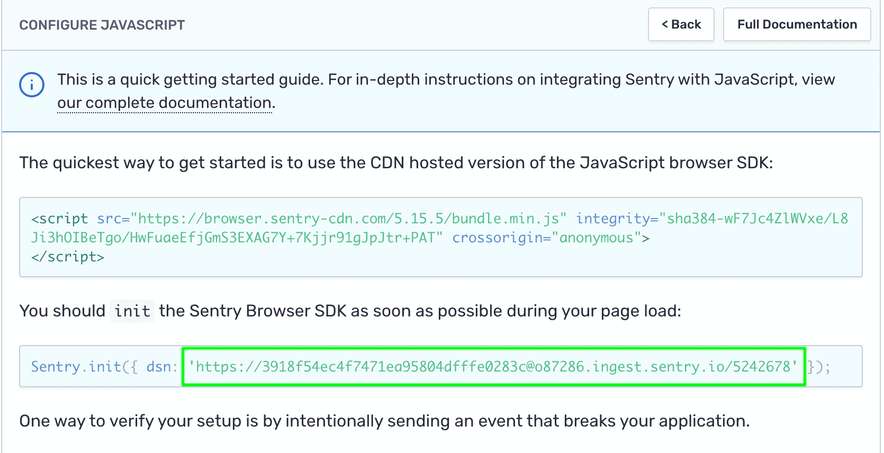

In this tutorial, you create a new `Project` in your Sentry account. Projects allow you to scope events to a distinct application in your organization and assign responsibility and ownership to specific users and teams within your organization. You can create a project for a particular language or framework used in your application. For example, you might have separate projects for your API server and frontend client. For more information see [Best Practices for Creating Projects](/product/sentry-basics/guides/getting-started/#4-create-projects)

## Step 1: Create the project

1. Login to your [Sentry organization](https://sentry.io)

2. Select `Projects` from the left side navigation menu to display the list of all your projects

3. Click on the `+ Create Project` button

   

   > **Note:** If there are no projects in your account --- you might be redirected to the onboarding wizard to create your first project.

   - Select the language or framework for your project based on the code you wish to monitor --- in this case, `JavaScript`.

   - Give the project a `Name`.

   - Under `Set your default alert settings` check `i'll create my own alerts later`

   - `Assign a Team` to the project.

     

     > If you haven't defined any teams, you can either select the default org team (the team that has the same name as your Sentry Org) or click on the `+` button to create a new team.

     

   - Click on `Create Project`.
     This takes you to the configuration page. Read through the quick Getting Started guide.

4. Copy the `DSN key` and keep it handy as we will be copying the key into the source code.

   

   > The DSN (or Data Source Name) tells the SDK where to send the events, associating them with the project you just created.

5. Click on the `Got it!` button at the bottom to create the project.

## Step 2: Create an alert rule

You can create various alert rules per project and let Sentry know when, how, and whom you want to notify when errors occur in your application. **Alert rules** consist of **Conditions** and **Actions**, which are performed when the associated conditions are met. For more information, see [Alerts](/product/alerts-notifications/alerts/). When creating a new project, you can select to create it with an alert rule that notifies all project team members (via email) the first time a new **issue** appears. This means that the next time a **similar error** occurs, the notification is not triggered since the error is not "new."

In this step, you create a new Alert rule notifying **every time** an event occurs, even if it's associated with an already existing **issue**. In a real-life scenario you'd probably add additional conditions, as you wouldn't want to be notified **every time** an event happens in your frontend code on your end user's browsers.

1. From the project drop down list, find the new project and click on the **cog icon** to open the `Project Settings`

   

2. Click on `Alerts` to open the Alerts Configuration page

3. Click on `New Alert Rule`

   

4. In the New Alert Rule form, select an `Issue Alert` type and enter the following values

   

   > The new alert rule notifies the selected team members every time _an event is seen_ in _All Environments_ via _Mail_

5. Click `Save Rule` to create the new rule

## Next

[Introduce Sentry SDK to your Frontend Code](/guides/integrate-frontend/initialize-sentry-sdk/)
